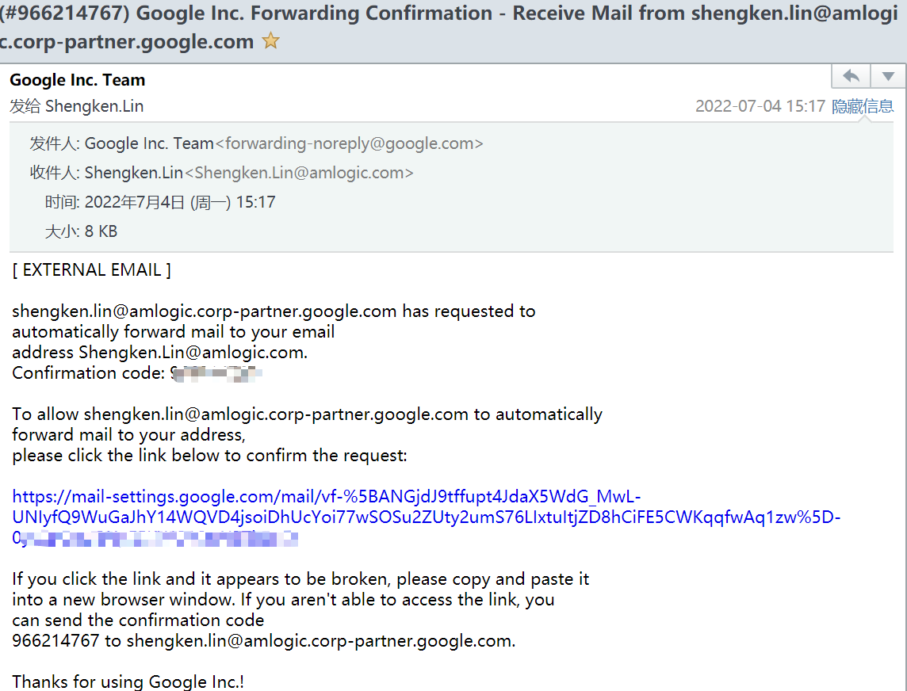

> 在开始之前，你需要收到google的邀请邮件，如果没有，请联系：frank.chen@amlogic.com



----

## 设置代理

- 公司的代理（设置代理之前请确保proxy有无更新）

```sh
proxy = 10.78.20.250
proxy_type = http
proxy_port = 3128
# proxy_user = 
# proxy_pass = 
proxy_rdns = True
```

> 可以将代理添加到环境变量中

```sh
$ vim ~/.bash_profile
export http_proxy="10.78.20.250:3128"
export https_proxy="10.78.20.250:3128"

$ source ~/.bash_profile
```


- git全局代理设置

```sh
# 设置代理
git config --global http.proxy http://10.78.20.250:3128
git config --global https.proxy https://10.78.20.250:3128
# 设置邮箱和用户
git config --global user.name "Shengken Lin"
git config --global user.email shengken.lin@amlogic.corp-partner.google.com
```

## Verify CPID

- 打开网址：https://eureka-partner.googlesource.com/ ，Click “**Generate Password**”。


- 选择自己的邮箱


- 点击 **允许**


- 之后得到如下命令


## chrome && korlan

### Download gclient

> 如果不懂怎么操作可以参考下面的截图

```sh
$ git clone https://chromium.googlesource.com/chromium/tools/depot_tools.git
cd depot_tools

# 配置环境变量
$ vim ~/.bash_profile
export depot_path="/mnt/fileroot/shengken.lin/workspace/google_source/depot_tools"
export BOTO_CONFIG=${depot_path}/.boto
export NO_AUTH_BOTO_CONFIG=${depot_path}/.boto
export PATH=${depot_tools}:$PATH
export DEPOT_TOOLS_UPDATE=1

$ source ~/.bash_profile
```


```sh
gsutil.py config
```

出现log中会有一个【链接】，将其复制到浏览器获取授权码

```sh
# 输出中有个链接：https://accounts.google.com/o/oauth2/auth?client_id=909320924072.apps.googleusercontent.com&redirect_uri=urn%3Aietf%3Awg%3Aoauth%3A2.0%3Aoob&scope=https%3A%2F%2Fwww.googleapis.com%2Fauth%2Fcloud-platform+https%3A%2F%2Fwww.googleapis.com%2Fauth%2Faccounts.reauth&access_type=offline&response_type=code  # gsutil.py config 之后生成

# 点击进去允许获取授权码 4/1AdQt8qgy0KTm8R157h_JJcv6ut_Qm7h8AuYdbZ8HCe3EweA79YzAUVvsBw8  # 每次不一样
```

- 如果提示一下信息，就输入

```sh
Enter the authorization code: <access the link to get it>
 
proxy host -> 10.78.20.250
proxy type -> http
proxy port -> 3128
proxy user -> (skip it)
proxy pass -> (skip it)
DNS lookup -> y
 
Enter the authorization code: <access the link to get it>
 
What is your project-id?  google.com:eureka-builds
```

### 拉取 chrome 代码