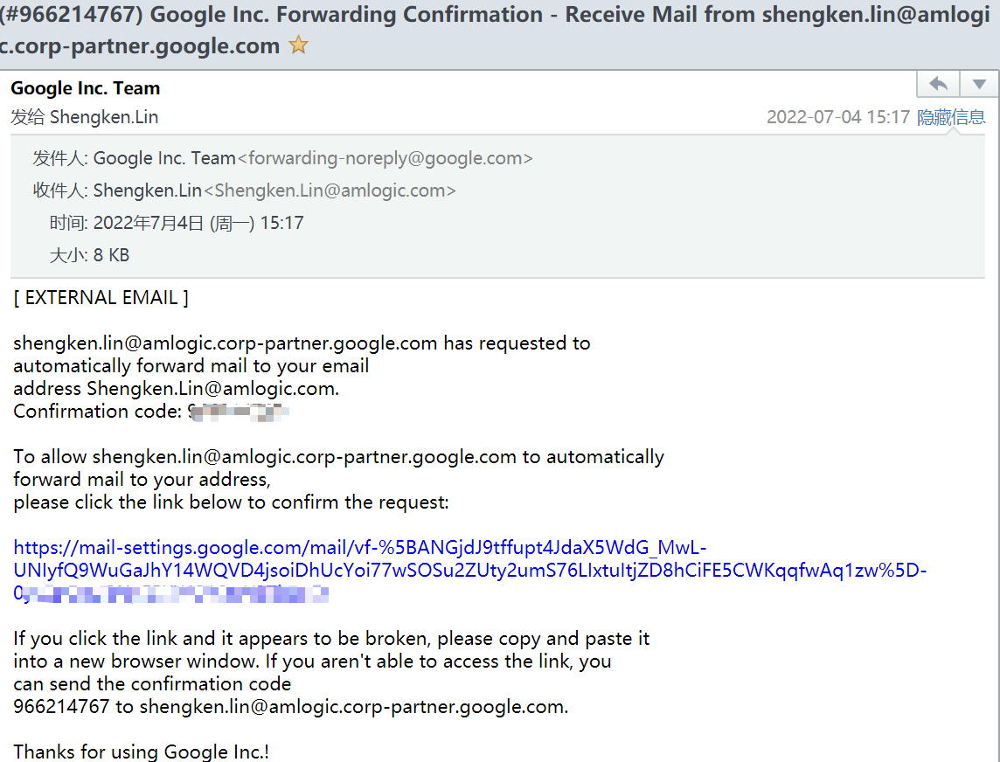
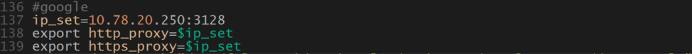
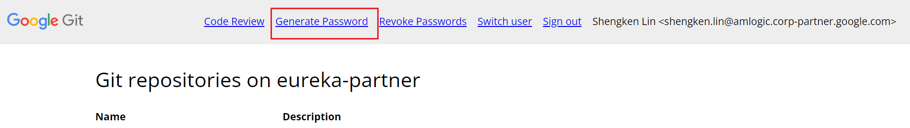
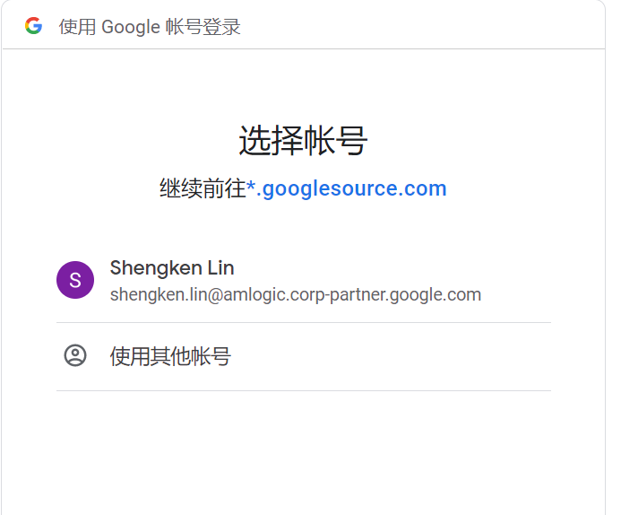
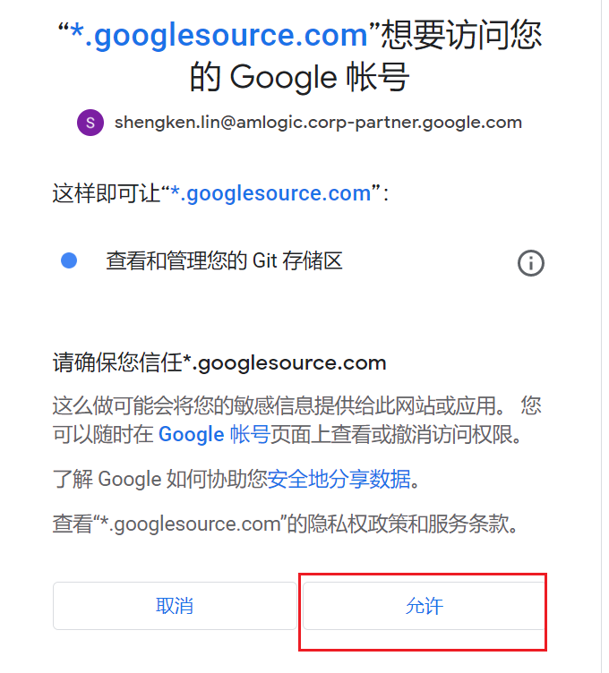
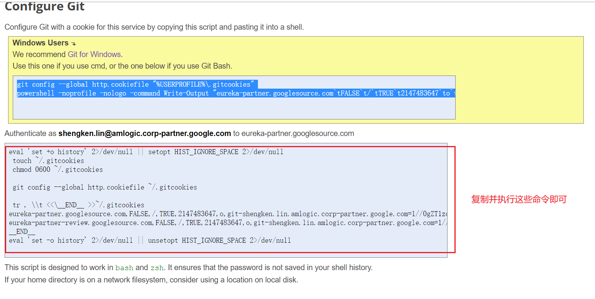
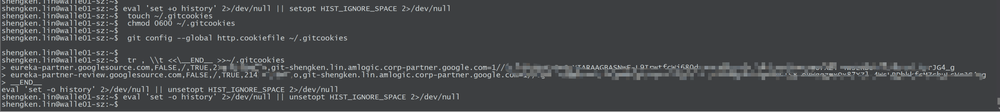
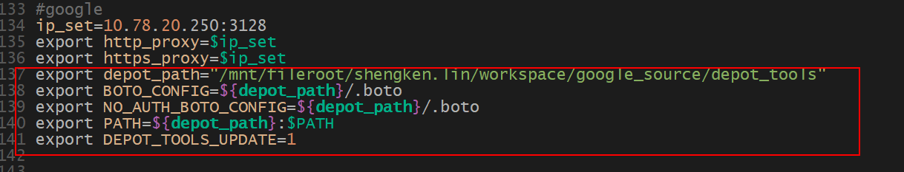

> Before you can begin, you need to receive an invitation email from Google, if not, please contact:  frank.chen@amlogic.com



----

## Set proxy

- Company proxy (make sure proxy is up to date before setting proxy)

```sh
proxy = 10.78.20.250
proxy_type = http
proxy_port = 3128
# proxy_user = 
# proxy_pass = 
proxy_rdns = True
```

> You can add a proxy to an environment variable

```sh
$ vim ~/.bash_profile
export http_proxy="10.78.20.250:3128"
export https_proxy="10.78.20.250:3128"

$ source ~/.bash_profile
```



- git global proxy Settings

```sh
# proxy
git config --global http.proxy http://10.78.20.250:3128
git config --global https.proxy https://10.78.20.250:3128
# email and user
git config --global user.name "Shengken Lin"
git config --global user.email shengken.lin@amlogic.corp-partner.google.com
```


## Verify CPID

- Open https://eureka-partner.googlesource.com/,  Click "**Generate Password**" .



- you email






- Then you will get this





## chrome && korlan

### Download gclient


```sh
# Select a directory where you want to store depot_tools
$ git clone https://chromium.googlesource.com/chromium/tools/depot_tools.git
cd depot_tools

# 配置环境变量
$ vim ~/.bash_profile
export depot_path="/mnt/fileroot/shengken.lin/workspace/google_source/depot_tools"
export BOTO_CONFIG=${depot_path}/.boto
export NO_AUTH_BOTO_CONFIG=${depot_path}/.boto
export PATH=${depot_path}:$PATH
export DEPOT_TOOLS_UPDATE=1

$ source ~/.bash_profile
```

> If you do not understand how to operate can refer to the following screenshot



```sh
gsutil.py config
```

There will be an [URL] in the log, copy it to the browser to get the authorization code.

```sh
# you will get this：https://accounts.google.com/o/oauth2/auth?client_id=909320924072.apps.googleusercontent.com&redirect_uri=urn%3Aietf%3Awg%3Aoauth%3A2.0%3Aoob&scope=https%3A%2F%2Fwww.googleapis.com%2Fauth%2Fcloud-platform+https%3A%2F%2Fwww.googleapis.com%2Fauth%2Faccounts.reauth&access_type=offline&response_type=code    # After gsutil.py config

# Get authorization code : 4/1AdQt8qgy0KTm8R157h_JJcv6ut_Qm7h8AuYdbZ8HCe3EweA79YzAUVvsBw8  
```

- If prompted for information, input...

```sh
Enter the authorization code: <access the link to get it>
 
proxy host -> 10.78.20.250
proxy type -> http
proxy port -> 3128
proxy user -> (skip)
proxy pass -> (skip)
DNS lookup -> y
 
Enter the authorization code: <access the link to get it>
 
What is your project-id?  google.com:eureka-builds
```

### chrome

```sh
mkdir eureka && cd eureka
mkdir chrome && cd chrome
repo init -u https://eureka-partner.googlesource.com/amlogic/manifest -m default.xml

repo sync
cd ./chromium
gclient setdep --deps-file=src/DEPS --var=fuchsia_sdk_bucket=fuchsia
gclient sync

# if error
# Failed to fetch file gs://chromium-telemetry/1d6ca505c384ef8f5af14e7958f62d54ec126356 for /mnt/fileroot/shengken.lin/workspace/google_source/eureka/chrome/chromium/src/content/test/data/gpu/mediapipe_zip/mediapipe_chromium_tests.zip, skipping. [Err: Traceback (most recent call last):
cd /mnt/fileroot/shengken.lin/workspace/google_source/eureka/chrome/chromium/src

# Download sync_fail.patch from the attachment below
patch -p1 < sync_fail.patch 

# If you cant't patch,you have to edit it yourself
chromium/src$ vim DEPS 


cd ..
# Continue to
gclient sync
```

### Korlan

```sh
cd eureka && mkdir amlogic_sdk
repo init -u https://eureka-partner.googlesource.com/amlogic/manifest -b korlan-master -m combined_sdk.xml
repo sync
```

