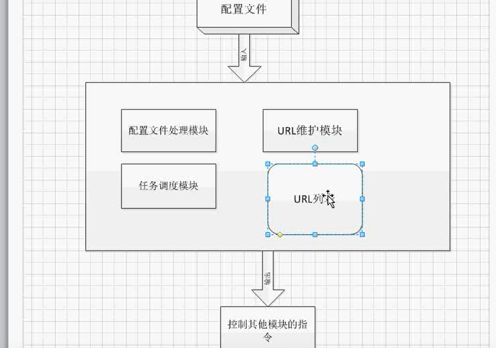
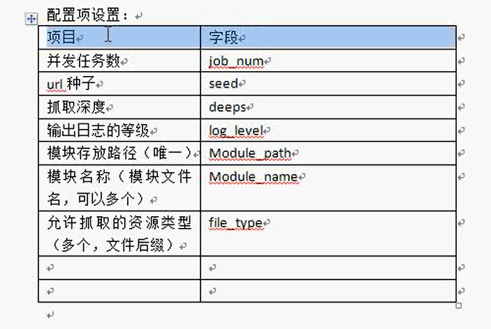
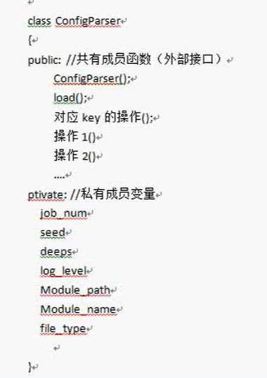
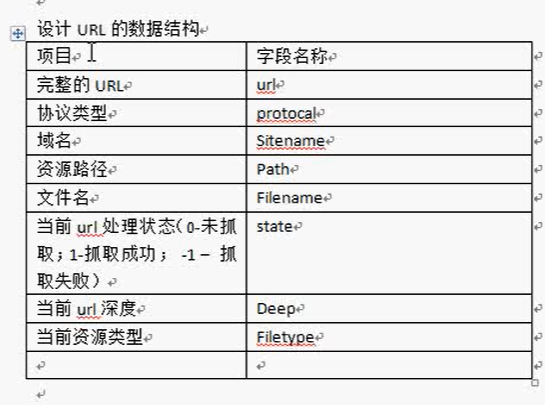

## 设计处理流程

用文件系统做数据库，可以用Hadoop

也叫数据的持久化

1.得到爬取终止（URL）

2.根据种子下载资源

3.提取页面，提取跟多的url

4.对页面做持久化操作

5.根据提取的url再进行下载操作

6.重复第二步到第五步

## 系统设计

## 控制器

输入配置文件，输出控制指令，控制其他模块的指令

控制模块由三部分组成

- 配置文件处理模块，从配置文件中读取配置项，提供配置项的提取接口，
- URL维护模块，负责维护URL库，提供如下功能：
  - 输入新的url
  - 输出一个未被抓取的url
  - 负责维护url的抓取状态
- 任务调度模块，多任务执行
  - 负责协调控制器的流程
  - 负责调用其他系统模块完成工作
- url列表

## 下载器设计

输入待抓取得url，输出抓取得页面

## 解析器

把页面的url解析出来，

只有一个HTML解析模块

### 持久化器

把数据持久化保存的文件系统上

页面保存模块

图片保存模块

视频流模块

音乐流模块

## 控制器

- 配置文件解析模块

配置文件解析模块

配置文件是以文件形式保存程序运行时必要的参数，减少输入时的繁琐过程，文件类型是文本文件，内容一般以键值对形式出现。

配置文件规则

key=value

配置项设置

模块详细设计
操作：
1.操作配置文件
2.得到配置文件选项的值（键值）
3.初始化

技术点：
1.按行读取fget
2.分割字符串
3.消除注释

### URL 维护模块

