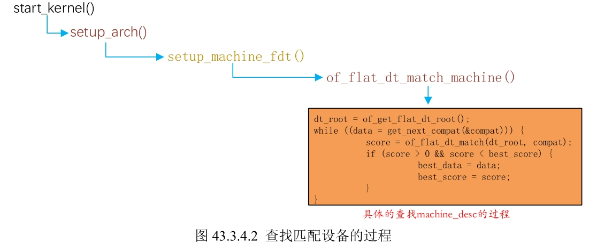
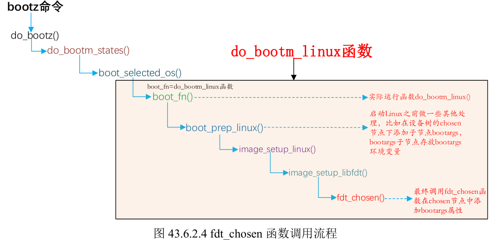
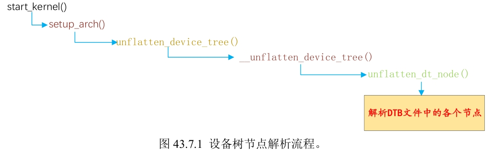
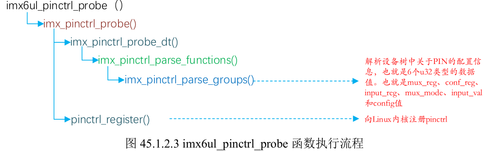

- [裸机程序](#裸机程序)
	- [开发环境的搭建](#开发环境的搭建)
		- [安装 NFS](#安装-nfs)
		- [CH340 驱动](#ch340-驱动)
		- [安装交叉编译器](#安装交叉编译器)
	- [汇编语言编写 LED 驱动](#汇编语言编写-led-驱动)
		- [编译驱动](#编译驱动)
		- [将板子连接到 PC](#将板子连接到-pc)
		- [makefile 的编写](#makefile-的编写)
	- [C 语言编写 LED 驱动](#c-语言编写-led-驱动)
		- [设置处理器模式](#设置处理器模式)
		- [设置 SP 指针](#设置-sp-指针)
		- [编译烧录](#编译烧录)
	- [stm32 模式编写LED驱动](#stm32-模式编写led驱动)
- [第三期 系统移植](#第三期-系统移植)
	- [烧写实验](#烧写实验)
		- [使用 OTG 烧写](#使用-otg-烧写)
		- [Ubuntu 脚本烧写](#ubuntu-脚本烧写)
	- [Uboot 编译和烧写](#uboot-编译和烧写)
	- [启动 Uboot 分析](#启动-uboot-分析)
		- [uboot 源码目录](#uboot-源码目录)
		- [uboot 启动流程](#uboot-启动流程)
	- [linux 内核移植](#linux-内核移植)
		- [编译 NXP 官方开发板对应的 linux 系统](#编译-nxp-官方开发板对应的-linux-系统)
		- [设置开发板、主机和ubuntu网络互连](#设置开发板主机和ubuntu网络互连)
		- [在 U-Boot 中添加正点原子的开发板](#在-u-boot-中添加正点原子的开发板)
	- [CPU 主频和网络驱动修改](#cpu-主频和网络驱动修改)
		- [修改 bootcmd 和 bootargs](#修改-bootcmd-和-bootargs)
		- [CPU 主频修改](#cpu-主频修改)
			- [设置超频，添加频率](#设置超频添加频率)
		- [使能 8 线 EMMC 驱动](#使能-8-线-emmc-驱动)
		- [修改网络驱动](#修改网络驱动)
		- [网络驱动测试](#网络驱动测试)
		- [保存修改后的图形化配置](#保存修改后的图形化配置)
	- [构建根文件系统](#构建根文件系统)
		- [使用 busybox](#使用-busybox)
			- [NFS 服务开启](#nfs-服务开启)
			- [拷贝解压 busybox](#拷贝解压-busybox)
			- [编译 busybox](#编译-busybox)
		- [向根文件系统添加 lib 库](#向根文件系统添加-lib-库)
		- [完善根文件系统](#完善根文件系统)
		- [软件运行测试](#软件运行测试)
		- [中文测试](#中文测试)
		- [开发板外网连接](#开发板外网连接)
- [第四期 驱动开发](#第四期-驱动开发)
	- [配置 vscode 开发环境](#配置-vscode-开发环境)
	- [字符设备开发基础实验](#字符设备开发基础实验)
		- [Linux 设备号](#linux-设备号)
		- [chrdevbase字符设备驱动开发实验](#chrdevbase字符设备驱动开发实验)
			- [创建设备节点文件](#创建设备节点文件)
			- [chrdevbase 设备操作测试](#chrdevbase-设备操作测试)
	- [linux LED 灯驱动实验](#linux-led-灯驱动实验)
		- [ioremap 函数](#ioremap-函数)
		- [iounmap 函数](#iounmap-函数)
		- [LED 灯驱动程序编写](#led-灯驱动程序编写)
	- [新字符设备驱动实验](#新字符设备驱动实验)
		- [编写程序](#编写程序)
	- [设备树](#设备树)
		- [设备节点](#设备节点)
		- [标准属性](#标准属性)
		- [设备树设备匹配方法](#设备树设备匹配方法)
			- [匹配 machine\_desc](#匹配-machine_desc)
		- [向节点追加或修改内容](#向节点追加或修改内容)
		- [创建小型模板设备树](#创建小型模板设备树)
		- [设备树节点解析流程](#设备树节点解析流程)
		- [设备树常用 OF 操作函数](#设备树常用-of-操作函数)
		- [查找节点的 OF 函数](#查找节点的-of-函数)
			- [of\_find\_node\_by\_name 函数](#of_find_node_by_name-函数)
			- [of\_find\_node\_by\_type 函数](#of_find_node_by_type-函数)
			- [of\_find\_compatible\_node 函数](#of_find_compatible_node-函数)
			- [of\_find\_matching\_node\_and\_match 函数](#of_find_matching_node_and_match-函数)
			- [of\_find\_node\_by\_path 函数](#of_find_node_by_path-函数)
			- [of\_get\_parent 和 of\_get\_next\_child](#of_get_parent-和-of_get_next_child)
			- [of\_find\_property 函数](#of_find_property-函数)
			- [of\_property\_read\_string 函数](#of_property_read_string-函数)
	- [基于设备树的LED等实验](#基于设备树的led等实验)
		- [添加设备树节点](#添加设备树节点)
		- [LED 灯驱动程序编写](#led-灯驱动程序编写-1)
	- [pinctl 和 gpio 子系统试验](#pinctl-和-gpio-子系统试验)
		- [如何找到 pinctl 子系统驱动](#如何找到-pinctl-子系统驱动)
		- [设备树中添加 pinctrl 节点模板](#设备树中添加-pinctrl-节点模板)
		- [设备树中的 gpio 信息](#设备树中的-gpio-信息)
		- [GPIO 驱动程序](#gpio-驱动程序)
		- [gpio 子系统 API 函数](#gpio-子系统-api-函数)
		- [实验程序编写](#实验程序编写)
			- [添加pinctrl节点](#添加pinctrl节点)
			- [添加 LED 设备节点](#添加-led-设备节点)
			- [检查 PIN 是否被其他外设使用](#检查-pin-是否被其他外设使用)
		- [LED 驱动程序编写](#led-驱动程序编写)
	- [蜂鸣器驱动](#蜂鸣器驱动)
		- [修改设备树文件](#修改设备树文件)
			- [添加 pinctrl 节点](#添加-pinctrl-节点)
		- [编写程序](#编写程序-1)
	- [Linux开发与竞争](#linux开发与竞争)
		- [Linux 竞争与并发实验](#linux-竞争与并发实验)
	- [Linux 按键输入实验](#linux-按键输入实验)
	- [内核定时器时间](#内核定时器时间)
		- [定时器驱动编写](#定时器驱动编写)
	- [linux 中断](#linux-中断)
	- [Linux音频驱动实验](#linux音频驱动实验)
		- [I2S 接口协议](#i2s-接口协议)
		- [音频驱动使能](#音频驱动使能)
			- [编译烧录](#编译烧录-1)
		- [alsa-lib 和 alsa-utils 移植](#alsa-lib-和-alsa-utils-移植)
			- [alsa-utils 移植](#alsa-utils-移植)
	- [Linux USB驱动](#linux-usb驱动)
	- [块设备驱动实验](#块设备驱动实验)

------

# 裸机程序

## 开发环境的搭建

### 安装 NFS

```sh
sudo apt-get install nfs-kernel-server rpcbind
```

创建一个 zd-linux 文件夹啊，正点原子所有的东西都放在这个目录下，然后在这个文件夹下创建一个 nfs 文件夹给 nfs 服务器使用。

```
/home/book/kenspace/zd-linux
```

如何使用 NFS 服务器

```sh
sudo vim /etc/exports 

#添加
/home/book/kenspace/zd-linux/nfs q(rw,sync,no_root_squash) 

# 重启 NFS 服务器
sudo /etc/init.d/nfs-kernel-server restart
```

### CH340 驱动

如果想使用正点原子的串口就必须安装 CH340 驱动，在 `E:\学习资源\正点原子\【正点原子】阿尔法Linux开发板（A盘）-基础资料\03、软件\03、软件\CH340驱动(USB串口驱动)_XP_WIN7共用` 这个目录下。

在安装之前必须将开发板和电脑连接，电源打开，双击 SETUP.EXE，等待安装完成，打开设备管理器查看端口，最后使用 SecureCRT 连接对应的端口。

拨码开关：EMMC 模式：1 0 1 0 0 1 1 0

连接上之后按下复位键，看到 secureCRT 有数据输出，说明已经正常工作了。

### 安装交叉编译器

在 X86 架构的 PC 上运行，可以编译 ARM 架构代码的 GCC 编译器，这个编译器就叫做交叉编译器。

编译器可以再 `E:\学习资源\正点原子\【正点原子】阿尔法Linux开发板（A盘）-基础资料\05、开发工具\05、开发工具\01、交叉编译器` 下找到

将编译器上传到 ubuntu ，然后拷贝到 `/usr/local/arm` 目录中并对其进行解压。

```sh
sudo tar -xf gcc-linaro-4.9.4-2017.01-x86_64_arm-linux-gnueabihf.tar.xz 
```

然后配置环境变量

```sh
sudo vim /etc/profile

export PATH=$PATH:/usr/local/arm/gcc-linaro-4.9.4-2017.01-x86_64_arm-linux-gnueabihf/bin
```

## 汇编语言编写 LED 驱动

- 创建逻辑驱动目录

```sh
mkdir MIX6ULL
/home/book/kenspace/zd-linux/IMX6ULL/board_drivers
/home/book/kenspace/zd-linux/IMX6ULL/board_drivers/1_leds
vim led.s
```


**I.MX6ULL IO初始化：**

- 使能时钟，CCGR0-CCGR6 这 7 个寄存器控制着 6ULL 所有外设时钟的使能，为了简单，在程序中将 CCGR0~CCGR6 这7个寄存器全部设置为 0XFFFFFFFF， 相当于使能所有外设时钟。

首先我们需要在 IMX6ULL 参考手册中查找到 CCGR0-CCGR6 的地址，找到 18 章 CCM 的 CCM_CCGR0 ，找到 CCM_CCGR0 ~ CCM_CCGR6 , 地址是：`Address: 20C_4000h base + 68h offset = 20C_4068h`

- IO复用，将寄存器 IOMUXC_SW_MUX_CTL_PAD_GPIO1_IO03 的 bit3~0 设置为 0101=5 ，这样 GPIO1_IO03 就复用为 GPIO

找到 30 章中 IOMUXC_SW_MUX_CTL_PAD_GPIO1_IO03 的地址，并将它设置为 5

- 寄存器 IOMUXC_SW_PAD_CTL_PAD_GPIO1_IO03 是设置 GPIO1_IO03 的电气属性。包括压摆率、速度、驱动能力、开漏、上下拉等。

找到 IOMUXC_SW_PAD_CTL_PAD_GPIO1_IO03 的地址是 0x020E02F4

- 配置 GPIO 功能，设置输入输出。设置 GPIO1_DR 寄存器 bit3 为 1，也就是设置为输出模式。设置 GPIO1_DR 寄存器的 bit3，为1表示输出高电平，为 0 表示输出低电平。

通过查看手册查到 GPIO1_GDIR 的地址是 0x0209C004

```x86asm
.global _start

_start:
    @ 初始化。使能所有外设时钟
    @ LDR 主要用于从存储加载数据到寄存器 Rx 中，LDR 也可以将一个立即数加载到寄存器 Rx 中
	ldr r0, =0x020c4068  @ CCGR0
    ldr r1, =0XFFFFFFFF  @ 要向 CCGR0 写入的数据，先初始化 0XFFFFFFFF 
	str r1, [r0]        @ 将0xFFFFFFFF写入到CCGR0中

    @ CCGR1
    ldr r0, =0x020C406C  @ CCGR1
    str r1, [r0]

    @ CCGR2
    ldr r0, =0x020C4070
    str r1, [r0]

    @ CCGR3
    ldr r0, =0x020C4074
    str r1, [r0]

    @ CCGR4
    ldr r0, =0x020C4078
    str r1, [r0]

    @ CCGR5
    ldr r0, =0x020C407C
    str r1, [r0]

    @ CCGR6
    ldr r0, =0x020C4080
    str r1, [r0]


    @ IO复用，将寄存器 IOMUXC_SW_MUX_CTL_PAD_GPIO1_IO03 的 bit3~0 设置为 0101=5 ，
    @ 这样 GPIO1_IO03 就复用为 GPIO
    /*
    配置 GPIO1_IO03 PIN 的复用为 GPIO ，也就是设置
    IOMUXC_SW_MUX_CTL_PAD_GPIO1_IO03 = 5
    IOMUXC_SW_MUX_CTL_PAD_GPIO1_IO03 寄存器的地址是  0x020E0068
     */

    ldr r0, =0x020e0068
    ldr r1, =0x5
	str r1, [r0]

    @ 寄存器IOMUXC_SW_PAD_CTL_PAD_GPIO1_IO03是设置 GPIO1_IO03的电气属性。
    @ 包括压摆率、速度、驱动能力、开漏、上下拉等。
    /* 
    *  bit0:    0 低速率
     * bit5:3： 110 R0/6驱动能力
     * bit7:6： 10 100MHz速度
     * bit11：  0 关闭开路输出
     * bit12：  1 使能pull/kepper
     * bit13：  0 kepper
     * bit15:14：00 100K下拉
     * bit16： 0 关闭hys
    */
    @ 换成 16 进制是 10B0
    ldr r0, =0x020e02f4
    ldr r1, =0x010B0
    str r1, [r0]

    /* 设置GPIO 
     * 设置GPIO1_GDIR寄存器，设置GPIO1_GPIO03为输出
     * GPIO1_GDIR寄存器地址为 0x0209c004,设置GPIO1_GDIR寄存器bit3为1,
     * 也就是设置GPIO1_IO03为输出。
     */
     ldr r0, =0x0209c004
     ldr r1, =0x08
     str r1, [r0]

     /* 打开LED，也就是设置GPIO1_IO03为0 也就是低电平
      * GPIO1_DR 寄存器地址为 0x0209c000
      */
    ldr r0, =0x0209c000
    ldr r1, =0
    str r1, [r0]

    @ 不断的循环
loop:
    b loop  @ 跳转到 loop
    @ 这里需要一个回车换行，否则会出现警告
```

### 编译驱动

编译到 SD 卡

- 编译

```sh
arm-linux-gnueabihf-gcc  -g -c led.s -o led.o   # -g 是产生调试信息， -c 是指定源文件
```

- 链接

> STM32 的存储起始地址和运行起始地址都是 0X08000000    
> 对于 6ULL 来说，链接起始地址应该指向 RAM 地址。RAM 分为内部 RAM 和外部 RAM，也就是 DDR     
> 本教程所有裸机例程的链接地址都在 DDR 中，链接起始地址为 0X87800000

```sh
arm-linux-gnueabihf-ld -Ttext 0X87800000 led.o -o led.elf
```

- 将 elf 文件转成 bin 文件

```sh
arm-linux-gnueabihf-objcopy -O binary -S -g led.elf led.bin
```

- 查看 SD 卡名称

```sh
$ ll /dev/sd*
brw-rw---- 1 root disk 8,  0 Mar 14 23:30 /dev/sda
brw-rw---- 1 root disk 8,  1 Mar 14 23:30 /dev/sda1
brw-rw---- 1 root disk 8,  2 Mar 14 23:30 /dev/sda2
brw-rw---- 1 root disk 8,  3 Mar 14 23:30 /dev/sda3
brw-rw---- 1 root disk 8,  4 Mar 14 23:30 /dev/sda4
brw-rw---- 1 root disk 8, 16 Mar 15 21:33 /dev/sdb
brw-rw---- 1 root disk 8, 17 Mar 15 21:33 /dev/sdb1
```

- 开始烧写

在 ubuntu 下烧写，所以需要把 SD 卡挂到 ubuntu 中去。烧写就是将 bin 文件写到绝对地址上。用 Imxdownlaod 烧写。

Imxdownlaod 会向 `led.bin` 添加一个头部，生成新的 `load.imx` 文件，这个 load.imx 文件就是最终烧写到SD卡里面去的。

```sh
 ./imxdownload led.bin /dev/sdb
 imxdownload led.bin /dev/sdb1  # 或者
```


### 将板子连接到 PC

使用 USB 线连接，secureCRE 连接时，注意 Band rate 选择 115200 。


### makefile 的编写

```
led.bin : led.s
	# 编译成目标文件
	arm-linux-gnueabihf-gcc -g -c led.s -o led.o
	# 链接
	arm-linux-gnueabihf-ld -Ttext 0x87800000 led.o -o led.elf
	# 转成二进制 bin 文件
	arm-linux-gnueabihf-objcopy -O binary -S -g led.elf led.bin
	# 反汇编
	arm-linux-gnueabihf-objdump -D led.elf > led.dis

clean:
	rm -rf *.o led.bin led.elf led.dis
```

烧写进 SD 卡

```sh
 imxdownload led.bin /dev/sdb1  # 或者
```

-----

##  C 语言编写 LED 驱动


### 设置处理器模式

设置 6ULL 处于 SVC 模式 下。设置 CPSR 寄存器的 bit4-0，也就是 M[4:0] 为 10011=0X13。读写状态寄存器需要用到 MRS 和 MSR 指令。MRS 将 CPSR 寄存器数据读出到通用寄存器里面，MSR 指令将通用寄存器的值写入到 CPSR 寄存器里面去。

### 设置 SP 指针

SP 指针可以指向内部 RAM，也可以指向 DDR，我们这里将其指向 DDR。

使用 b 指令，跳转到 C 语言函数，比如 main 函数。

### 编译烧录

需要将 imx6u.lds 文件拷贝当代码路径下

make

imxdownload ledc.bin /dev/sdb1

## stm32 模式编写LED驱动

> 先放一放 看不懂

----
----


# 第三期 系统移植

## 烧写实验

### 使用 OTG 烧写

使用 mfgtool 先开发板烧写系统，先将拨码快关打到 USB 模式，切记使用 OTG 烧写的时候需要将 SD 卡拔出来，等连接到开发板后可以插进去。

双击 Mfgtool2-eMMC-ddr512-eMMC.vbs ，出现 【符合 HID 标准的供应商定义设备】 就表示开发板和电脑连接成功。

将拨码开关拨到 EMMC，开始启动。

### Ubuntu 脚本烧写

向 SD 卡烧写一个系统，然后使用 SD 卡系统。

将 `D:\kendallStudy\正点原子第三期\mfgtool\Profiles\Linux\OS Firmware\files` 整个 files 整个文件夹拷贝到 ubuntu 中。

```sh
chmod +x imx6mksdboot.sh imx6mkemmcboot.sh
```

将 SD 卡接到 Ubuntu ，查看 `sudo fdisk -l`

```sh
 sudo ./imx6mksdboot.sh -device /dev/sdb -flash emmc -ddrsize 512
```

点击回车 --> 等待烧写完成即可，这时候查看 Ubuntu 中的文件夹可以看到多了个 rootfs 文件夹。往 EMMC 中烧写，所以需要将其存到 rootfs 中，存到 rootfs 的 home/root 文件夹下。直接将 ubuntu 下的 files 文件夹复制到 rootfs 的 home/root 文件夹下。然后执行 sync 同步操作。


拔掉 SD 卡，并使用 SD 卡系统。

- 从 SD 卡系统系统后，需要烧录到 EMMC 中去

```sh
root@ATK-IMX6U:~/files# ./imx6mkemmcboot.sh --help

fdisk -l # 找到 EMMC
# Disk /dev/mmcblk1: 7.3 GiB, 7818182656 bytes, 15269888 sectors

root@ATK-IMX6U:~/files# ./imx6mkemmcboot.sh -device /dev/mmcblk1 -ddrsize 512
```

> 如果想要还原 SD 卡可以使用 SDFormatter(内存卡修复工具).exe 工具

## Uboot 编译和烧写

uboot 就是一个 bootloader，作用是用于启动 kernel，最主要的工作是初始化 DDR，一般 Linux 镜像 zImage(uImage)+设备树(.dtb)存放在 SD、EMMC、NAND、SPI FLASH 等等外置存储区域。

```sh
# 解压
book@kendall:uboot$ tar jxf uboot-imx-2016.03-2.1.0-gee88051-v1.6.tar.bz2 
```

编译 uboot 的时候需要进行配置，

```sh
#!/bin/bash

make ARCH=arm CROSS_COMPILE=arm-linux-gnueabihf- distclean

make ARCH=arm CROSS_COMPILE=arm-linux-gnueabihf- mx6ull_14x14_ddr512_emmc_defconfig

make V=1 ARCH=arm CROSS_COMPILE=arm-linux-gnueabihf- -j4
```

> 也可以将上面编写层脚本：chmod +x mx6ull_alientek_emmc.sh ，**如果配置过uboot，那么一定要注意shell脚本会清除整个工程，那么配置的文件也会被删除，配置项也会被删除掉。**

> 可以修改 Makefile

```mk
 249 ARCH ?= arm
 250 CROSS_COMPILE ?= arm-linux-gnueabihf- 
```

之后可以使用 make -j4 直接编译。

```sh
 make distclean
 make mx6ull_14x14_ddr512_emmc_defconfig
 make -j4
```

编译完成以后就会生成一个 u-boot.bin。必须向 u-boot.bin 添加头部信息。Uboot编译最后会通过 /tools/mkimage 软件添加头部信息，生成 u-boot.imx。

将 u-boot.imx 拷贝到 `D:\kendallStudy\正点原子第三期\mfgtool\Profiles\Linux\OS Firmware\firmware`, 并将名字修改成 `u-boot-imx6ull-14x14-emmc.imx`.

在复制一份到 `D:\kendallStudy\正点原子第三期\mfgtool\Profiles\Linux\OS Firmware\files\boot` 文件夹下，命名为：`u-boot-imx6ull-14x14-ddr512-emmc`

连接 OTB 线连接上去，拨码开关：0 1 .....

双击 ：Mfgtool2-eMMC-ddr512-eMMC.vbs

烧写完成后将拨码开关设置成 EMMC 启动。然后复位启动。

在启动倒计时时【按住回车】进入 uboot 命令行模式。

## 启动 Uboot 分析

```sh
 make distclean
 make mx6ull_14x14_ddr512_emmc_defconfig
 make -j4
```

烧写进 SD 卡

```sh
# /home/book/kenspace/zd-linux/IMX6ULL/uboot
imxdownload u-boot.bin /dev/sdb
```

使用 SD 卡启动开发板，查看 log

### uboot 源码目录

先编译 uboot，使用上面的方式，

- api: 与硬件无关的 API 函数
- arch：与架构体系有关的代码
- board：不同开发板的定制代码
- cmd：命令相关代码
- common：通用代码
- configs：配置文件
- disk：磁盘分区相关代码
- doc：文档
- drivers：驱动代码
- dts：设备树
- examples：示例代码
- fs：文件系统
- include：头文件
- lib：库文件
- License：许可证相关代码
- net：网络相关代码
- psot：上电自检程序
- scripts：脚本文件
- test：测试代码
- tools：工具文件夹


Makefile 调试

```mk
mytest:
    echo srctree=$(srctree)
```

### uboot 启动流程

uboot 根目录下生成 u-boot.lds文件是 uboot 启动的起始地址。编译 u-boot 后才会在根目录下出现 u-boot.lds.

里面有个 __image_copy_start ，它的地址在 u-boot.map 中可以找到

- __image_copy_start >> 0x0000000087800000
  - u-boot.map 是 uboot 的映射文件，可以从此文件看到某个文件或者函数链接到了哪个地址
- vectors >>  0x0000000087800000  存放中断向量表
-  arch/arm/cpu/armv7/start.o(.text*) --> start.c  

```s
 .text :
 {
  *(.__image_copy_start)
  *(.vectors)
  arch/arm/cpu/armv7/start.o (.text*)
  *(.text*)
 }
```

- image_copy_end >> 0x000000008784e9ec
  - 不同的编译地址可能不一样

- rel 段
- rel_dyn_start >> 0x000000008784e9ec
- __rel_dyn_end >> 0x000000008785707c


vectors.S 中

reset 函数在 arch/arm/cpu/armv7/start.S 里面


---


## linux 内核移植

> E:\学习资源\正点原子\【正点原子】阿尔法Linux开发板（A盘）-基础资料\01、例程源码\01、例程源码\04、NXP官方原版Uboot和Linux\

拷贝 linux-imx-rel_imx_4.1.15_2.1.0_ga.tar 到  `/home/book/kenspace/zd-linux/IMX6ULL/linux`。

```sh
tar xjf linux-imx-rel_imx_4.1.15_2.1.0_ga.tar.bz2 
```

### 编译 NXP 官方开发板对应的 linux 系统

创建 imx6ull_14x14_evk.sh 文件

```sh
#!/bin/bash

make ARCH=arm CROSS_COMPILE=arm-linux-gnueabihf- distclean

# /home/book/kenspace/zd-linux/IMX6ULL/linux/linux-imx-rel_imx_4.1.15_2.1.0_ga/arch/arm/configs/imx_v7_mfg_defconfig
make ARCH=arm CROSS_COMPILE=arm-linux-gnueabihf- imx_v7_mfg_defconfig

make V=1 ARCH=arm CROSS_COMPILE=arm-linux-gnueabihf- menuconfig

make V=1 ARCH=arm CROSS_COMPILE=arm-linux-gnueabihf- -j4
```

```sh
chmod  +x imx6ull_14x14_evk.sh

./imx6ull_14x14_evk.sh
```

编译完成生成的设备树文件在

```sh
# /home/book/kenspace/zd-linux/IMX6ULL/linux/linux-imx-rel_imx_4.1.15_2.1.0_ga/arch/arm/boot/dts

ls imx6ull*.dts

# /home/book/kenspace/zd-linux/IMX6ULL/linux/linux-imx-rel_imx_4.1.15_2.1.0_ga/arch/arm/boot
ls zIamge
```

最终编译出 zImage 和生成 imx6ull-14x14-evk-emmc.dtb 

需要将 imx6ull-14x14-evk-emmc.dtb 和 zImage 这两个文件拷贝到 tftpboot 目录下，然后在 uboot 通过网络 tftp 服务启动。

```sh
cp IMX6ULL/linux/linux-imx-rel_imx_4.1.15_2.1.0_ga/arch/arm/boot/zImage ./tftpboot -f

cp IMX6ULL/linux/linux-imx-rel_imx_4.1.15_2.1.0_ga/arch/arm/boot/dts/imx6ull-14x14-evk-emmc.dtb ./tftpboot/ -f
```

**使用 SD 卡启动开发板，进入 uboot 命令行模式**

通过 => tftp 80800000 zImage 这个命令下载 ZImage 

可以尝试 uboot 上 ping 一下 UBunut 的 ip 地址

```sh
=> ping 192.168.91.130
# ERROR: `ipaddr' not set
```

- 原因：没有网络配置
- 解决：设置网络信息

### 设置开发板、主机和ubuntu网络互连

参考：https://blog.csdn.net/lylg_ban/article/details/121657952

参考：`E:\学习资源\正点原子\【正点原子】阿尔法Linux开发板（A盘）-基础资料\10、用户手册\10、用户手册\【正点原子】I.MX6U网络环境TFTP&NFS搭建手册V1.3.1.pdf`


设置 uboot ip

> 在 EMMC 模式执行 ifconfig 拷贝的：88:f8:d2:4b:bf:f2

```sh
setenv ipaddr 192.168.10.50
setenv ethaddr 88:f8:d2:4b:bf:f2
setenv gatewayip 192.168.10.1
setenv netmask 255.255.255.0
setenv serverip 192.168.10.100
saveenv

Saving Environment to MMC...
Writing to MMC(0)... done
=> ping 192.168.10.100
FEC1 Waiting for PHY auto negotiation to complete.... done
Using FEC1 device
host 192.168.10.100 is alive
```

继续参考上面文档配置 TFTP

```
server tftp
    {
        socket_type = dgram
        wait = yes
        disable = no
        user = root
        protocol = udp
        server = /usr/sbin/in.tftpd
        server_args = -s /home/book/kenspace/zd-linux/tftpboot -c
        #log_on_success += PID HOST DURATION
        #log_on_failure += HOST
        per_source = 11
        cps =100 2
        flags =IPv4
    }
```

在 uboot 执行 tftp 80800000 zImag

```
=> tftp 80800000 zImage
Using FEC1 device
TFTP from server 192.168.10.100; our IP address is 192.168.10.50
Filename 'zImage'.
Load address: 0x80800000
Loading: #################################################################
         #################################################################
         #################################################################
         #################################################################
         #################################################################
         ########################################################


=> tftp 83000000 imx6ull-14x14-evk-emmc.dtb
Using FEC1 device
TFTP from server 192.168.10.100; our IP address is 192.168.10.50
Filename 'imx6ull-14x14-evk-emmc.dtb'.
Load address: 0x83000000
Loading: ###
         1.1 MiB/s
done
Bytes transferred = 36093 (8cfd hex)


# 启动
=> bootz 80800000 - 83000000

...
hub 1-1:1.0: USB hub found
Kernel panic - not syncing: VFS: Unable to mount root fs on unknown-block(0,0)
---[ end Kernel panic - not syncing: VFS: Unable to mount root fs on unknown-block(0,0)
```

出现上面信息是因为没有根文件系统导致的。

综上所述，NPX 官网的 ZImage 和 dtb 可以在正点原子开发板启动。


### 在 U-Boot 中添加正点原子的开发板

- 复制 `arch/arm/configs/imx_v7_mfg_defconfig` 文件为`imx_alientek_emmc_defconfig`。
- 复制`arch/arm/boot/dts/imx6ull-14x14-evk.dts`文件为`imx6ull-alientek-emmc.dts`

```sh
# /home/book/kenspace/zd-linux/IMX6ULL/linux/linux-imx-rel_imx_4.1.15_2.1.0_ga/arch/arm/configs
cp imx_v7_mfg_defconfig imx_alientek_emmc_defconfig

# 设备树
# /home/book/kenspace/zd-linux/IMX6ULL/linux/linux-imx-rel_imx_4.1.15_2.1.0_ga/arch/arm/boot/dts
cp imx6ull-14x14-evk.dts imx6ull-alientek-emmc.dts
```

修改 dts 的 Makefile

```mk
# /home/book/kenspace/zd-linux/IMX6ULL/linux/linux-imx-rel_imx_4.1.15_2.1.0_ga/arch/arm/boot/dts
418     imx6ull-alientek-emmc.dtb \
```

编写脚本

```sh
# /home/book/kenspace/zd-linux/IMX6ULL/linux/linux-imx-rel_imx_4.1.15_2.1.0_ga
book@kendall:linux-imx-rel_imx_4.1.15_2.1.0_ga$ cp imx6ull_14x14_evk.sh imx6ull-alientek-emmc.sh
```

vim imx6ull-alientek-emmc.sh 

```sh
#!/bin/bash                                                                                                                                   
make ARCH=arm CROSS_COMPILE=arm-linux-gnueabihf- distclean

# /home/book/kenspace/zd-linux/IMX6ULL/linux/linux-imx-rel_imx_4.1.15_2.1.0_ga/arch/arm/configs/imx_alientek_emmc_defconfig
make ARCH=arm CROSS_COMPILE=arm-linux-gnueabihf- imx_alientek_emmc_defconfig

make  ARCH=arm CROSS_COMPILE=arm-linux-gnueabihf- menuconfig

make  ARCH=arm CROSS_COMPILE=arm-linux-gnueabihf- -j4 
```


开始编译

./imx6ull-alientek-emmc.sh

- 为了快速编译，修改顶层 Makefile

```mk
 257 ARCH ?= arm  
 258 CROSS_COMPILE ?= arm-linux-gnueabihf-
```

- 之后执行 make 编译就可以了


```sh
# make distclean
make -j4
```

编译出来的 zImage `arch/arm/boot/Image`

编译出来的 imx6ull-alientek-emmc.dtb  `arch/arm/boot/dts`

拷贝

```sh
cp arch/arm/boot/dts/imx6ull-alientek-emmc.dtb ~/kenspace/zd-linux/tftpboot/

cp arch/arm/boot/zImage ~/kenspace/zd-linux/tftpboot/
```


- 拷贝完成后复位开发板


```sh
# 下载镜像
tftp 80800000 zImage

# 下载设备树
tftp 83000000 imx6ull-alientek-emmc.dtb

bootz 80800000 - 83000000
```


## CPU 主频和网络驱动修改

- 设置通过网络启动的 bootcmd ，这样直接复位，不需要，如果【不回车】就会自动进入 kernel 了。

### 修改 bootcmd 和 bootargs

- 修改 bootcmd

```
setenv bootcmd 'tftp 80800000 zImage;tftp 83000000 imx6ull-alientek-emmc.dtb;bootz 80800000 - 83000000;'

saveenv
```

- 设置加载默认的 根文件系统， 设置 bootargs


```sh
# onsole=ttymxc0 是 imx6uLL 开发板串口 1 的设备，也就是控制台使用串口 1
# root=根文件系统位置，p2 表示 EMMC 的第二个分区
setenv bootargs 'console=ttymxc0,115200 root=/dev/mmcblk1p2 rootwait rw'
saveenv
```

> 修改完成之后再启动 uboot 的时候会自动去执行这些命令去加载 zImage 和 dtb

- 修改解决驱动问题

```sh
book@kendall:tftpboot$ vim ../IMX6ULL/linux/linux-imx-rel_imx_4.1.15_2.1.0_ga/arch/arm/boot/dts/imx6ull-alientek-emmc.dts

# 找到描述 EMMC 板子设备信息的节点
&usdhc2 {                                                                                                                                     
    pinctrl-names = "default";
    pinctrl-0 = <&pinctrl_usdhc2>;
    non-removable;
    status = "okay";
};

# 找到 book@kendall:tftpboot$ vim ../IMX6ULL/linux/linux-imx-rel_imx_4.1.15_2.1.0_ga/arch/arm/boot/dts/imx6ull-14x14-evk-emmc.dts
&usdhc2 {
    pinctrl-names = "default", "state_100mhz", "state_200mhz";
    pinctrl-0 = <&pinctrl_usdhc2_8bit>;
    pinctrl-1 = <&pinctrl_usdhc2_8bit_100mhz>;
    pinctrl-2 = <&pinctrl_usdhc2_8bit_200mhz>;
    bus-width = <8>;
    non-removable;
    status = "okay";
};
```

- 将 imx6ull-14x14-evk-emmc.dts 的 &usdhc2 信息复制到 imx6ull-alientek-emmc.dts 的 &usdhc2 下（覆盖掉原来的），如下所示：

```
&usdhc2 {
    pinctrl-names = "default", "state_100mhz", "state_200mhz";
    pinctrl-0 = <&pinctrl_usdhc2_8bit>;
    pinctrl-1 = <&pinctrl_usdhc2_8bit_100mhz>;
    pinctrl-2 = <&pinctrl_usdhc2_8bit_200mhz>;
    bus-width = <8>;
    non-removable;
    status = "okay";
};
```

- 直接编译被修改过的设备树

make dtbs

> 注意第一次执行的话需要先需要通过 ./imx6ull-alientek-emmc.sh 来进行编译。

- 复位开发板，启动 kernel

### CPU 主频修改

- 查看 CPU 信息 

root@ATK-IMX6U:/# cat /proc/cpuinfo 

- 查看 CPU 的工作频率

```
cd /sys/bus/cpu/devices/cpu0/cpufreq/
cat cpuinfo_cur_freq 
792000
```

- 找到配置文件

```sh
# /home/book/kenspace/zd-linux/IMX6ULL/linux/linux-imx-rel_imx_4.1.15_2.1.0_ga/arch/arm
$ vim imx_alientek_emmc_defconfig

 42 CONFIG_CPU_FREQ=y                                                                                                                         
 43 CONFIG_CPU_FREQ_GOV_POWERSAVE=y
 44 CONFIG_CPU_FREQ_GOV_USERSPACE=y
 45 CONFIG_CPU_FREQ_GOV_ONDEMAND=y
 46 CONFIG_CPU_FREQ_GOV_CONSERVATIVE=y
```

- 可以看到所有的 CPU 都使能了，我们可以通过图形化界面进行配置

```sh
# /home/book/kenspace/zd-linux/IMX6ULL/linux/linux-imx-rel_imx_4.1.15_2.1.0_ga
$ make menuconfig

CPU Power Management  ---> 
  ==>  CPU Frequency scaling
    ==>  Default CPUFreq governor (ondemand)  ---> 
      ==>  (X) ondemand 
```

- YES 保存退出，更改成根据负载动态调频

make -j4

- 编译完成之后，需要将 zImage 拷贝到 tftpboot 

cp arch/arm/boot/zImage ../../../tftpboot/

- 复位启动 kernel

#### 设置超频，添加频率

- 重新查看 CPU 频率 

root@ATK-IMX6U:/# cat /proc/cpuinfo 

- 查看 CPU 的工作频率

```
root@ATK-IMX6U:/sys/devices/system/cpu/cpu0/cpufreq# cat cpuinfo_cur_freq 
528000
```

- 可以看到主频从原来的 792000 变成 396000 了。

- 查看当前支持的频率

可以看出当前的 CPU 支持的 198MHz、196MHz、528MHz 和 518MHz 四种频率切换，其中调频策略为 ondemand，也就是定期检测负载，然后根据负载情况调节 CPU 频率。因为我们当前开发板还没做什么工作，因此 CPU 频率降低为 198MHz 以省电。但是如果开发板做一些高负载的工作，比如播放视频等，那么 CPU 频率就会提升扇区。查看 stats 目录下的 time_in_state 可以看到 CPU 在各个频率下的工作时间。

```sh
root@ATK-IMX6U:/sys/devices/system/cpu/cpu0/cpufreq# cat stats/time_in_state 
198000 66262
396000 251232
528000 800
792000 2313
```

从上面的打印结果可以看出，CPU 在 198MHz、396MHz、528MHz 和 792MHz 都工作过，其
中 198MHz 的工作时间最长！


### 使能 8 线 EMMC 驱动

Linux 内核驱动里面 EMMC 默认是 4 线模式的，4 线模式肯定没有 8 线模式的速度快，所以本节我们将 EMMC 的驱动修改为 8 线模式

> 通过修改设备树实现，imx6ull-alientek-emmc.dts 的 usdhc2 节点

> **开发板中已经做好了**

修改完成以后保存一下 imx6ull-alientek-emmc.dts，然后使用命令“ make dtbs ”重新编译一下设备树，编译完成以后使用新的设备树重启 Linux 系统即可。

### 修改网络驱动

我们通过网络挂载进行驱动 kernel，直接把镜像文件和设备树文件放在 ubuntu 里面，然后通过网络挂载到开发板。

- 修改 LAN8720 的复位以及网络时钟引脚驱动【不改】

ENET1 复位引脚 ENET1_RST 连接在 I.M6ULL 的 SNVS_TAMPER7 这个引脚上。ENET2 的复位引脚 ENET2_RST 连接在 I.MX6ULL 的 SNVS_TAMPER8 上。打开设备树文件 imx6ull-alientek-emmc.dts ，并找到

```c
		pinctrl_spi4: spi4grp {
                        fsl,pins = <
                                MX6ULL_PAD_BOOT_MODE0__GPIO5_IO10        0x70a1
                                MX6ULL_PAD_BOOT_MODE1__GPIO5_IO11        0x70a1
							                	/* comment out following two lines */
                                /* MX6ULL_PAD_SNVS_TAMPER7__GPIO5_IO07      0x70a1 */
                                /* MX6ULL_PAD_SNVS_TAMPER8__GPIO5_IO08      0x80000000 */
                        >;
                };
```

- 继续找到 spi4 【不改】

 GPIO5_IO07 和 GPIO5_IO08 分别作为 ENET1 和 ENET2 的复位引脚，而不是 SPI4 的什么功能引脚

```c
    spi4 {
        compatible = "spi-gpio";
        pinctrl-names = "default";
        pinctrl-0 = <&pinctrl_spi4>;
        /* pinctrl-assert-gpios = <&gpio5 8 GPIO_ACTIVE_LOW>; */
        status = "okay";
        gpio-sck = <&gpio5 11 0>; 
        gpio-mosi = <&gpio5 10 0>;
        /* cs-gpios = <&gpio5 7 0>; */
        num-chipselects = <1>;
        #address-cells = <1>;                                                                                                                 
        #size-cells = <0>;
```

- 添加网络引脚信息，修改 iomuxc_snvs

```c
&iomuxc_snvs {
	pinctrl-names = "default_snvs";
        pinctrl-0 = <&pinctrl_hog_2>;
        imx6ul-evk {
			pinctrl_hog_2: hoggrp-2 {
							fsl,pins = <
									MX6ULL_PAD_SNVS_TAMPER0__GPIO5_IO00      0x80000000
							>;
					};

			pinctrl_dvfs: dvfsgrp {
							fsl,pins = <
									MX6ULL_PAD_SNVS_TAMPER3__GPIO5_IO03      0x79
							>;
					};
			
			pinctrl_lcdif_reset: lcdifresetgrp {
							fsl,pins = <
									/* used for lcd reset */
									MX6ULL_PAD_SNVS_TAMPER9__GPIO5_IO09  0x49
							>;
					};

			pinctrl_spi4: spi4grp {
							fsl,pins = <
									MX6ULL_PAD_BOOT_MODE0__GPIO5_IO10        0x70a1
									MX6ULL_PAD_BOOT_MODE1__GPIO5_IO11        0x70a1
									MX6ULL_PAD_SNVS_TAMPER7__GPIO5_IO07      0x70a1
									MX6ULL_PAD_SNVS_TAMPER8__GPIO5_IO08      0x80000000
							>;
					};

			pinctrl_fec1_reset: fec1_resetgrp {
				fsl,pins = <
					MX6ULL_PAD_SNVS_TAMPER7__GPIO5_IO07	0x79
				>;
			};

			pinctrl_fec2_reset: fec2_resetgrp {
				fsl,pins = <
					MX6ULL_PAD_SNVS_TAMPER8__GPIO5_IO08	0x79
				>;
			};

			pinctrl_sai2_hp_det_b: sai2_hp_det_grp {
					fsl,pins = <
							MX6ULL_PAD_SNVS_TAMPER4__GPIO5_IO04   0x17059
					>;
			};

			ts_reset_pin: ts_reset_pin_mux {
				fsl,pins = <
					MX6ULL_PAD_SNVS_TAMPER9__GPIO5_IO09	0x49
				>;
			};

			pinctrl_beep: beep {
				fsl,pins = <
					MX6ULL_PAD_SNVS_TAMPER1__GPIO5_IO01	0x17059
				>;
			};
        };
};
```

- 接着修改 pinctrl_enet1: enet1grp 【可以不改】

分别为 ENET1 和 ENET2 的网络时钟引脚配置信息，将这两个引脚的电气属性值改为 0x4001b009，原来默认值为 0x4001b031。

```c
		pinctrl_enet1: enet1grp {
			fsl,pins = <
				MX6UL_PAD_ENET1_RX_EN__ENET1_RX_EN	0x1b0b0
				MX6UL_PAD_ENET1_RX_ER__ENET1_RX_ER	0x1b0b0
				MX6UL_PAD_ENET1_RX_DATA0__ENET1_RDATA00	0x1b0b0
				MX6UL_PAD_ENET1_RX_DATA1__ENET1_RDATA01	0x1b0b0
				MX6UL_PAD_ENET1_TX_EN__ENET1_TX_EN	0x1b0b0
				MX6UL_PAD_ENET1_TX_DATA0__ENET1_TDATA00	0x1b0b0
				MX6UL_PAD_ENET1_TX_DATA1__ENET1_TDATA01	0x1b0b0
				/* MX6UL_PAD_ENET1_TX_CLK__ENET1_REF_CLK1	0x4001b031 */
				MX6UL_PAD_ENET1_TX_CLK__ENET1_REF_CLK1 0x4001b009
			>;
		};

		pinctrl_enet2: enet2grp {
			fsl,pins = <
				MX6UL_PAD_GPIO1_IO07__ENET2_MDC		0x1b0b0
				MX6UL_PAD_GPIO1_IO06__ENET2_MDIO	0x1b0b0
				MX6UL_PAD_ENET2_RX_EN__ENET2_RX_EN	0x1b0b0
				MX6UL_PAD_ENET2_RX_ER__ENET2_RX_ER	0x1b0b0
				MX6UL_PAD_ENET2_RX_DATA0__ENET2_RDATA00	0x1b0b0
				MX6UL_PAD_ENET2_RX_DATA1__ENET2_RDATA01	0x1b0b0
				MX6UL_PAD_ENET2_TX_EN__ENET2_TX_EN	0x1b0b0
				MX6UL_PAD_ENET2_TX_DATA0__ENET2_TDATA00	0x1b0b0
				MX6UL_PAD_ENET2_TX_DATA1__ENET2_TDATA01	0x1b0b0
				/* MX6UL_PAD_ENET2_TX_CLK__ENET2_REF_CLK2	0x4001b031 */
				MX6UL_PAD_ENET2_TX_CLK__ENET2_REF_CLK2	0x4001b009
			>;
		};
```

编译 make dtbs

- 修改 fec1 和 fec2 节点的 pinctrl-0 属性

在 imx6ull-alientek-emmc.dts 文件中找到名为“fec1”和“fec2”的这两个节点，修改其中的 “pinctrl-0” 属性值。

找到 &fec1

```c
&fec1 {
	pinctrl-names = "default";
	pinctrl-0 = <&pinctrl_enet1
		     &pinctrl_fec1_reset>;
	phy-mode = "rmii";
	phy-handle = <&ethphy0>;
	phy-reset-gpios = <&gpio5 7 GPIO_ACTIVE_LOW>;
	phy-reset-duration = <200>;
	status = "okay";
};
&fec2 {
	pinctrl-names = "default";
	pinctrl-0 = <&pinctrl_enet2
		     &pinctrl_fec2_reset>;
	phy-mode = "rmii";
	phy-handle = <&ethphy1>;
	phy-reset-gpios = <&gpio5 8 GPIO_ACTIVE_LOW>;
	phy-reset-duration = <200>;
	status = "okay";
```

ENET1 的 LAN8720A 地址为 0x0，ENET2 的 LAN8720A 地址为 0x1。在 imx6ull-alientek-emmc.dts 中找到如下代码


- 修改 LAN8720A 的 PHY 地址

```c
	mdio {
		#address-cells = <1>;
		#size-cells = <0>;

		ethphy0: ethernet-phy@2 {
			compatible = "ethernet-phy-ieee802.3-c22";
			reg = <0>;
		};

		ethphy1: ethernet-phy@1 {
			compatible = "ethernet-phy-ieee802.3-c22";
			reg = <1>;
		};
	};
```

- 修改 fec_main.c 文件

要 在 I.MX6ULL 上 使 用 LAN8720A ， 需 要 修 改 一 下 Linux 内 核 源 码 ， 打开 `drivers/net/ethernet/freescale/fec_main.c`，找到函数 fec_probe ，在 fec_probe 中加入如下代码，设置 `MX6UL_PAD_ENET1_TX_CLK` 和 `MX6UL_PAD_ENET2_TX_CLK` 这两个 IO 的复用寄存器的 SION 位为 1。


```c
	/* add code  start*/
	void __iomem *IMX6U_ENET1_TX_CLK;
	void __iomem *IMX6U_ENET2_TX_CLK;

	IMX6U_ENET1_TX_CLK = ioremap(0X020E00DC, 4);
	writel(0X14, IMX6U_ENET1_TX_CLK);

	IMX6U_ENET2_TX_CLK = ioremap(0X020E00FC, 4);
	writel(0X14, IMX6U_ENET2_TX_CLK);
	/* add code  end*/
```

输入命令“ make menuconfig ”，打开图形化配置界面，选择使能 LAN8720A 的驱动

```
-> Device Drivers  --->  
  -> Network device support  --->  
    -> PHY Device support and infrastructure  --->
       -> <*>   Drivers for SMSC PHYs    
```

编译拷贝

```sh
make dtbs
cp arch/arm/boot/dts/imx6ull-alientek-emmc.dtb ~/kenspace/zd-linux/tftpboot/
```

- 修改 smsc.c 文件

到 LAN8720A 的驱动文件，LAN8720A 的驱动文件是 drivers/net/phy/smsc.c ，在此文件中有个叫做 smsc_phy_reset 的函数。

```c
// $ vim drivers/net/phy/smsc.c


static int smsc_phy_reset(struct phy_device *phydev)
{
	int err, phy_reset;
	int msec = 1;
	int rc;
	int timeout = 50000;
	struct device_node *np;

	np = NULL;

	if(phydev->addr == 0) /* FEC1  */ {
		np = of_find_node_by_path("/soc/aips-bus@02100000/ethernet@02188000");
		if(np == NULL) {
			return -EINVAL;
		}
	}

	if(phydev->addr == 1) /* FEC2  */ {
		np = of_find_node_by_path("/soc/aips-bus@02000000/ethernet@020b4000");
		if(np == NULL) {
			return -EINVAL;
		}
	}

	err = of_property_read_u32(np, "phy-reset-duration", &msec);
	/* A sane reset duration should not be longer than 1s */
	if (!err && msec > 1000)
		msec = 1;
	phy_reset = of_get_named_gpio(np, "phy-reset-gpios", 0);
	if (!gpio_is_valid(phy_reset))
		gpio_free(phy_reset);

	gpio_direction_output(phy_reset, 0);
	gpio_set_value(phy_reset, 0);
	msleep(msec);
	gpio_set_value(phy_reset, 1);

	rc = phy_read(phydev, MII_LAN83C185_SPECIAL_MODES);
	if (rc < 0)
		return rc;

	/* If the SMSC PHY is in power down mode, then set it
	 * in all capable mode before using it.
	 */
	if ((rc & MII_LAN83C185_MODE_MASK) == MII_LAN83C185_MODE_POWERDOWN) {

		/* set "all capable" mode and reset the phy */
		rc |= MII_LAN83C185_MODE_ALL;
		phy_write(phydev, MII_LAN83C185_SPECIAL_MODES, rc);
	}

	phy_write(phydev, MII_BMCR, BMCR_RESET);
	/* wait end of reset (max 500 ms) */
	do {
		udelay(10);
		if (timeout-- == 0)
			return -1;
		rc = phy_read(phydev, MII_BMCR);
	} while (rc & BMCR_RESET);

	return 0;
}
```

修改好设备树和 Linux 内核以后重新编译一下，得到新的 zImage 镜像文件和 imx6ull-alientek-emmc.dtb 设备树文件，最后使用新的文件启动 Linux 内核。启动以后使用“ifconfig”命令查看一下当前活动的网卡有哪些。

make -j4

拷贝

```sh
cp arch/arm/boot/zImage ~/kenspace/zd-linux/tftpboot/
cp arch/arm/boot/dts/imx6ull-alientek-emmc.dtb ~/kenspace/zd-linux/tftpboot/
```

**重新复位开发板**

### 网络驱动测试

通过 ifconfig -a 查看所有网卡

启动网卡

```sh
ifconfig eth0 up
ifconfig eth1 up
```

输入“ifconfig”命令来查看一下当前活动的网卡

可以看出，此时 eth0 和 eth1 两个网卡都已经打开，并且工作正常，但是这两个网卡都还没有 IP 地址，所以不能进行 ping 等操作。使用如下命令给两个网卡配置 IP 地址

```sh
ifconfig eth0 192.168.111.251
ifconfig eth1 192.168.111.252

ping 192.168.111.128
```

### 保存修改后的图形化配置

make menuconfig --> save -> 输入：arch/arm/configs/imx_alientek_emmc_defconfig  可能需要按住 ctrl+back 才能删除。

---------


## 构建根文件系统

### 使用 busybox

> 可以去 busybox 官网下载

构建根文件系统调试，通过 nfs 网络挂载，也就是根文件系统放在 Ubuntu 下，开发板启动后通过 nfs 服务使用 ubuntu 下的根文件系统。 

#### NFS 服务开启

sudo apt-get install nfs-kernel-server rpcbind

以后我们可以在开发板上通过网络文件系统来访问 nfs 文件夹，要先配置 nfs，使用如下命令打开 nfs 配置文件 `/etc/exports`：

打开 `vim /etc/exports` 以后在后面添加如下所示内容

```
/home/book/kenspace/zd-linux/nfs *(rw,sync,no_root_squash)
```

重启 NFS 服务，使用命令如下

sudo /etc/init.d/nfs-kernel-server restart

给 nfs 共享目录权限

chmod 777 nfs

------

#### 拷贝解压 busybox

```sh
tar -xjf busybox-1.29.0.tar.bz2

/home/book/kenspace/zd-linux/IMX6ULL/tools/busybox-1.29.0
```


#### 编译 busybox

- 修改 Makefile，添加交叉编译器

```mk
 191 CROSS_COMPILE ?= /usr/local/arm/gcc-linaro-4.9.4-2017.01-x86_64_arm-linux-gnueabihf/bin/arm-linux-gnueabihf-                             
 192 ARCH ?= arm  
```

- busybox 中文字符支持

```c
// 修改 libbb/printable_string.c 

	/*	if (c >= 0x7f) */
	/*		break;  */

		//	if (c < ' ' || c >= 0x7f)
			if (c < ' ')

// libbb/unicode.c 
// *d++ = (c >= ' ' && c < 0x7f) ? c : '?';
  *d++ = (c >= ' ') ? c : '?';

//				if (c < ' ' || c >= 0x7f)
				if (c < ' ')    
```


- 配置 busybox

make defconfig

出现 .config 说明配置成功，但是这只是默认配置，可以通过图形界面进行配置

```sh
book@kendall:busybox-1.29.0$ make menuconfig

Location:
-> Settings
-> Build static binary (no shared libs)   (不要选中)

# 继续配置如下路径配置项

Location:
-> Settings
-> [*]   vi-style line editing commands

# 继续配置如下路径配置项

Location:
-> Linux Module Utilities
-> [ ] Simplified modutils 

# 继续配置如下路径配置项

Location:
-> Linux System Utilities
-> mdev (16 kb) //确保下面的全部选中，默认都是选中的

# 最后就是使能 busybox 的 unicode 编码以支持中文

Location:
-> Settings
->  [*] Support Unicode          # 选中
-> [*]   Check $LC_ALL, $LC_CTYPE and $LANG environment variables   # //选中
```


- 现在可以编译 busybox 了

COFIG_PREFIX 指定编译结果的存放目录

```sh
book@kendall:busybox-1.29.0$ make install CONFIG_PREFIX=/home/book/kenspace/zd-linux/nfs/rootfs

book@kendall:rootfs$ ls
bin  linuxrc  sbin  usr
```

编译完成以后会在 busybox 的所有工具和文件就会被安装到 rootfs 目录中，rootfs 目录下有 bin、sbin 和 usr 这三个目录，以及 linuxrc 这个文件。前面说过 Linux 内核 init 进程最后会查找用户空间的 init 程序，找到以后就会运行这个用户空间的 init 程序，从而切换到用户态。如果 bootargs 设置 `init=/linuxrc`，那么 linuxrc 就是可以作为用户空间的 init 程序，所以用户态空间的 init 程序是 busybox 来生成的。

### 向根文件系统添加 lib 库

- 向 rootfs 的“/lib”目录添加库文件

Linux 中的应用程序一般都是需要动态库的，当然你也可以编译成静态的，但是静态的可执行文件会很大。如果编译为动态的话就需要动态库，所以我们需要向根文件系统中添加动态库。在 rootfs 中创建一个名为“`lib`”的文件夹:  `mkdir lib`

lib 库文件从交叉编译器中获取，前面我们搭建交叉编译环境的时候将交叉编译器存放到了“`/usr/local/arm/`”目录中。交叉编译器里面有很多的库文件，

```sh
cp /usr/local/arm/gcc-linaro-4.9.4-2017.01-x86_64_arm-linux-gnueabihf/arm-linux-gnueabihf/libc/lib/*so* ~/kenspace/zd-linux/nfs/rootfs/lib/ -d

cp /usr/local/arm/gcc-linaro-4.9.4-2017.01-x86_64_arm-linux-gnueabihf/arm-linux-gnueabihf/libc/lib/*.a* ~/kenspace/zd-linux/nfs/rootfs/lib/ -d
```

需要将 `ld-linux-armhf.so.3 -> ld-2.19-2014.08-1-git.so*` 软连接改成真正的**源文件**

```sh
rm -rf ~/kenspace/zd-linux/nfs/rootfs/lib/ld-linux-armhf.so.3

cp /usr/local/arm/gcc-linaro-4.9.4-2017.01-x86_64_arm-linux-gnueabihf/arm-linux-gnueabihf/libc/lib/ld-linux-armhf.so.3 ~/kenspace/zd-linux/nfs/rootfs/lib/
```

还需要拷贝其他 so 和 .a 文件。

```sh
cp /usr/local/arm/gcc-linaro-4.9.4-2017.01-x86_64_arm-linux-gnueabihf/arm-linux-gnueabihf/lib/*so* ~/kenspace/zd-linux/nfs/rootfs/lib/ -d

cp /usr/local/arm/gcc-linaro-4.9.4-2017.01-x86_64_arm-linux-gnueabihf/arm-linux-gnueabihf/lib/*.a* ~/kenspace/zd-linux/nfs/rootfs/lib/ -d
```

- 向 rootfs 的“usr/lib”目录添加库文件

在 rootfs 的 usr 目录下创建一个名为 lib 的目录

```sh
cp /usr/local/arm/gcc-linaro-4.9.4-2017.01-x86_64_arm-linux-gnueabihf/arm-linux-gnueabihf/libc/usr/lib/*so* ~/kenspace/zd-linux/nfs/rootfs/usr/lib/ -d

cp /usr/local/arm/gcc-linaro-4.9.4-2017.01-x86_64_arm-linux-gnueabihf/arm-linux-gnueabihf/libc/usr/lib/*.a* ~/kenspace/zd-linux/nfs/rootfs/usr/lib/ -d

# 查看文件夹大小
$ du lib usr/lib -sh
57M     lib
67M     usr/lib
```

- 创建其他文件夹

在根文件系统中创建其他文件夹，如 dev、proc、mnt、sys、tmp 和 root 等

```sh
book@kendall:rootfs$ mkdir dev proc mnt sys tmp root
```

- 根文件系统初步测试

从 ubunut 加载我们前面移植的 zImage 和 dtb，设置 bootcmd 

```sh
# bootargs=console=ttymxc0,115200 root=/dev/mmcblk1p2 rootwait rw
# 设置  ubuntu2018 版本之后需要加上 v3
setenv bootargs 'console=ttymxc0,115200 root=/dev/nfs rw\
nfsroot=192.168.10.100:/home/book/kenspace/zd-linux/nfs/rootfs,proto=tcp,v3 \
ip=192.168.10.50:192.168.10.100:192.168.10.1:255.255.255.0::eth0:off'

saveenv

# 启动
boot

/ # ls
bin      lib      mnt      root     sys      usr
dev      linuxrc  proc     sbin     tmp
```

### 完善根文件系统

进入开发板 kernel

```sh
mkdir /etc
mkdir /etc/init.d

vim /etc/init.d/rcS
sudo chmod +x rcS 
```

```sh
#!/bin/sh

PATH=/sbin:/bin:/usr/sbin:/usr/bin:$PATH
LD_LIBRARY_PATH=$LD_LIBRARY_PATH:/lib:/usr/lib
export PATH LD_LIBRARY_PATH

mount -a
mkdir /dev/pts

mount -t devpts devpts /dev/pts

echo /sbin/mdev > /proc/sys/kernel/hotplug
mdev -s
```

reboot 重启查看是否还提示 `can't run '/etc/init.d/rcS': No such file or directory`。

但是提示：

```
mount: can't read '/etc/fstab': No such file or directory
/etc/init.d/rcS: line 12: can't create /proc/sys/kernel/hotplug: nonexistent directory
```

book@kendall:etc$ sudo vim fstab

```sh
#<file system>	<mount point>	<type>	<options>	<dump>	<pass>
proc	/proc	proc	defaults	0	0
tmpfs	/tmp	tmpfs	defaults	0	0
sysfs	/sys	sysfs	defaults	0	0
```

继续 reboot 重启发现没有出现任何错误提示，但是我们要还需要创建一个文件 `/etc/inittab`

```sh
#etc/inittab
::sysinit:/etc/init.d/rcS
console::askfirst:-/bin/sh
::restart:/sbin/init
::ctrlaltdel:/sbin/reboot
::shutdown:/bin/umount -a -r
::shutdown:/sbin/swapoff -a
```

- 第 2 行，系统启动以后运行 /etc/init.d/rcS 这个脚本文件

- 第 3 行，将 console 作为控制台终端，也就是 ttymxc0。

- 第 4 行，重启的话运行/sbin/init

- 第 5 行，按下 ctrl+alt+del 组合键的话就运行/sbin/reboot，看来 ctrl+alt+del 组合键用于重
启系统。

- 第 6 行，关机的时候执行/bin/umount，也就是卸载各个文件系统

- 第 7 行，关机的时候执行/sbin/swapoff，也就是关闭交换分区

`/etc/inittab` 文件创建好以后就可以重启开发板即可，至此！根文件系统要创建的文件就已经
全部完成了

### 软件运行测试

在 ubuntu 下使用 vim 编辑器新建一个 hello.c 文件，在 hello.c 里面输入如下内容：

```c
#include <stdio.h>

int main(void)
{
	while(1) {
	printf("hello world!\r\n");
	sleep(2);
	}
	return 0;
}
```

```sh
arm-linux-gnueabihf-gcc hello.c -o hello

file hello
# 查看 hello 的文件类型以及编码格式

cp hello drivers 拷贝到 drivers
```

进入 kernel

```sh
/ # cd drivers/
/drivers # ./hello 
hello world!
hello world!
```

### 中文测试

可以看出“`中文测试`”这个文件夹显示正常，接着“`touch`”命令在“`中文测试`”文件夹中新建一个名为“`测试文档.txt`”的文件，并且使用 vim 编辑器在其中输入“这是一个中文测试文件”，借此来测试一下中文文件名和中文内容显示是否正常。

在 kernel 中使用“`cat`”命令来查看“`测试文档.txt`”中的内容。

```
/中文测试 # cat 测试文档.txt 
这是一个中文测试文件
```

### 开发板外网连接

```sh
book@kendall:etc$ sudo touch resolv.conf
# 添加如下内容

nameserver 114.114.114.114
nameserver 192.168.10.1
```


reboot 重启开发板，重新 ping www.baidu.com

> 还是无法访问外网


-----
-----


# 第四期 驱动开发

## 配置 vscode 开发环境

> 参考：https://blog.csdn.net/lizy_fish/article/details/106385958

打开 c_cpp_properties.json

```json
{
    "configurations": [
        {
            "name": "Linux",
            "includePath": [
                "${workspaceFolder}/**",
                "/home/book/kenspace/zd-linux/IMX6ULL/linux/linux-imx-rel_imx_4.1.15_2.1.0_ga/include",
                "/home/book/kenspace/zd-linux/IMX6ULL/linux/linux-imx-rel_imx_4.1.15_2.1.0_ga/arch/arm/include",
                "/home/book/kenspace/zd-linux/IMX6ULL/linux/linux-imx-rel_imx_4.1.15_2.1.0_ga/arch/arm/include/generated"
            ],
            "defines": [],
            "compilerPath": "/usr/bin/gcc",
            "cStandard": "c11",
            "cppStandard": "gnu++14",
            "intelliSenseMode": "linux-gcc-x64"
        }
    ],
    "version": 4
}
```

## 字符设备开发基础实验

### Linux 设备号

Linux 中每个设备都有一个设备号，设备号由主设备号和次设备号两部分组成，主设备号表示某一个具体的驱动，次设备号表示使用这个驱动的各个设备。在 `include/linux/types.h ` 中。

```c
typedef __u32 __kernel_dev_t;    

typedef __kernel_dev_t dev_t;  //设备号 dev_t

//typedef unsigned int __u32;
```

dev_t 其实就是 unsigned int 类型，是一个 32 位的数据类型。这 32 位的数据构成了**主设备号**和**次设备号**两部分，其中高 12 位为主设备号，低 20 位为次设备号。因此 Linux系统中主设备号范围为 0~4095，

在设置主设备号的时候需要选择没有被使用的设备号，可以在 kernel 下执行 `cat /proc/devices` 查看自己已经使用的设备号。

在自测字符设备之前需要先申请一个设备号，设备号申请函数

```c
int alloc_chrdev_region(dev_t *dev, unsigned baseminor, unsigned count, const char *name);
```

- dev 保存申请到的设备号
- baseminor 次设备号起始地址，alloc_chrdev_region 可以一次申请多个设备号，他们的注射备号一样，但是次设备号不同，次设备号以 baseminor 为起始地址地址开始递增。一般 baseminor 为 0，也就是说次设备号从 0 开始。
- count 申请的设备号的数量
- name 设备名字

注销字符设备之后要释放掉设备号，设备号释放函数如下：

```c
void unregister_chrdev_region(dev_t from, unsigned count)
```

- from 要释放的设备号

- count 从 from 开始，释放的设备号数量

### chrdevbase字符设备驱动开发实验

chrdevbase 不是实际存在的一个设备，chrdevbase设备有两个缓冲区，一个为读缓冲区，一个为写缓冲区，这两个缓冲区的大小都为 100 字节。

- 编写程序

```c

```


（1）我们插入一个内核模块，一般会使用工具insmod，该工具实际上调用了系统调用init_module，在该系统调用函数中，首先调用 load_module，把用户空间传入的整个内核模块文件创建成一个内核模块，返回一个struct module结构体。内核中便以这个结构体代表这个内核模块。


- 编写 Makefile

```mk
KERNELDIR := /home/book/kenspace/zd-linux/IMX6ULL/linux/linux-imx-rel_imx_4.1.15_2.1.0_ga

CURRENT_PATH := $(shell pwd)

obj-m := chardevbase.o

build: kernel_modules

kernel_modules:
	$(MAKE) -C $(KERNELDIR) M=$(CURRENT_PATH) modules

clean:
	$(MAKE) -C $(KERNELDIR) M=$(CURRENT_PATH) clean 
```

- 编译 APP

```sh
arm-linux-gnueabihf-gcc chrdevbaseApp.c -o chrdevbaseApp
```

编译完成以后会生成一个叫做 chrdevbaseApp 的可执行程序

- make

生成的 chardevbase.ko 文件就是要测试的驱动模块，所以需要拷贝到根文件系统挂载的目录下

```sh
cd ~/kenspace/zd-linux/nfs/rootfs/lib/

mkdir modules
cd modules
mkdir 4.1.15
modprobe   # 缺少什么文件夹就创建

sudo cp chrdevbase.ko chrdevbaseAPP ~/kenspace/zd-linux/nfs/rootfs/lib/modules/4.1.15/ -f
```

- 测试 .ko

加载 chardevbase.ko 驱动文件 `insmod chardevbase.ko` 或者 `modprobe chardevbase.ko` 

```sh
 cd /lib/modules/4.1.15/
 
 modprobe chrdevbase.ko 
# modprobe: module chrdevbase.ko not found in modules.dep  可能会报这个错误
```

所以在家在 module 之前需要先手动创建 modules.dep  文件，**直接输入 depmod 命令即可自动生成 modules.dep**

如果没有这个命令就只能重新配置 busybox，使能此命令，然后重新编译 busybox（学习指南 P1047）

输入“depmod”命令以后会自动生成 modules.alias、modules.symbols 和 modules.dep 这三个文件。然后重新使用 modprobe 加载 chrdevbase.ko 。

```c
# depmod
# modprobe chardevbase.ko 
/lib/modules/4.1.15 # lsmod   查看挂载的模块
Module                  Size  Used by    Tainted: G  
chardevbase              672  0 

cat /proc/devices
    # 200 chrdevase

# rmmod chardevbase.ko   卸载模块
```

- 如果提示这些信息

```
chardevbase: module license 'unspecified' taints kernel.
Disabling lock debugging due to kernel taint
```


需要修改代码，在源码后面添加

```c
MODULE_AUTHOR("kendall");
MODULE_DESCRIPTION("kendall test chrdevbase");
MODULE_LICENSE("GPL v2"); 
```

#### 创建设备节点文件

```sh
/lib/modules/4.1.15 # mknod /dev/chrdevbase c 200 0
/lib/modules/4.1.15 # ls /dev/chrdevbase -l 
crw-r--r--    1 0        0         200,   0 Jan  6 14:12 /dev/chrdevbase
```

其中“mknod”是创建节点命令，“/dev/chrdevbase”是要创建的节点文件，“c”表示这是个字符设备，“200”是设备的主设备号，“0”是设备的次设备号。创建完成以后就会存在`/dev/chrdevbase` 这个文件，可以使用“ ls /dev/chrdevbase -l ”命令查看>

#### chrdevbase 设备操作测试

```sh
/lib/modules/4.1.15 # ls
chardevbase.ko   chrdevbaseAPP    modules.alias    modules.symbols
chrdevbase.ko    dtsled.ko        modules.dep

# 读chrdevbase操作
/lib/modules/4.1.15 # ./chrdevbaseAPP /dev/chrdevbase  1
chrdevbase_open
copy_to_user successful!
chrdevbase_releaseel data!

# 向 chrdevbase 写操作
/lib/modules/4.1.15 # ./chrdevbaseAPP /dev/chrdevbase  2
chrdevbase_open
kernel recevdata:usr data!
chrdevbase_release
```

----

## linux LED 灯驱动实验

Linux 内核启动的时候会初始化 MMU，设置好内存映射，设置好 CPU 的访问的都是虚拟地址，比如 IMX6ULL 的 GPIO_IO03 引脚的复用寄存器 IOMUXC_SW_MUX_CTL_PAD_GPIO1_IO03 的地址为 0X020E0068。如果没有开启 MMU 的话，直接向 0X020E0068 这个寄存器地址写入数据就可以配置 GPIO1_IO03 的复用功能，开启了 MMU ，并且设置了内存映射，因此就不能直接向 0X020E0068 这个地址写入数据了，必须得到 0X020E0068 这个物理地址里面对应的虚拟地址。物理地址和虚拟地址之间的转换需要用到两个函数：ioremap 和 iounmap 。

### ioremap 函数

ioremap 函数用于获得指定物理地址空间对应的虚拟地址

```c
#define ioremap(cookie,size)    __arm_ioremap((cookie), (size), MT_DEVICE) 
```

如果我们需要获取 IMX6ULL 的 IOMUXC_SW_MUX_CTL_PAD_GPIO1_IO03 寄存器对应的虚拟地址，使用如下代码即可

```c
#define SW_MUX_GPIO1_IO03_BASE (0X020E0068)
static void __iomem* SW_MUX_GPIO1_IO03;
SW_MUX_GPIO1_IO03 = ioremap(SW_MUX_GPIO1_IO03_BASE, 4);
```

### iounmap 函数

卸载驱动的时候需要使用 iounnmap 函数释放掉 ioremap 函数所做的映射

```c
void iounmap (volatile void __iomem *addr)
```

只需要将要取消映射的虚拟地址空间首地址当做参数传递给该函数即可，比如我们现在要取消  IOMUXC_SW_MUX_CTL_PAD_GPIO1_IO03 寄存器的地址映射

```c
iounmap(SW_MUX_GPIO1_IO03);
```

使用 ioremap 函数将寄存器的物理地址映射到虚拟地址以后，我们就可以直接通过指针访问这些地址，但是 Linux 内核不建议这么做，而是推荐使用一组操作函数来对映射后的内存进行读写操作。

- 读操作函数

```c
u8 readb(const volatile void __iomem *addr)
u16 readw(const volatile void __iomem *addr)
u32 readl(const volatile void __iomem *addr)
```

addr 就是要读取写内存地址，返回值就是读取到的数据。

- 写操作函数

```c
void writeb(u8 value, volatile void __iomem *addr)
void writew(u16 value, volatile void __iomem *addr)
void writel(u32 value, volatile void __iomem *addr)
```

value 是要写入的数值，addr 是要写入的地址。

### LED 灯驱动程序编写

```c
#include <linux/module.h>
#include <linux/kernel.h>
#include <linux/init.h>
#include <linux/fs.h>
#include <linux/slab.h>
#include <linux/uaccess.h>
#include <linux/io.h>

#define LED_MAJOR	200   // 主设备号
#define LED_NAME	"led"  //设备名

//寄存器物理地址
#define CCM_CCGR1_BASE              (0X020C406C)
#define SW_MUX_GPIO1_IO03_BASE      (0X020E0068)
#define SW_PAD_GPIO1_IO03_BASE      (0X020E02F4)
#define GPIO1_DR_BASE               (0X0209C000)
#define GPIO1_GDIR_BASE             (0X0209C004)

// 地址映射后的虚拟地址指针
static void __iomem *IMX6U_CCM_CCGR1;
static void __iomem *SW_MUX_GPIO1_IO03;
static void __iomem *SW_PAD_GPIO1_IO03;
static void __iomem *GPIO1_DR;
static void __iomem *GPIO1_GDIR;

#define LEDOFF	0	//关闭
#define LEDON	1	//打开
 
 /* LED灯打开/关闭 */
static void led_switch(u8 sta)
{
    u32 val = 0;

    if(sta == LEDON) {
        val = readl(GPIO1_DR);
        val &= ~(1 << 3);            /* bit3清零,打开LED灯 */
        writel(val, GPIO1_DR); 
    } else if(sta == LEDOFF) {
        val = readl(GPIO1_DR);
        val |= (1 << 3);            /* bit3清零,打开LED灯 */
        writel(val, GPIO1_DR);
    }
}
static int led_open(struct inode *inode, struct file *filp)
{
    return 0;
}

static int led_release(struct inode *inode, struct file *filp)
{
    return 0;
}

static ssize_t led_write(struct file *filp, const char __user *buf,
			 size_t count, loff_t *ppos)
{
	int ret = 0;
	unsigned char databuf[1];

	ret = copy_from_user(databuf,buf,count);
	if(ret < 0) {
		printk("kernel write failed\r\n");
		return -EFAULT;
	}
	//判断是开灯还是关灯
	led_switch(databuf[0]);
	return 0;
}

//字符设备操作集
static const struct file_operations led_fops = {
	.owner = THIS_MODULE,
	.write = led_write,
	.open = led_open,
	.release = led_release
};

static int __init led_init(void)
{
	int ret = 0;
	unsigned int val = 0;
	//初始化LED灯，虚拟地址地址映射
	IMX6U_CCM_CCGR1 = ioremap(CCM_CCGR1_BASE,4); //对于 I.MX6ULL 来说一个寄存器是 4 字节(32 位)的，因此映射的内存长度为 4。
	SW_MUX_GPIO1_IO03 = ioremap(SW_MUX_GPIO1_IO03_BASE,4);
	SW_PAD_GPIO1_IO03 = ioremap(SW_PAD_GPIO1_IO03_BASE,4);
	GPIO1_DR = ioremap(GPIO1_DR_BASE, 4);
    GPIO1_GDIR = ioremap(GPIO1_GDIR_BASE, 4);

	// 初始化
	val = readl(IMX6U_CCM_CCGR1);   //返回值就是读取到的数据
	printk("IMX6U_CCM_CCGR1 val = %u\r\n",val);
	val &= ~(3 << 26);			//先清除以前的配置 bit26,27
	val |= 3 << 26;     /* bit26,27置1 */
	writel(val, IMX6U_CCM_CCGR1);

	// 设置复用
	writel(0x5, SW_MUX_GPIO1_IO03);
	//设置电气属性
	writel(0x10B0, SW_PAD_GPIO1_IO03);

	val = readl(GPIO1_GDIR);
	printk("GPIO1_GDIR val = %u\r\n",val);
	val |= 1 << 3;    /* bit3置1,设置为输出 */
	writel(val,GPIO1_GDIR);

	val = readl(GPIO1_DR);
	printk("GPIO1_DR val = %u\r\n",val);
	val |= (1 << 3);  				/* bit3置1,关闭LED灯 */	
	printk("GPIO1_DR val = %u\r\n",val);
	writel(val,GPIO1_DR);

	// 注册字符设备
	ret = register_chrdev(LED_MAJOR,LED_NAME,&led_fops);
	if(ret < 0) {
        printk("register chardev failed!\r\n");
        return -EIO;
	}
	printk("led_init\r\n");
	return 0;
}

static void  __exit led_exit(void)
{
	unsigned int val = 0;
	val = readl(GPIO1_DR);
	val |= (1 << 3);            /* bit3清零,打开LED灯 */
	writel(val,GPIO1_DR);

	//取消地址映射
	iounmap(IMX6U_CCM_CCGR1);
	iounmap(SW_MUX_GPIO1_IO03);
	iounmap(SW_PAD_GPIO1_IO03);
	iounmap(GPIO1_DR);
	iounmap(GPIO1_GDIR);

	//注销字符设备
	unregister_chrdev(LED_MAJOR,LED_NAME);
	printk("led_exit\r\n");
}

module_init(led_init);
module_exit(led_exit);

MODULE_LICENSE("GPL");
MODULE_AUTHOR("kendall");
```

编译

```sh
make
arm-linux-gnueabihf-gcc ledApp.c -o ledApp
sudo cp ledApp led.ko ~/kenspace/zd-linux/nfs/rootfs/lib/modules/4.1.15/ -f

# kernel
depmod
modprobe led.ko
lsmod

# 驱动加载成功以后创建“/dev/led”设备节点
mknod /dev/led c 200 0
./ledApp /dev/led 1   # 打开 LED 灯
./ledApp /dev/led 0   # 关闭 LED 灯

rmmod led.ko
```

## 新字符设备驱动实验

使用 register_chrdev 函数注册字符设备的时候会带来两个问题

- 需要我们事先确定好哪些主设备号没有使用
- 会将一个主设备号下的所有次设备号都使用掉，比如现在设置 LED 这个主设备号为200，那么 0~1048575(2^20-1)这个区间的次设备号就全部都被 LED 一个设备分走了。这样太浪费次设备号了！一个 LED 设备肯定只能有一个主设备号，一个次设备号。

如果没有指定设备号的话就使用如下函数来申请设备号

```c
int alloc_chrdev_region(dev_t *dev, unsigned baseminor, unsigned count, const char *name)
```

如果给定了设备的主设备号和次设备号就使用如下所示函数来注册设备号即可：

```c
int register_chrdev_region(dev_t from, unsigned count, const char *name)
```

参数 from 是要申请的起始设备号，也就是给定的设备号；参数 count 是要申请的数量，一般都是一个；参数 name 是设备名字。

释放函数

```c
void unregister_chrdev_region(dev_t from, unsigned count)
```

### 编写程序

```c
#include <linux/module.h>
#include <linux/kernel.h>
#include <linux/init.h>
#include <linux/fs.h>
#include <linux/slab.h>
#include <linux/uaccess.h>
#include <linux/io.h>
#include <linux/cdev.h>
#include <linux/device.h>

#define NEWCHRLED_NAME  "newchrled"
#define NEWCHRLED_COUNT 1

/* 寄存器物理地址 */
#define CCM_CCGR1_BASE              (0X020C406C)
#define SW_MUX_GPIO1_IO03_BASE      (0X020E0068)
#define SW_PAD_GPIO1_IO03_BASE      (0X020E02F4)
#define GPIO1_DR_BASE               (0X0209C000)
#define GPIO1_GDIR_BASE             (0X0209C004)


/* 地址映射后的虚拟地址指针 */
static void __iomem *IMX6U_CCM_CCGR1;
static void __iomem *SW_MUX_GPIO1_IO03;
static void __iomem *SW_PAD_GPIO1_IO03;
static void __iomem *GPIO1_DR;
static void __iomem *GPIO1_GDIR;

#define LEDOFF  0       /* 关闭 */
#define LEDON   1       /* 打开 */

// LED设备结构体
struct newchrled_dev
{
    struct cdev cdev;       /* 字符设备 */
    dev_t   devid;          /* 设备号 */
    struct class *class;    /* 类 */
    struct device *device;  /* 设备 */
    int major;              /* 主设备号 */
    int minor;              /* 次设备号 */
};
struct newchrled_dev newchrled; /* led设备 */


/* LED灯打开/关闭 */
static void led_switch(u8 sta)
{
    u32 val = 0;

    if(sta == LEDON) {
        val = readl(GPIO1_DR);
        val &= ~(1 << 3);            /* bit3清零,打开LED灯 */
        writel(val, GPIO1_DR); 
    } else if(sta == LEDOFF) {
        val = readl(GPIO1_DR);
        val |= (1 << 3);            /* bit3清零,打开LED灯 */
        writel(val, GPIO1_DR);
    }
}

static int newchrled_open(struct inode *inode, struct file *filp)
{
    filp->private_data = &newchrled;
    return 0;
}

static int newchrled_release(struct inode *inode, struct file *filp)
{
   // struct newchrled_dev *dev = (struct newchrled_dev*)filp->private_data;
    // 否则会出现警告
    
    return 0;
}

static ssize_t newchrled_write(struct file *filp, const char __user *buf,
			 size_t count, loff_t *ppos)
{
    int retvalue;
    unsigned char databuf[1];

    retvalue = copy_from_user(databuf, buf, count);
    if(retvalue < 0) {
        printk("kernel write failed!\r\n");
        return -EFAULT;
    }

    /* 判断是开灯还是关灯 */
    led_switch(databuf[0]);

    return 0;
}

static const struct file_operations newchrled_fops = {
    .owner = THIS_MODULE,
    .write	= newchrled_write,
	.open	= newchrled_open,
	.release= newchrled_release,
};


static int __init newchrled_init(void) 
{
	int ret = 0;
	unsigned int val = 0;
	//初始化led灯，地址映射
	IMX6U_CCM_CCGR1 = ioremap(CCM_CCGR1_BASE,4);
	SW_MUX_GPIO1_IO03 = ioremap(SW_MUX_GPIO1_IO03_BASE,4);
	SW_PAD_GPIO1_IO03 = ioremap(SW_PAD_GPIO1_IO03_BASE,4);
    GPIO1_DR = ioremap(GPIO1_DR_BASE, 4);
    GPIO1_GDIR = ioremap(GPIO1_GDIR_BASE, 4);

	//初始化
	val = readl(IMX6U_CCM_CCGR1);
	val &= ~(3 << 26);  //先清除以前的配置bit26,27 
	val |= 3 << 26;   	//bit26,27置1 

	// 设置复用
	writel(0x5,SW_MUX_GPIO1_IO03);
	//设置电气属性
	writel(0x10B0,SW_PAD_GPIO1_IO03);

    val = readl(GPIO1_GDIR);
    val |= 1 << 3;              /* bit3置1,设置为输出 */
    writel(val, GPIO1_GDIR);

    val = readl(GPIO1_DR);
    val |= (1 << 3);            /* bit3置1,关闭LED灯 */
    writel(val, GPIO1_DR);

	// 设置为0,表示由系统申请设备号 
	newchrled.major = 0;

	//注册字符设备
	if(newchrled.major) {
		newchrled.devid = MKDEV(newchrled.major, 0);//如果 major 有效的话就使用 MKDEV 来构建设备号，次设备号选择 0
		ret = register_chrdev_region(newchrled.devid,NEWCHRLED_COUNT,NEWCHRLED_NAME);
	} else {
		ret = alloc_chrdev_region(&newchrled.devid, 0, NEWCHRLED_COUNT,NEWCHRLED_NAME);
        newchrled.major = MAJOR(newchrled.devid);	//获取分配号的主设备号
        newchrled.minor = MINOR(newchrled.devid);	//获取分配号的次设备号
	}
	if(ret < 0) {
        printk("newchrled chrdev_region err!\r\n");
        goto fail_devid;
    }
	printk("newchrled major=%d, minor=%d\r\n", newchrled.major, newchrled.minor);

	//初始化cdev
	newchrled.cdev.owner = THIS_MODULE;
	cdev_init(&newchrled.cdev, &newchrled_fops);
    ret = cdev_add(&newchrled.cdev, newchrled.devid, NEWCHRLED_COUNT);
    if(ret < 0) {
        goto fail_cdev;
    }	
	//自动创建设备节点
    newchrled.class = class_create(THIS_MODULE, NEWCHRLED_NAME);
	if (IS_ERR(newchrled.class)) {
        ret = PTR_ERR(newchrled.class);
		goto fail_class;
    }

	newchrled.device = device_create(newchrled.class, NULL, newchrled.devid,NULL,NEWCHRLED_NAME);
	if (IS_ERR(newchrled.device)) {
        ret = PTR_ERR(newchrled.device);
        goto fail_device;
    }
	
	return 0;

fail_device:
    class_destroy(newchrled.class);
fail_class:
    cdev_del(&newchrled.cdev);
fail_cdev:
    unregister_chrdev_region(newchrled.devid, NEWCHRLED_COUNT);
fail_devid:
	return ret; 
}
/* 出口 */
static void __exit newchrled_exit(void)
{
   
    unsigned int val = 0;
    printk("newchrled_exit\r\n");

    val = readl(GPIO1_DR);
    val |= (1 << 3);            /* bit3清零,打开LED灯 */
    writel(val, GPIO1_DR);

    /* 1,取消地址映射 */
    iounmap(IMX6U_CCM_CCGR1);
    iounmap(SW_MUX_GPIO1_IO03);
    iounmap(SW_PAD_GPIO1_IO03);
    iounmap(GPIO1_DR);
    iounmap(GPIO1_GDIR);

    /* 1,删除字符设备 */
    cdev_del(&newchrled.cdev);

    /* 2,注销设备号 */
    unregister_chrdev_region(newchrled.devid, NEWCHRLED_COUNT);

    /* 3,摧毁设备 */
    device_destroy(newchrled.class, newchrled.devid);

    /* 4,摧毁类 */
    class_destroy(newchrled.class);
}

module_init(newchrled_init);
module_exit(newchrled_exit);
MODULE_LICENSE("GPL");
MODULE_AUTHOR("kendall");
```

------

## 设备树

一般 `.dts` 描述板级信息(也就是开发板上有哪些 IIC 设备、SPI 设备等)，`.dtsi` 描述 SOC 级信息(也就是 SOC 有几个 CPU、主频是多少、各个外设控制器信息等)。

DTC 工具源码在 Linux 内核的 `scripts/dtc` 目录下，基于 ARM 架构的 SOC 有很多种，一种 SOC 又可以制作出很多款板子，每个板子都有一个对应的 DTS 文件，确定编译哪一个 DTS 文件，在 `arch/arm/boot/dts/Makefile` 中设置。

```c
dtb-$(CONFIG_SOC_IMX6ULL) += \
    imx6ull-14x14-ddr3-arm2.dtb \
    imx6ull-14x14-ddr3-arm2-adc.dtb \
    imx6ull-14x14-ddr3-arm2-cs42888.dtb \
    imx6ull-14x14-ddr3-arm2-ecspi.dtb \
    imx6ull-14x14-ddr3-arm2-emmc.dtb \
    imx6ull-14x14-ddr3-arm2-epdc.dtb \
    imx6ull-14x14-ddr3-arm2-flexcan2.dtb \
    imx6ull-14x14-ddr3-arm2-gpmi-weim.dtb \
    imx6ull-14x14-ddr3-arm2-lcdif.dtb \
    imx6ull-14x14-ddr3-arm2-ldo.dtb \
    imx6ull-14x14-ddr3-arm2-qspi.dtb \
    imx6ull-14x14-ddr3-arm2-qspi-all.dtb \
    imx6ull-14x14-ddr3-arm2-tsc.dtb \
    imx6ull-14x14-ddr3-arm2-uart2.dtb \
    imx6ull-14x14-ddr3-arm2-usb.dtb \
    imx6ull-14x14-ddr3-arm2-wm8958.dtb \
    imx6ull-14x14-evk.dtb \
    imx6ull-alientek-emmc.dtb \
    imx6ull-14x14-evk-btwifi.dtb \
    imx6ull-14x14-evk-emmc.dtb \
    imx6ull-14x14-evk-gpmi-weim.dtb \
    imx6ull-14x14-evk-usb-certi.dtb \
    imx6ull-9x9-evk.dtb \
    imx6ull-9x9-evk-btwifi.dtb \
    imx6ull-9x9-evk-ldo.dtb
```

可以看出，当选中 I.MX6ULL 这个 SOC 以后(`CONFIG_SOC_IMX6ULL=y`)，所有使用到 I.MX6ULL 这个 SOC 的板子对应的 `.dts` 文件都会被编译为 `.dtb`。如果我们使用 I.MX6ULL 新做了一个板子，只需要新建一个此板子对应的`.dts` 文件，然后将对应的`.dtb` 文件名添加到 `dtb-$(CONFIG_SOC_IMX6ULL)`下，这样在编译设备树的时候就会将对应的`.dts` 编译为二进制的`.dtb`文件。uboot 中使用 bootz 或 bootm 命令向 Linux 内核传递二进制设备树文件(`.dtb`)。


### 设备节点

```c
/ {
    aliases {
        can0 = &flexcan1
        ...
    };
    cpus {
      #address-cells = <1>;
      #size-cells = <0>;
  
      cpu0: cpu@0 {
          compatible = "arm,cortex-a7";
          device_type = "cpu";
          reg = <0>;
          ...
      }
    };
    intc: interrupt-controller@00a01000 {
      compatible = "arm,cortex-a7-gic";
      #interrupt-cells = <3>;
      interrupt-controller;
      reg = <0x00a01000 0x1000>,
            <0x00a02000 0x100>;
    };

}
```

aliases、cpus 和 intc 是三个子节点，在设备树中节点命名格式如下：

```
label:node-name@unit-address
```

引入 label 的目的就是为了方便访问节点，可以直接通过&label 来访问这个节点，比如通过 &cpu0 就可以访问“cpu@0”这个节点，而不需要输入完整的节点名字。

### 标准属性

- compatible 属性

compatible 属性也叫做“兼容性”属性，compatible 属性用于将设备和驱动绑定起来。字符串列表用于选择设备所要使用的驱动程序。

```
"manufacturer,model"
```

其中 manufacturer 表示厂商，model 一般是模块对应的驱动名字。比如 `imx6ull-alientek-emmc.dts` 中 sound 节点是 I.MX6U-ALPHA 开发板的音频设备节点，I.MX6U-ALPHA 开发板上的音频芯片采用的欧胜(WOLFSON)出品的 WM8960，sound 节点的 compatible 属性值如下：

```
compatible = "fsl,imx6ul-evk-wm8960","fsl,imx-audio-wm8960";
```

sound 这个设备首先使用第一个兼容值在 Linux 内核里面查找，看看能不能找到与之匹配的驱动文件，

```c
// ./sound/soc/fsl/imx-wm8960.c

static const struct of_device_id imx_wm8960_dt_ids[] = { 
  { .compatible = "fsl,imx-audio-wm8960", },
  { /* sentinel */ }                
};                                  
MODULE_DEVICE_TABLE(of, imx_wm8960_dt_ids);
                                    
static struct platform_driver imx_wm8960_driver = { 
  .driver = {                       
    .name = "imx-wm8960",           
    .pm = &snd_soc_pm_ops,          
    .of_match_table = imx_wm8960_dt_ids,
  },                                
  .probe = imx_wm8960_probe,        
  .remove = imx_wm8960_remove,   
};                                  
module_platform_driver(imx_wm8960_driver);
```

一般驱动程序文件都会有一个 OF 匹配表，此 OF 匹配表保存着一些 compatible 值，如果设备节点的 compatible 属性值和 OF 匹配表中的任何一个值相等，那么就表示设备可以使用这个驱动。数组 imx_wm8960_dt_ids 就是 `imx-wm8960.c` 这个驱动文件的匹配表，此匹配表只有一个匹配值“fsl,imx-audio-wm8960”。如果在设备树中有哪个节点的 compatible 属性值与此相等，那么这个节点就会使用此驱动文件。此行设置 `.of_match_table` 为 `imx_wm8960_dt_ids` ，也就是设置这个 platform_driver 所使用的 OF 匹配表。

- model 属性

一般 model 属性描述设备模块信息，比如名字什么的 `model = "wm8960-audio";`


- `#address-cells` 和 `#size-cells` 属性

这两个属性的值都是无符号 32 位整形，`#address-cells` 和 `#size-cells` 这两个属性可以用在任何拥有子节点的设备中，用于**描述子节点的地址信息**。`#address-cells` 属性值决定了子节点 reg 属性中地址信息所占用的字长(32 位)，`#size-cells` 属性值决定了子节点 reg 属性中长度信息所占的字长(32 位)。`#address-cells` 和`#size-cells` 表明了子节点应该如何编写 reg 属性值，一般 reg 属性都是和地址有关的内容，和地址相关的信息有两种：起始地址和地址长度，reg 属性的格式一为：

```
reg = <address1 length1 address2 length2 address3 length3……>
```

每个“address length”组合表示一个地址范围，其中 address 是起始地址，length 是地址长度，`#address-cells` 表明 address 这个数据的起始地址，#size-cells 表明 length 这个数据所占用的字长.

- reg 属性

reg 属性的值一般是(address，length)对。reg 属性一般用于描述设备地址空间资源信息，一般都是某个外设的寄存器地址范围信息。比如 

```c
uart1: serial@02020000 { 
  ...
  reg = <0x02020000 0x4000>;
}
```

其中 uart1 的父节点 `aips1: aips-bus@02000000` 设置了`#address-cells = <1>、#size-cells = <1>`，因此 reg 属性中 `address=0x02020000，length=0x4000` 。


### 设备树设备匹配方法

通过 DT_MACHINE_START 来匹配，在 `arch/arm/include/asm/mach/arch.h` 中。

```c
  #define DT_MACHINE_START(_name, _namestr)   \                                             
  static const struct machine_desc __mach_desc_##_name  \
   __used             \
   __attribute__((__section__(".arch.info.init"))) = {  \
    .nr   = ~0,       \
    .name   = _namestr,
```

打开文件 `arch/arm/mach-imx/mach-imx6ul.c`

```c
static const char * const imx6ul_dt_compat[] __initconst = {                                                                                           
  "fsl,imx6ul",                     
  "fsl,imx6ull",                    
  NULL,                             
};                                  
                                      
DT_MACHINE_START(IMX6UL, "Freescale i.MX6 Ultralite (Device Tree)")
  .init_irq = imx6ul_init_irq,   
  .init_machine = imx6ul_init_machine,
  .init_late  = imx6ul_init_late,
  .dt_compat  = imx6ul_dt_compat,
MACHINE_END  
```

`machine_desc` 结构体中有个`.dt_compat` 成员变量，此成员变量保存着本设备兼容属性，`.dt_compat = imx6ul_dt_compat，imx6ul_dt_compat` 表里面有"fsl,`imx6ul`" 和"`fsl,imx6ull`"这两个兼容值。只要某个设备(板子)根节点“/”的 compatible 属性值与
`imx6ul_dt_compat` 表中的任何一个值相等，那么就表示 Linux 内核支持此设备。`imx6ull-alientek-emmc.dts` 中根节点的 compatible 属性值如下：

```c
compatible = "fsl,imx6ull-14x14-evk", "fsl,imx6ull";
```

其中“fsl,imx6ull”与 imx6ul_dt_compat 中的“fsl,imx6ull”匹配，因此 I.MX6U-ALPHA 开发板可以正常启动Linux 内核。如果将 imx6ull-alientek-emmc.dts 根节点的 compatible 属性改为其他的值，比如：

```c
compatible = "fsl,imx6ull-14x14-evk", "fsl,imx6ullll"
```

这时再编译 DTS，以新的 DTS 启动 kernel 会失败。

**所以 `arch/arm/mach-imx/mach-imx6ul.c` 和 `arch/arm/boot/dts/imx6ull-alientek-emmc.dts`  中的 compatible 匹配。**

#### 匹配 machine_desc

Linux 内核是如何根据设备树根节点的 compatible 属性来匹配出对应的 machine_desc ，Linux 内核调用 start_kernel 函数来启动内核，start_kernel 函数会调用setup_arch 函数来匹配 machine_desc，setup_arch 函数定义在文件 `arch/arm/kernel/setup.c` 中

```c
void __init setup_arch(char **cmdline_p)
{
  setup_processor();
  // 匹配的 machine_desc,参数就是 atags 的首地址，也就是 uboot 传递给 Linux 内核的 dtb 文件首地址,返回找到的最匹配的 machine_desc
  mdesc = setup_machine_fdt(__atags_pointer);
  if (!mdesc)
    mdesc = setup_machine_tags(__atags_pointer, __machine_arch_type);
}
```

setup_machine_fdt 调用函数 of_flat_dt_match_machine 来获取匹配的 machine_desc ，找到匹配的 machine_desc 的过程就是用设备树根节点的 compatible 属性值和 Linux 内核中 machine_desc 下 `.dt_compat` 的值比较，看看那个相等，如果相等的话就表示找到匹配的 machine_desc，arch_get_next_mach 函数的工作就是获取 Linux 内核中下一个 machine_desc 结构体。



**Linux 内核通过根节点 compatible 属性找到对应的设备的函数调用过程**

### 向节点追加或修改内容

一旦硬件修改了，我们就要同步的修改设备树文件，毕竟设备树是描述板子硬件信息的文件。假设现在有个六轴芯片 fxls8471，fxls8471 要接到 I.MX6U-ALPHA 开发板的 I2C1 接口上，那么相当于需要在 i2c1 这个节点上添加一个 fxls8471 子节点。打开文件 imx6ull.dtsi 文件

```c
i2c1: i2c@021a0000 {
  #address-cells = <1>;
  #size-cells = <0>;
  compatible = "fsl,imx6ul-i2c", "fsl,imx21-i2c";
  reg = <0x021a0000 0x4000>;
  interrupts = <GIC_SPI 36 IRQ_TYPE_LEVEL_HIGH>;
  clocks = <&clks IMX6UL_CLK_I2C1>;
  status = "disabled";
};
```


向 i2c1 节点追加一个名为 fxls8471 的子节点，而且不能影响到其他使用到 I.MX6ULL 的板子。I.MX6U-ALPHA 开发板使用的设备树文件为 imx6ull-alientek-emmc.dts

```c
&i2c1 {
  fxls8471@1e {
    compatible = "fsl,fxls8471";
    reg = <0x1e>;
    position = <0>;
    interrupt-parent = <&gpio5>;
    interrupts = <0 8>;
  };
};
```

### 创建小型模板设备树

在设备树里面描述的内容如下

- I.MX6ULL 这个 Cortex-A7 架构的 32 位 CPU
- I.MX6ULL 内部 ocram，起始地址 0x00900000，大小为 128KB(0x20000)
- I.MX6ULL 内部 aips1 域下的 ecspi1 外设控制器，寄存器起始地址为 0x02008000，大小为 0x4000。
- I.MX6ULL 内部 aips2 域下的 usbotg1 外设控制器，寄存器起始地址为 0x02184000，大小为 0x4000
- I.MX6ULL 内部 aips3 域下的 rngb 外设控制器，寄存器起始地址为 0x02284000，大小为 0x4000

```c
// /home/book/kenspace/zd-linux/IMX6ULL/linux/linux-imx-rel_imx_4.1.15_2.1.0_ga/arch/arm/boot/dts
// touch myfirst.dts


/ {
	compatible = "fsl,imx6ull-alientek-evk", "fsl,imx6ull";

	cpus {
		#address-cells = <1>;
		@size-cells = <0>;

		//CPU0节点
		cpu0: cpu0@0 {
			compatible = "arm,cortex-a7";
			device_type = "cpu";
			reg = <0>;
		};
	};

	//soc节点
	soc {
		#address-cells = <1>;
		#size-cells = <1>;
		compatible = "simple-bus";
		ranges;    // 子空间和父空间地址范围相同
	};

	// ocram 节点
	ocram: sram@0x00900000 {   // ocram 起始地址为 0x00900000
		compatible = "mmio-sram";
		reg = <0x00900000 0x20000>;  //大小为 128KB(0x20000)
	};

	//aips1 节点
	aips1: aips-bus@02000000 {
		compatible = "fsl,aips-bus", "simple-bus";
		#address-cells = <1>;
		@size-cells = <1>;
		reg = <0x02000000 0x100000>;
		ranges;

		// ecspi1 节点
		ecspi1: ecspi@02008000 {
			#address-cells = <1>;
			#size-cells = <0>;
			compatible = "fsl,imx6ul-ecspi", "fsl,imx51-ecspi";
			reg = <0x02008000 0x4000>;
			status = "disabled";
		};
	};
	//aips2 节点
	aips1: aips-bus@02000000 {
		compatible = "fsl,aips-bus", "simple-bus";
		#address-cells = <1>;
		@size-cells = <1>;
		reg = <0x02100000 0x100000>;
		ranges;

		//usbotg1 节点
		usbotg1: usb@02184000 {
			compatible = "fsl,imx6ul-usb", "fsl,imx27-usb";
			reg = <0x02184000 0x4000>;
			status = "disabled";
		};
	};
	//aips3 节点
	aips1: aips-bus@02000000 {
		compatible = "fsl,aips-bus", "simple-bus";
		#address-cells = <1>;
		@size-cells = <1>;
		reg = <0x02200000 0x100000>;
		ranges;

		//rngb 节点
		rngb: rngb@02284000 {
			compatible = "fsl,imx6sl-rng", "fsl,imx-rng", "imx-rng";
			reg = <0x02284000 0x4000>;
		};
	};
};
```

- 添加 SOC 节点

soc 节点设置 `#address-cells = <1>，#size-cells = <1>`，这样 soc 子节点的 reg 属性中起始地占用一个字长，地址空间长度也占用一个字长。

- 添加 ocram 节点

ocram 是 I.MX6ULL 内部 RAM ,因此 ocram 节点应该是 soc 节点的子节点

```c 
ocram: sram@0x00900000 {   // ocram 起始地址为 0x00900000
  compatible = "mmio-sram";
  reg = <0x00900000 0x20000>;  //大小为 128KB(0x20000)
};
```

- 添加 aips1、aips2 和 aips3 这三个子节点

I.MX6ULL 内部分为三个域：aips1~3，这三个域分管不同的外设控制器

- 添加 ecspi1、usbotg1 和 rngb 这三个外设控制器节点

其中 ecspi1 属于 aips1 的子节点，usbotg1 属于 aips2 的子节点，rngb 属于 aips3 的子节点


> Linux 内核启动的时候会解析设备树中各个节点的信息，并且在根文件系统的 `/proc/device-tree` 目录下根据节点名字创建不同文件夹


- aliases 子节点

aliases 节点的主要功能就是定义别名，定义别名的目的就是为了方便访问节点。不过我们一般会在节点命名的时候会加上 label，然后通过 &label 来访问节点，这样也很方便，而且设备树里面大量的使用 &label 的形式来访问节点。

- chosen 子节点

chosen 节点主要是为了 uboot 向 Linux 内核传递数据，重点是 bootargs 参数，属性值和 uboot 的 bootargs 一样。

```c
// /home/book/kenspace/zd-linux/IMX6ULL/uboot

//在 common/fdt_support.c 文件中


int fdt_chosen(void *fdt)
{
    int   nodeoffset;
    int   err; 
    char  *str;     /* used to set string properties */

    err = fdt_check_header(fdt);
    if (err < 0) { 
        printf("fdt_chosen: %s\n", fdt_strerror(err));
        return err; 
    }    

    /* find or create "/chosen" node. */
    nodeoffset = fdt_find_or_add_subnode(fdt, 0, "chosen");
    if (nodeoffset < 0) 
        return nodeoffset;                                                                                                                    

    str = getenv("bootargs");   // 获取 bootargs 环境变量的值
    if (str) {
        err = fdt_setprop(fdt, nodeoffset, "bootargs", str, 
                  strlen(str) + 1);
        if (err < 0) { 
            printf("WARNING: could not set bootargs %s.\n",
                   fdt_strerror(err));
            return err; 
        }    
    }    

    return fdt_fixup_stdout(fdt, nodeoffset);
}
```

调用函数 fdt_find_or_add_subnode 从设备树(.dtb)中找到 chosen 节点，如果没有找到的话就会自己创建一个 chosen 节点。

读取 uboot 中 bootargs 环境变量的内容。

调用函数 fdt_setprop 向 chosen 节点添加 bootargs 属性，并且 bootargs 属性的值就是环境变量 bootargs 的内容。

> uboot 中的 fdt_chosen 函数在设备树的 chosen 节点中加入了 bootargs 属性，并且还设置了 bootargs 属性值,do_bootm_linux 函数会通过一系列复杂的调用，最终通过 fdt_chosen 函数在 chosen 节点中加入了 bootargs 属性。而我们通过 bootz 命令启动 Linux 内核的时候会运行 do_bootm_linux 函数，




当我们输入上述命令【`bootz 80800000 – 83000000`】并执行以后，do_bootz 函数就会执行，然后按照上图流程运行。

- compatible 属性

compatible 属性用于将设备和驱动绑定起来。字符串列表用于选择设备所要
使用的驱动程序。compatible 属性的值格式如下所示：
```c
"manufacturer,model"   // manufacturer 表示厂商，model 一般是模块对应的驱动名字
```

### 设备树节点解析流程



### 设备树常用 OF 操作函数

### 查找节点的 OF 函数

Linux 内核使用 device_node 结构体来描述一个节点，在文件 include/linux/of.h 中定义。

#### of_find_node_by_name 函数

of_find_node_by_name 函数通过节点名字查找指定的节点

```c
struct device_node *of_find_node_by_name(struct device_node *from,
	const char *name);
```

- from：开始查找的节点，如果为 NULL 表示从根节点开始查找整个设备树。

- name：要查找的节点名字。

- 返回值：找到的节点，如果为 NULL 表示查找失败

#### of_find_node_by_type 函数

of_find_node_by_type 函数通过 device_type 属性查找指定的节点

```c
struct device_node *of_find_node_by_type(struct device_node *from,
	const char *type);
```

#### of_find_compatible_node 函数

of_find_compatible_node 函数根据 device_type 和 compatible 这两个属性查找指定的节点

```c
struct device_node *of_find_compatible_node(
						struct device_node *from,
						const char *type,
						const char *compat)
```

#### of_find_matching_node_and_match 函数

of_find_matching_node_and_match 函数通过 of_device_id 匹配表来查找指定的节点

```c
struct device_node *of_find_matching_node_and_match(
	struct device_node *from,
	const struct of_device_id *matches,  //matches：of_device_id 匹配表，也就是在此匹配表里面查找节点
	const struct of_device_id **match)
```

#### of_find_node_by_path 函数

of_find_node_by_path 函数通过路径来查找指定的节点

```c
inline struct device_node *of_find_node_by_path(const char *path)
```

path：带有全路径的节点名，可以使用节点的别名，比如“`/backlight`”就是 backlight 这个节点的全路径.

#### of_get_parent 和 of_get_next_child

- of_get_parent 函数用于获取指定节点的父节点(如果有父节点的话)

- of_get_next_child 函数用迭代的方式查找子节点

```c
struct device_node *of_get_parent(const struct device_node *node);

struct device_node *of_get_next_child(
	const struct device_node *node, struct device_node *prev)
```

#### of_find_property 函数

of_find_property 函数用于查找指定的属性

```c
struct property *of_find_property(const struct device_node *np,  //设备节点
						const char *name,  //属性名字
						int *lenp)    // 属性值的字节数
// 返回找到的属性的值
```

#### of_property_read_string 函数

of_property_read_string 函数用于读取属性中字符串值

```c
static inline int of_property_read_string(struct device_node *np,
					  const char *propname,   //要读取的属性名字
					  const char **out_string)  //读取到的字符串值。
```


## 基于设备树的LED等实验

### 添加设备树节点

vim imx6ull-alientek-emmc.dts

```c
// 根节点下添加
	alphaled {
		//  reg 属性中起始地址占用一个字长(cell)，地址长度也占用一个字长(cell)
		#address-cell = <1>;
		#size-cell = <1>;
		statis = "okay";
		reg = < 0X020C406C 0x04
				0X020E0068 0x04
				0X020E02F4 0x04
				0X0209C000 0x04
				0X0209C004 0x04				
			>;
	};
```

reg 属性设置了驱动里面所要使用的寄存器物理地址，比如第 7 行的 “0X020C406C 0X04”表示 I.MX6ULL 的 CCM_CCGR1 寄存器，其中寄存器首地址为 0X020C406C ，长度为 4 个字节

- 重新编译

linux-imx-rel_imx_4.1.15_2.1.0_ga$ make dtbs

cp arch/arm/boot/dts/imx6ull-alientek-emmc.dtb ~/kenspace/zd-linux/tftpboot/

重新启动 kernel

查看有没有 alphaled 节点

```sh
cd /proc/device-tree

/sys/firmware/devicetree/base # ls 
```

### LED 灯驱动程序编写

- 编写代码


```sh
/home/book/kenspace/zd-linux/linux-kernel/drivers_code/4_desled

make

sudo cp dtsled.ko ~/kenspace/zd-linux/nfs/rootfs/lib/modules/4.1.15/ -f
```

去 kernel 加载运行

depmod

modprobe dtsled.ko

> 未完成


## pinctl 和 gpio 子系统试验

pinctrl 子系统主要工作内容如下：
- ①、获取设备树中 pin 信息。
- ②、根据获取到的 pin 信息来设置 pin 的复用功能
- ③、根据获取到的 pin 信息来设置 pin 的电气特性，比如上/下拉、速度、驱动能力等。
  

对于我们使用者来讲，只需要在设备树里面设置好某个 pin 的相关属性即可，其他的初始化工作均由 pinctrl 子系统来完成，pinctrl 子系统源码目录为 `drivers/pinctrl`

arch/arm/boot/dts/imx6ull.dtsi

```c
iomuxc: iomuxc@020e0000 {
  compatible = "fsl,imx6ul-iomuxc";
  reg = <0x020e0000 0x4000>;
};
```

在 IMX6ULL 手册上找 IOMUXC 

在 imx6ull-alientek-emmc.dts 中能找到 iomuxc 追加的节点

比如 pinctrl_hog_1 子节点就是和热插拔有关的 PIN 集合，比如 USB OTG 的 ID 引脚。

pinctrl_flexcan1 子节点是 flexcan1 这个外设所使用的 PIN

```c
&iomuxc {
  pinctrl-names = "default";
  pinctrl-0 = <&pinctrl_hog_1>;
  imx6ul-evk {
		pinctrl_hog_1: hoggrp-1 {
			fsl,pins = <  // 引脚节点
				MX6UL_PAD_UART1_RTS_B__GPIO1_IO19	0x17059 /* SD1 CD */
				MX6UL_PAD_GPIO1_IO05__USDHC1_VSELECT	0x17059 /* SD1 VSELECT */
				MX6UL_PAD_GPIO1_IO09__GPIO1_IO09        0x17059 /* SD1 RESET */
			>;
		};

    pinctrl_flexcan1: flexcan1grp{
      fsl,pins = <
        MX6UL_PAD_UART3_RTS_B__FLEXCAN1_RX  0x1b020
        MX6UL_PAD_UART3_CTS_B__FLEXCAN1_TX  0x1b020
      >;
    };
...
  };
}
```

可以得到完整的 imx6ul.dtsi 节点信息。

```c
iomuxc: iomuxc@020e0000 {
  compatible = "fsl,imx6ul-iomuxc";
  reg = <0x020e0000 0x4000>;
  pinctrl-names = "default";
  pinctrl-0 = <&pinctrl_hog_1>;
  imx6ul-evk {
    pinctrl_hog_1: hoggrp-1 {
      fsl,pins = <
        MX6UL_PAD_UART1_RTS_B__GPIO1_IO19     0x17059   // UART1_RTS_B
        MX6UL_PAD_GPIO1_IO05__USDHC1_VSELECT  0x17059
        MX6UL_PAD_GPIO1_IO09__GPIO1_IO09      0x17059
        MX6UL_PAD_GPIO1_IO00__ANATOP_OTG1_ID  0x13058
      >;
      。。。
    };
  };
};
```

- compatible 属性值为 “fsl,imx6ul-iomuxc” ，前面讲解设备树的时候说过，Linux 内核会根据 compatbile 属性值来查找对应的驱动文件，所以在源码中查找 “fsl,imx6ul-iomuxc” 就会找到 I.MX6ULL 这颗 SOC 的 pinctrl 驱动文件。在 `drivers/pinctrl` 搜索找到子啊 `freescale/pinctrl-imx6ul.c` 有 “fsl,imx6ul-iomuxc” 。

- pinctrl_hog_1 子节点所使用的 PIN 配置信息，以 UART1_RTS_B 这个 PIN 为例，学习如何添加 PIN 信息

```
MX6UL_PAD_UART1_RTS_B__GPIO1_IO19 0x17059
```

> UART1_RTS_B 这个 PIN 是作为 SD 卡的检测引脚，也就是通过此 PIN 就可以检测到 SD 卡是否有插入

对于一个 PIN 的配置主要包括两方面，一个是设置这个 PIN 的复用功能，另一个就是设置这个 PIN 的电气特性（比如上/下拉、速度、驱动能力等）。

- 首先来看一下 MX6UL_PAD_UART1_RTS_B__GPIO1_IO19 ，这是一个宏定义，定义在文件 `arch/arm/boot/dts/imx6ul-pinfunc.h` 中，imx6ull.dtsi 会引用 imx6ull-pinfunc.h 这个头文件，而 imx6ull-pinfunc.h 又会引用 imx6ul-pinfunc.h 这个头文件

```c
...
define MX6UL_PAD_UART1_RTS_B__GPIO1_IO19 0x0090 0x031C 0x0000 0x5 0x0

// mux_reg conf_reg input_reg mux_mode input_val
// 0x0090   0x031C    0x0000    0x5        0x0
...
```

一共有 8 个以“MX6UL_PAD_UART1_RTS_B”开头的宏定义, 8 个宏定义分别对应 UART1_RTS_B 这个 PIN 的 8 个复用 IO


IOMUXC 父节点首地址是 020e0000 ，因此 UART1_RTS_B 这个 PIN 的 mux 寄存器地址就是 020e0000 + 0x0090 = 0x020e0090

conf_reg: 020e0000 + 0x031C = 0x020e 031C ,这个寄存器就是 UART1_RTS_B 的电气属性配置寄存器，值就是 0x17059 。

mux_mode：5 表示复用为 GPIO1_IO19 ，将其写入 0x020e0090


### 如何找到 pinctl 子系统驱动

设备树里面的设备节点是通过 compatible 跟驱动匹配的。 **of_device_id 变量里面保存着这个驱动文件的兼容性值**，设备树中的 compatible 属性值会和 of_device_id 中的所有兼容性字符串比较，查看是否可以使用此驱动。当设备树节点的 compatible 属性和驱动里面的兼容性字符串匹配，也就是一模一样的时候就表示驱动匹配了。

所以我们只需要在 `drivers/pinctrl` 下全局搜索，设备节点里面的 compatible 属性的值（fsl,imx6ul-iomuxc），看看在哪个`.c`文件里面有，那么此`.c`文件就是驱动文件。
	
找到 `pinctrl-imx6ul.c` 文件，那么此文件就是`6UL/6ULL`的`pinctrl` 驱动文件。当驱动和设备匹配以后执行 `probe` 函数

```c
static struct of_device_id imx6ul_pinctrl_of_match[] = {                                                                                      
  { .compatible = "fsl,imx6ul-iomuxc", .data = &imx6ul_pinctrl_info, },
  { .compatible = "fsl,imx6ull-iomuxc-snvs", .data = &imx6ull_snvs_pinctrl_info, },
  { /* sentinel */ }
};

static int imx6ul_pinctrl_probe(struct platform_device *pdev)
{
	const struct of_device_id *match;
	struct imx_pinctrl_soc_info *pinctrl_info;

	match = of_match_device(imx6ul_pinctrl_of_match, &pdev->dev);

	if (!match)
		return -ENODEV;

	pinctrl_info = (struct imx_pinctrl_soc_info *) match->data;

	return imx_pinctrl_probe(pdev, pinctrl_info);
}
```



### 设备树中添加 pinctrl 节点模板

虚拟一个名为“test”的设备，test 使用了 GPIO1_IO00 这个 PIN 的 GPIO 功能，pinctrl 节点添加过程如下：

- 创建对应的节点

同一个外设的 PIN 都放到一个节点里面，打开 imx6ull-alientek-emmc.dts，在 iomuxc 节点中的“imx6ul-evk”子节点下添加“pinctrl_test”节点，注意！节点前缀一定要为“`pinctrl_`”。

```c
pinctrl_test: testgrp {
  /* 具体的 PIN 信息 */
};
```

- 添加“fsl,pins”属性

设备树是通过属性来保存信息的，因此我们需要添加一个属性，属性名字一定要为“`fsl,pins`”，

```c
pinctrl_test: testgrp {
  fsl,pins = <
    /* 设备所使用的 PIN 配置信息 */
    MX6UL_PAD_GPIO1_IO00__GPIO1_IO00 config /*config 是具体设置值*/
  >;
};
```

### 设备树中的 gpio 信息

I.MX6ULL-ALPHA 开发板上的 UART1_RTS_B 做为 SD 卡的检测引脚，UART1_RTS_B 复用为 GPIO1_IO19，通过读取这个 GPIO 的高低电平就可以知道 SD 卡有没有插入。首先肯定是将 UART1_RTS_B 这个 PIN 复用为 GPIO1_IO19 ，并且设置电气属性。打开 imx6ull-alientek-emmc.dts， 对 UART1_RTS_B 这个 PIN 的 pincrtl 设置

```c
pinctrl_hog_1: hoggrp-1 {
  fsl,pins = <
    MX6UL_PAD_UART1_RTS_B__GPIO1_IO19 0x17059 /* SD1 CD */
    。。。
  >;
};
```

pinctrl 配置好以后就是设置 gpio 了，SD 卡驱动程序通过读取 GPIO1_IO19 的值来判断 SD 卡有没有插入，但是 SD 卡驱动程序怎么知道 CD 引脚连接的 GPIO1_IO19 呢？

通过设备树告诉驱动，在设备树中 SD 卡节点下添加一个属性来描述 SD 卡的 CD 引脚就行了，SD 卡驱动直接读取这个属性的值就知道 SD 卡的 CD 引脚使用的是哪个 GPIO 了，SD 卡连接在 IMX6ULL 的 usdhc1 接口上，在 imx6ull-alientek-emmc.dts 中找到名为“usdhc1”的节点

```c
&usdhc1 {    
    pinctrl-names = "default", "state_100mhz", "state_200mhz";
    pinctrl-0 = <&pinctrl_usdhc1>;
    pinctrl-1 = <&pinctrl_usdhc1_100mhz>;
    pinctrl-2 = <&pinctrl_usdhc1_200mhz>;
    cd-gpios = <&gpio1 19 GPIO_ACTIVE_LOW>;  // 描述了 SD 卡的 CD 引脚使用的哪个 IO
    keep-power-in-suspend;
    enable-sdio-wakeup;
    vmmc-supply = <&reg_sd1_vmmc>;
    status = "okay";
};
```

usdhc1 节点作为 SD 卡设备总节点，usdhc1 节点需要描述 SD 卡所有的信息，因为驱动要使用。SD 卡驱动需要根据 pincrtl 节点信息来设置 CD 引脚的复用功能等。

### GPIO 驱动程序

gpio1 节点的 compatible 属性描述了兼容性，在 Linux 内核中搜索“fsl,imx6ul-gpio”和 “fsl,imx35-gpio”这两个字符串，查找 GPIO 驱动文件。`drivers/gpio/gpio-mxc.c` 就是 I.MX6ULL 的 GPIO 驱动文件，在此文件中有如下所示 of_device_id 匹配表


```c
static const struct of_device_id mxc_gpio_dt_ids[] = {
  { .compatible = "fsl,imx1-gpio", .data = &mxc_gpio_devtype[IMX1_GPIO], },
  { .compatible = "fsl,imx21-gpio", .data = &mxc_gpio_devtype[IMX21_GPIO], },
  { .compatible = "fsl,imx31-gpio", .data = &mxc_gpio_devtype[IMX31_GPIO], },
  { .compatible = "fsl,imx35-gpio", .data = &mxc_gpio_devtype[IMX35_GPIO], }, // “fsl,imx35-gpio”，和 gpio1 的 compatible 属性匹配
  { /* sentinel */ } 
};
```

gpio-mxc.c 所在的目录为 `drivers/gpio`

```c
static struct platform_driver mxc_gpio_driver = {                                                                                             
  .driver   = {                   
    .name = "gpio-mxc",           
    .of_match_table = mxc_gpio_dt_ids,
  },                              
  .probe    = mxc_gpio_probe,  
  .id_table = mxc_gpio_devtype,
};
```

当设备树中的设备节点与驱动的 of_device_id 匹配以后 probe 函数就会执行，


### gpio 子系统 API 函数

- gpio_request 函数：用于申请一个 GPIO 管脚，在使用一个 GPIO 之前一定要使用 gpio_request 进行申请

- gpio_free 函数：如果不使用某个 GPIO 了，那么就可以调用 gpio_free 函数进行释放

- gpio_direction_input 函数：用于设置某个 GPIO 为输入

- gpio：要设置为输入的 GPIO 标号

- gpio_direction_output 函数：gpio_direction_output 函数

- gpio_get_value 函数，此函数用于获取某个 GPIO 的值(0 或 1)

- gpio_set_value 函数此函数用于设置某个 GPIO 的值

### 实验程序编写

#### 添加pinctrl节点

.MX6U-ALPHA 开发板上的 LED 灯使用了 GPIO1_IO03 这个 PIN，打开 imx6ull-alientek-emmc.dts，在 iomuxc 节点的 imx6ul-evk 子节点下创建一个名为“pinctrl_led”的子节点。

```c
pinctrl_led: ledgrp {
    fsl.pins = < 
        MX6UL_PAD_GPIO1_IO03__GPIO1_IO03 0x10B0 /* LED0*/
    >;   
} 
```

#### 添加 LED 设备节点

在根节点“/”下创建 LED 灯节点，节点名为“gpioled”。

```c
    gpioled {            
        #address-cells = <1>;                 
        #size-cells = <1>;                    
        compatible = "atkalpha-gpioled";      
        pinctrl-names = "default";            
        pinctrl-0 = <&pinctrl_led>; // pinctrl-0 属性设置 LED 灯所使用的 PIN 对应的 pinctrl 节点        
        led-gpio = <&gpio1 3 GPIO_ACTIVE_LOW>;  // led-gpio 属性指定了 LED 灯所使用的 GPIO
        status = "okay"; 
    }; 
```

#### 检查 PIN 是否被其他外设使用

- 检查 pinctrl 设置
- 如果这个 PIN 配置为 GPIO 的话，检查这个 GPIO 有没有被别的外设使用。

LED 灯使用的 PIN 为 GPIO1_IO03 ，因此先检查 GPIO1_IO03 这个 PIN 有没有被其他的 pinctrl 节点使用，在 imx6ull-alientek-emmc.dts 中找到如下内容

```c
pinctrl_tsc: tscgrp { 
    fsl,pins = <
        MX6UL_PAD_GPIO1_IO01__GPIO1_IO01    0xb0
        MX6UL_PAD_GPIO1_IO02__GPIO1_IO02    0xb0
        // MX6UL_PAD_GPIO1_IO03__GPIO1_IO03    0xb0
        MX6UL_PAD_GPIO1_IO04__GPIO1_IO04    0xb0
    >;
};
```

pinctrl_tsc 节点是 TSC(电阻触摸屏接口)的 pinctrl 节点，从上面可以看出默认情况下， GPIO1_IO03 作为了 TSC 外设的 PIN。所以我们需要将其屏蔽掉。继续搜索 “gpio1 3” ，除了 LED 等以外的都屏蔽掉

```c
//  xnur-gpio = <&gpio1 3 GPIO_ACTIVE_LOW>;  
```

编译和去 kernel 中的 /proc/device-tree 下看有没有 gpioled

```
linux-imx-rel_imx_4.1.15_2.1.0_ga$ make dtbs

dts$ cp imx6ull-alientek-emmc.dtb ~/kenspace/zd-linux/tftpboot/ -f

# ls /proc/device-tree/
```

### LED 驱动程序编写


```c
#include <linux/types.h>
#include <linux/kernel.h>
#include <linux/delay.h>
#include <linux/ide.h>
#include <linux/init.h>
#include <linux/module.h>
#include <linux/errno.h>
#include <linux/gpio.h>
#include <linux/cdev.h>
#include <linux/device.h>
#include <linux/of.h>
#include <linux/of_address.h>
#include <linux/of_gpio.h>
#include <asm/mach/map.h>
#include <asm/uaccess.h>
#include <asm/io.h>

#define GPIOLED_CNT			1		  	/* 设备号个数 */
#define GPIOLED_NAME		"gpioled"	/* 名字 */
#define LEDOFF 				0			/* 关灯 */
#define LEDON 				1			/* 开灯 */

struct gpioled_dev {
	dev_t devid;			/* 设备号 	 */
	struct cdev cdev;		/* cdev 	*/
	struct class *class;	/* 类 		*/
	struct device *device;	/* 设备 	 */
	int major;				/* 主设备号	  */
	int minor;				/* 次设备号   */
	struct device_node	*nd; /* 设备节点 */
	int led_gpio;			/* led所使用的GPIO编号		*/
};
static struct gpioled_dev gpioled;

/*
 * @description			: 打开设备
 * @param - inode 	: 传递给驱动的 inode
 * @param - filp 		: 设备文件，file结构体有个叫做private_data的成员变量
 * 					 				 一般在open的时候将private_data指向设备结构体。
 * @return 					: 0 成功;其他 失败
 */
static int led_open(struct inode *inode, struct file *filp)
{
	filp->private_data = &gpioled;		//设置私有数据
	return 0;
}

/*
 * @description		: 从设备读取数据 
 * @param - filp 	: 要打开的设备文件(文件描述符)
 * @param - buf 	: 返回给用户空间的数据缓冲区
 * @param - cnt 	: 要读取的数据长度
 * @param - offt 	: 相对于文件首地址的偏移
 * @return 			: 读取的字节数，如果为负值，表示读取失败
 */
static ssize_t led_read(struct file *filp, char __user *buf, size_t cnt, loff_t *offt)
{
	return 0;
}

/*
 * @description		: 向设备写数据 
 * @param - filp 	: 设备文件，表示打开的文件描述符
 * @param - buf 	: 要写给设备写入的数据
 * @param - cnt 	: 要写入的数据长度
 * @param - offt 	: 相对于文件首地址的偏移
 * @return 			: 写入的字节数，如果为负值，表示写入失败
 */
static ssize_t led_write(struct file *filp, const char __user *buf, size_t cnt, loff_t *offt)
{
	int ret;
	unsigned char databuf[1];
	unsigned char ledstat;
	struct gpioled_dev *dev = filp->private_data;

	ret = copy_from_user(databuf,buf,cnt);
	if(ret < 0) {
		printk("kernel write failed!\r\n");
		return -EFAULT;
	}

	ledstat = databuf[0];		//获取状态值
	if(ledstat == LEDON) {
		gpio_set_value(dev->led_gpio, 0);		//关闭LED灯
	} else if(ledstat == LEDOFF) {
		gpio_set_value(dev->led_gpio, 1);	  //打开LED灯
	}
	return 0;
}

/*
 * @description		: 关闭/释放设备
 * @param - filp 	: 要关闭的设备文件(文件描述符)
 * @return 			: 0 成功;其他 失败
 */
static int led_release(struct inode *inode, struct file *filp)
{
	return 0;
}


//设备操作函数
static struct file_operations gpioled_fops = {
	.owner = THIS_MODULE,
	.open = led_open,
	.read = led_read,
	.write = led_write,
	.release = led_release,
};

static int __init led_init(void) 
{
	int ret;
	//获取设备节点
	gpioled.nd = of_find_node_by_path("/gpioled");
	if(!gpioled.nd) {
		printk("%s\n","gpioled node not find");;
		return -EINVAL;
	}	else {
		printk("%s\n","gpioled node find!");;
	}
	//从设备树中获取gpio节点中的属性，得到LED灯所使用的LED编号
	gpioled.led_gpio = of_get_named_gpio(gpioled.nd,"led-gpio", 0);
	if(gpioled.led_gpio < 0) {
		printk("%s\n","can't get led-gpio");;
		return -EINVAL;
	}
	printk("led-gpio num = %d\n",gpioled.led_gpio);

	//设置 GPIO01_IO03 为输出，并且输出高电平，默认关闭LED灯
	ret = gpio_direction_output(gpioled.led_gpio, 1);		//设置GPIO为输出
	if(ret < 0) {
		printk("can't set gpio output\n");
		return -EINVAL;
	}

	//注册字符设备驱动
	//创建设备号
	if(gpioled.major) { //如果已经定义了设备号
		gpioled.devid = MKDEV(gpioled.major, 0);   //如果 major 有效的话就使用 MKDEV 来构建设备号，次设备号选择 0
		register_chrdev_region(gpioled.devid, GPIOLED_CNT, GPIOLED_NAME);
	} else {
		alloc_chrdev_region(&gpioled.devid, 0, GPIOLED_CNT, GPIOLED_NAME);  //申请设备号
		gpioled.major = MAJOR(gpioled.devid);	//获取分配号的主设备号
		gpioled.minor = MINOR(gpioled.devid); //获取分配号的次设备号
	}
	printk("gpioled major=%d,minor=%d\r\n",gpioled.major, gpioled.minor);	

	//初始化cdev
	gpioled.cdev.owner = THIS_MODULE;   //拥有该结构体的模块的指针，一般设置为 THIS_MODULE。
	cdev_init(&gpioled.cdev, &gpioled_fops) ;   //gpioled_fops 设备操作函数

	//添加一个cdev
	cdev_add(&gpioled.cdev, gpioled.devid,GPIOLED_CNT);

	//创建类
	gpioled.class = class_create(THIS_MODULE,GPIOLED_NAME);
	if(IS_ERR(gpioled.class)) {
		return PTR_ERR(gpioled.class);
	}

	//创建设备
	gpioled.device = device_create(gpioled.class, NULL,gpioled.devid, NULL, GPIOLED_NAME);
	if(IS_ERR(gpioled.device)) {
		return PTR_ERR(gpioled.device);
		class_destroy(gpioled.class);
	}
	return 0;
}
static void __exit led_exit(void)
{
	//注销字符设备驱动
	cdev_del(&gpioled.cdev);		//深处cdev
	unregister_chrdev_region(gpioled.devid,GPIOLED_CNT);  //注销设备号

	device_destroy(gpioled.class, gpioled.devid);
	class_destroy(gpioled.class);
}

module_init(led_init);
module_exit(led_exit);

MODULE_LICENSE("GPL");
MODULE_AUTHOR("kendall");
```


测试

```sh
sudo cp gpioled.ko ~/kenspace/zd-linux/nfs/rootfs/lib/modules/4.1.15/

depmod 
modprobe gpioled.ko 
# gpioled node find!
# led-gpio num = 3
# gpioled major=249,minor=0
lsmod
# Module                  Size  Used by    Tainted: G  
# gpioled                 1643  0 

rmmod gpioled.ko  # 卸载驱动
```

可以看出，gpioled 这个节点找到了，并且 GPIO1_IO03 这个 GPIO 的编号为 3。驱动加载成功以后就可以使用 ledApp 软件来测试驱动是否工作正常，

```sh
./ledApp /dev/gpioled 1     # 打开 LED 灯
```

## 蜂鸣器驱动

 Linux 下编写蜂鸣器驱动需要做哪些工作：

- 在设备树中添加 SNVS_TAMPER1 引脚的 pinctrl 信息。
- 在设备树中创建蜂鸣器节点，在蜂鸣器节点中加入 GPIO 信息。
- 编写驱动程序和测试 APP

### 修改设备树文件

#### 添加 pinctrl 节点

在 arch/arm/boot/dts/imx6ull-alientek-emmc.dts 的 iomuxc 节点的 imx6ul-evk 下创建 pinctrl_beep 子节点

```c
pinctrl_beep: beepgrp {
    fsl,pins = < 
        X6ULL_PAD_SNVS_TAMPER1__GPIO5_IO01 0x10B0 /* beep */
    >;
};
```

将 SNVS_TAMPER1 这个 PIN 复用为 GPIO5_IO01 ，MX6ULL_PAD_SNVS_TAMPER1__GPIO5_IO01 定义在 `arch/arm/boot/dts/imx6ull-pinfunc-snvs.h` 。

在根节点“/”下创建 BEEP 节点，节点名为“beep”

```c
beep {               
    #address-cells = <1>;                   
    #size-cells = <1>;                      
    compatible = "atkalpha-beep";           
    pinctrl-names = "default"               
    pinctrl-0 = <&pinctrl_beep>;    //pinctrl-0 属性设置蜂鸣器所使用的 PIN 对应的 pinctrl 节点
    beep-gpio = <&gpio5 1 GPIO_ACTIVE_HIGH>; // beep-gpio 属性指定了蜂鸣器所使用的 GPIO
    status = "okay";                   
};
```

测试

```
cp arch/arm/boot/dts/imx6ull-alientek-emmc.dtb ~/kenspace/zd-linux/tftpboot/ -f

ls /proc/device-tree/
```

### 编写程序

```c
#include <linux/types.h>
#include <linux/kernel.h>
#include <linux/delay.h>
#include <linux/ide.h>
#include <linux/init.h>
#include <linux/module.h>
#include <linux/errno.h>
#include <linux/gpio.h>
#include <linux/cdev.h>
#include <linux/device.h>
#include <linux/of.h>
#include <linux/of_address.h>
#include <linux/of_gpio.h>
#include <asm/mach/map.h>
#include <asm/uaccess.h>
#include <asm/io.h>

#define BEEP_CNT   1      /* 设备号个数 */
#define BEEP_NAME "beep"  	/* 名字 */
#define BEEPOFF    0		/* 关蜂鸣器 */
#define BEEPON     1		/* 开蜂鸣器 */


//beep设备结构体
struct beep_dev {
	dev_t devid;
	struct cdev cdev;					//设备号
	struct class *class;			//类
	struct device *device;		//设备
	int major;								//主设备号
	int minor;								//次设备号
	struct device_node *nd;		//设备节点
	int beep_gpio;						//beep所使用的GPIO编号
};
struct beep_dev beep;

/*
 * @description		: 打开设备
 * @param - inode 	: 传递给驱动的inode
 * @param - filp 	: 设备文件，file结构体有个叫做private_data的成员变量
 * 					  一般在open的时候将private_data指向设备结构体。
 * @return 			: 0 成功;其他 失败
 */
static int beep_open(struct inode *inode, struct file *filp)
{
	filp->private_data = &beep; /* 设置私有数据 */
	return 0;
}

/*
 * @description		: 向设备写数据 
 * @param - filp 	: 设备文件，表示打开的文件描述符
 * @param - buf 	: 要写给设备写入的数据
 * @param - cnt 	: 要写入的数据长度
 * @param - offt 	: 相对于文件首地址的偏移
 * @return 			: 写入的字节数，如果为负值，表示写入失败
 */
static ssize_t beep_write(struct file *filp, const char __user *buf, size_t cnt, loff_t *offt)
{
	int ret;
	unsigned char databuf[1];
	unsigned char beepstat;
	struct beep_dev *dev = filp->private_data;

	ret = copy_from_user(databuf,buf,cnt);
	if(ret < 0) {
		printk("kernel write failed!\r\n");
		return -EFAULT;
	}
	beepstat = databuf[0];		/* 获取状态值 */

	if(beepstat == BEEPON) {	
		gpio_set_value(dev->beep_gpio, 0);	/* 打开蜂鸣器 */
	} else if(beepstat == BEEPOFF) {
		gpio_set_value(dev->beep_gpio, 1);	/* 关闭蜂鸣器 */
	}
	return 0;
}
static int beep_release(struct inode *inode, struct file *filp)
{
	return 0;
}

//设备操作函数
static struct file_operations beep_fops = {
	.owner = THIS_MODULE,
	.open = beep_open,
	.write = beep_write,
	.release = beep_release,
};

static int __init beep_init(void)
{
	int ret = 0;
	// 设置beep所使用的gpio
	
	//获取gpio设备节点
	beep.nd = of_find_node_by_path("/beep");
	if(beep.nd == NULL) {
		printk("beep node not find!\r\n");
		return -EINVAL;
	} else {
		printk("beep node find!\r\n");
	}

	// 获取设备树中的gpio属性，得到BEEP所使用的BEEP编号
	beep.beep_gpio = of_get_named_gpio(beep.nd, "beep-gpio", 0);
	if(beep.beep_gpio < 0) {
		printk("can't get beep-gpio");
		return -EINVAL;
	}
	printk("led-gpio num = %d\r\n", beep.beep_gpio);

	// 设置GPIO5_IO01为输出，并且输出高电平，默认关闭BEE
	ret = gpio_direction_output(beep.beep_gpio, 1);
	if(ret < 0) {
		printk("can't set gpio!\r\n");
	}

	//注册字符设备驱动
	//创建设备号
	if(beep.major) {
		beep.devid = MKDEV(beep.major, 0);
		register_chrdev_region(beep.devid, BEEP_CNT, BEEP_NAME);
	} else {
		alloc_chrdev_region(&beep.devid, 0 ,BEEP_CNT, BEEP_NAME);
		beep.major = MAJOR(beep.devid);	/* 获取分配号的主设备号 */
		beep.minor = MINOR(beep.devid);	/* 获取分配号的次设备号 */
	}
	printk("beep major=%d,minor=%d\r\n",beep.major, beep.minor);	


	// 初始化cdev
	beep.cdev.owner = THIS_MODULE;
	cdev_init(&beep.cdev, &beep_fops);

	//添加一个cdev
	cdev_add(&beep.cdev, beep.devid, BEEP_CNT);

	//创建类
	beep.class = class_create(THIS_MODULE, BEEP_NAME);
	if(IS_ERR(beep.class)) {
		return PTR_ERR(beep.class);
	}
	//创建设备
	beep.device = device_create(beep.class,NULL,beep.devid, NULL, BEEP_NAME);
	if(IS_ERR(beep.device)) {
		return PTR_ERR(beep.device);
	}
	return 0;
}

static void __exit beep_exit(void) {
	//注销赋设备驱动
	cdev_del(&beep.cdev);
	unregister_chrdev_region(beep.devid,BEEP_CNT); //注销设备号

  device_destroy(beep.class, beep.devid);
  class_destroy(beep.class);

}

module_init(beep_init);
module_exit(beep_exit);
MODULE_LICENSE("GPL");
MODULE_AUTHOR("kendall");
```

测试

```
make
arm-linux-gnueabihf-gcc beepApp.c -o beepApp

sudo cp beep.ko ~/kenspace/zd-linux/nfs/rootfs/lib/modules/4.1.15/ -f
sudo cp beepApp ~/kenspace/zd-linux/nfs/rootfs/lib/modules/4.1.15/ -f

depmod 
modprobe beep.ko
lsmod

./beepApp /dev/beep 1 //打开蜂鸣器
./beepApp /dev/beep 0 //打开蜂鸣器

rmmod gpioled.ko  # 卸载驱动
```

## Linux开发与竞争

- 原子操作

Linux 内核中定义了 atomic_t 的结构体来完成整形数据的原子操作，在使用中用原子变量来代替整形变量，此结构体定义在 `include/linux/types.h` 文件中。

```c
  typedef struct {
    int counter;
  } atomic_t;

//64位 SOC
	typedef struct {
    long counter;
  } atomic64_t;
```

使用原子操作 API 函数，需要定义一个 atomic_t 变量

```c
atomic_t a; 
atomic_t b = ATOMIC_INIT(0); //定义原子变量 b 并赋初值为 0
```

- 信号量 API 函数

```c
struct semaphore {
	raw_spinlock_t lock;
	unsigned int count;
	struct list_head wait_list;
};

struct semaphore sem; /* 定义信号量 */
sema_init(&sem, 1);		/* 初始化信号量 */

down(&sem);						/* 申请信号量 */
/* 临界区 */
up(&sem);							/* 释放信号量 */
```

- 互斥体

互斥体 ——— mutex。互斥访问表示一次只有一个线程可以访问共享资源，不能递归申请互斥体。在我们编写 Linux 驱动的时候遇到需要互斥访问的地方建议使用 mutex


```c
struct mutex {
	/* 1: unlocked, 0: locked, negative: locked, possible waiters */
	atomic_t count;
	spinlock_t wait_lock;
};
```

- mutex 可以导致休眠，因此不能在中断中使用 mutex ，中断中只能使用自旋锁
- 和信号量一样，mutex 保护的临界区可以调用引起阻塞的 API 函数
- 因为一次只有一个线程可以持有 mutex，因此，必须由 mutex 的持有者释放 mutex。并且 mutex 不能递归上锁和解锁。

### Linux 竞争与并发实验


## Linux 按键输入实验

- 添加 pinctrl 节点

imx6ull-alientek-emmc.dts，在 iomuxc 节点的 imx6ul-evk 子节点下创建一个名为“pinctrl_key”的子节点。

```c
        pinctrl_key: keygrp {                                         
            fsl,pins = <                                              
                MX6UL_PAD_UART1_CTS_B__GPIO1_IO18 0xF080 /* KEY0 */                                                                                                                
            >;                                                 
        };

/ key {
	#address-cells = <1>;
	#size-cells = <1>;
	compatible = "atkalpha-key";
	pinctrl-names = "default";
	pinctrl-0 = <&pinctrl_key>;
	key-gpio = <&gpio1 18 GPIO_ACTIVE_LOW>;  	/* KEY0 */
	status = "okay";
};
```

检查 PIN 为 UART1_CTS_B ， GPIO1_IO18 有没有被使用。

make dtbs  

cp arch/arm/boot/dts/imx6ull-alientek-emmc.dtb ~/kenspace/zd-linux/tftpboot/ -f

- 编写按键驱动程序

arm-linux-gnueabihf-gcc keyApp.c -o keyApp

sudo cp keyApp ~/kenspace/zd-linux/nfs/rootfs/lib/modules/4.1.15/

sudo cp key.ko ~/kenspace/zd-linux/nfs/rootfs/lib/modules/4.1.15/

```sh
depmod
modprobe key.ko

./keyApp /dev/key
# 按键 key0

rmmod key.ko
```

## 内核定时器时间

Linux 内核使用全局变量 jiffies 来记录系统从启动以来的系统节拍数，系统启动的时候会将 jiffies 初始化为 0，jiffies 定义在文件 include/linux/jiffies.h 中。

```c
extern u64 __jiffy_data jiffies_64;
extern unsigned long volatile __jiffy_data jiffies;
```


HZ 表示每秒的节拍数，jiffies 表示系统运行的【节拍数】，所以 jiffies/HZ 就是系统运行时间，单位为秒。

要使用内核定时器首先要先定义一个 timer_list 变量，表示定时器，tiemr_list 结构体的 expires 成员变量表示超时时间，单位为节拍数。比如我们现在需要定义一个周期为 2 秒的定时器，那么这个定时器的超时时间就是 `jiffies+(2*HZ)`，因此 `expires=jiffies+(2*HZ)`

### 定时器驱动编写

```c
#include <linux/types.h>
#include <linux/kernel.h>
#include <linux/delay.h>
#include <linux/ide.h>
#include <linux/init.h>
#include <linux/module.h>
#include <linux/errno.h>
#include <linux/gpio.h>
#include <linux/cdev.h>
#include <linux/device.h>
#include <linux/of.h>
#include <linux/of_address.h>
#include <linux/of_gpio.h>
#include <linux/semaphore.h>
#include <linux/timer.h>
#include <asm/mach/map.h>
#include <asm/uaccess.h>
#include <asm/io.h>

#define TIMER_CNT		1		/* 设备号个数 	*/
#define TIMER_NAME		"timer"	/* 名字 		*/
#define CLOSE_CMD 		(_IO(0XEF, 0x1))	/* 关闭定时器 */
#define OPEN_CMD		(_IO(0XEF, 0x2))	/* 打开定时器 */
#define SETPERIOD_CMD	(_IO(0XEF, 0x3))	/* 设置定时器周期命令 */
#define LEDON 			1		/* 开灯 */
#define LEDOFF 			0		/* 关灯 */

// timer设备结构体
struct timer_dev {
        dev_t devid;    //设备号
        struct cdev cdev;
        struct class *class;
        struct device *device;
        int major;
        int minor;
        struct device_node *nd; //设备节点
        int led_gpio;   //设备使用的GPIO编号
        int timeperiod; //定时周期
        struct timer_list timer;        //定义一个定时器
        spinlock_t lock;        //定义自旋锁
};

struct timer_dev timerdev;

static int led_init(void)
{
        int ret = 0;
        timerdev.nd = of_find_node_by_path("/gpioled");
	if (timerdev.nd == NULL) {
		return -EINVAL;
	}

        timerdev.led_gpio = of_get_named_gpio(timerdev.nd, "led-gpio", 0);
	if (timerdev.led_gpio < 0) {
		printk("can't get led\r\n");
		return -EINVAL;
	}
	

        //初始化 LED 灯所使用的 IO
        gpio_request(timerdev.led_gpio, "led");  //请求 IO
        ret = gpio_direction_output(timerdev.led_gpio, 1);
        if(ret < 0) {
   		printk("can't set gpio!\r\n");
        }
        return 0;
}

//打开设备，传递给驱动的inode
static int timer_open(struct inode *inode, struct file *filp)
{
        int ret = 0;
        filp->private_data = &timerdev;      //设置私有数据
        

        timerdev.timeperiod = 1000;		/* 默认周期为1s */
        ret = led_init();
        if(ret < 0) {
                return ret;
        }
        return 0;
}

/*
 * @description		: ioctl函数，
 * @param - filp 	: 要打开的设备文件(文件描述符)
 * @param - cmd 	: 应用程序发送过来的命令
 * @param - arg 	: 参数
 * @return 			: 0 成功;其他 失败
 */
static long timer_unlocked_ioctl(struct file *filp, unsigned int cmd, unsigned long arg)
{
        struct timer_dev *dev = (struct timer_dev *)filp->private_data;
        int timerperiod;
        unsigned long flags;

	switch (cmd) {
		case CLOSE_CMD:		/* 关闭定时器 */
			del_timer_sync(&dev->timer);
			break;
		case OPEN_CMD:		/* 打开定时器 */
			spin_lock_irqsave(&dev->lock, flags);
			timerperiod = dev->timeperiod;
			spin_unlock_irqrestore(&dev->lock, flags);
			mod_timer(&dev->timer, jiffies + msecs_to_jiffies(timerperiod));
			break;
		case SETPERIOD_CMD: /* 设置定时器周期 */
			spin_lock_irqsave(&dev->lock, flags);
			dev->timeperiod = arg;
			spin_unlock_irqrestore(&dev->lock, flags);
			mod_timer(&dev->timer, jiffies + msecs_to_jiffies(arg));
			break;
		default:
			break;
	}
	return 0;
}

/* 设备操作函数 */
static struct file_operations timer_fops = {
	.owner = THIS_MODULE,
	.open = timer_open,
	.unlocked_ioctl = timer_unlocked_ioctl,
};


//定时器回调函数
void timer_function(unsigned long arg)
{
        struct timer_dev *dev = (struct timer_dev *)arg;
        static int sta = 1;
        int timerperiod;
        unsigned long flags;

        sta = !sta;   //是的 LED 灯反转
        gpio_set_value(dev->led_gpio, sta);

        //重启定时器
        spin_lock_irqsave(&dev->lock, flags);
        timerperiod = dev->timeperiod;
        spin_unlock_irqrestore(&dev->lock, flags);
        //当一个定时器已经被插入到内核动态定时器链表中后，我们还能够改动该定时器的expires值
        mod_timer(&dev->timer, jiffies + msecs_to_jiffies(dev->timeperiod));  // msecs_to_jiffies(2000) 超时两秒钟
}

static int __init timer_init(void)
{
        /* 初始化自旋锁 */
	spin_lock_init(&timerdev.lock);

        //初始化字符设备驱动
        //创建设备号
        if(timerdev.major) {
                timerdev.devid = MKDEV(timerdev.major, 0) ;
                register_chrdev_region(timerdev.devid, TIMER_CNT, TIMER_NAME);
        } else {
                alloc_chrdev_region(&timerdev.devid, 0 ,TIMER_CNT, TIMER_NAME); //申请设备号
                timerdev.major = MAJOR(timerdev.devid);
                timerdev.minor = MINOR(timerdev.devid);
        }
        //初始化cdev
        timerdev.cdev.owner = THIS_MODULE;
        cdev_init(&timerdev.cdev, &timer_fops);

        //添加一个cdev
        cdev_add(&timerdev.cdev, timerdev.devid, TIMER_CNT);

        //创建类
        timerdev.class = class_create(THIS_MODULE, TIMER_NAME);
	if (IS_ERR(timerdev.class)) {
		return PTR_ERR(timerdev.class);
	}

        //创建设备 
	timerdev.device = device_create(timerdev.class, NULL, timerdev.devid, NULL, TIMER_NAME);
	if (IS_ERR(timerdev.device)) {
		return PTR_ERR(timerdev.device);
	}

        //初始化timer，设置定时器处理函数,还未设置周期，所有不会激活定时器
        init_timer(&timerdev.timer);
        timerdev.timer.function = timer_function;  //传入的是 timer_dev
        timerdev.timer.data = (unsigned long)&timerdev;
        return 0;
}

static void __exit timer_exit(void)
{
        gpio_set_value(timerdev.led_gpio, 1);   //卸载驱动的时候关闭 LED
        del_timer_sync(&timerdev.timer);        //删除timer
        // del_timer(&timerdev.tiemr);

        //注销字符设备驱动
        gpio_free(timerdev.led_gpio);
        cdev_del(&timerdev.cdev);      //删除cdev
        unregister_chrdev_region(timerdev.devid, TIMER_CNT);    //注销设备号
        device_destroy(timerdev.class, timerdev.devid);
        class_destroy(timerdev.class);
}

module_init(timer_init);
module_exit(timer_exit);
MODULE_LICENSE("GPL");
MODULE_ALIAS("kendall");
```

编译 APP

arm-linux-gnueabihf-gcc timerApp.c -o timerApp

sudo cp timer.ko timerApp ~/kenspace/zd-linux/nfs/rootfs/lib/modules/4.1.15/

```sh
depmod
modprobe timer.ko

./timerApp /dev/timer
# 按键 key0

rmmod timer.ko
```


## linux 中断


-------------

## Linux音频驱动实验

- DAC 芯片：放出声音
- ADC 芯片：录音声音（采集）
- DSP 单元：声音处理

- 将以上所有功能叠加到 ADC 和 ADX 芯片上，就是音频编码芯片，即 Audio Codec.

音频越能接近真实的声音，也就是 HIFI 值。

- I2C -- WM8960 控制数据传输（比如：音量控制）控制接口
- I2S -- 音频接口，传输音频数据

### I2S 接口协议

- SCK：串行时钟信号，也叫做位时钟(BCLK)，音频数据的每一位数据都对应一个 SCK，立体声都是双声道的，因此 SCK=2×采样率×采样位数。比如采样率为 44.1KHz、16 位的立体声
音频，那么 SCK=2×44100×16=1411200Hz=1.4112MHz。

- WS：字段(声道)选择信号，也叫做 LRCK，也叫做帧时钟，用于切换左右声道数据，WS 为“1”表示正在传输左声道的数据，WS 为“0”表示正在传输右声道的数据。WS 的频率等于采
样率，比如采样率为 44.1KHz 的音频，WS=44.1KHz。

- SD：串行数据信号，也就是我们实际的音频数据，如果要同时实现放音和录音，那么就需要 2 根数据线，比如 WM8960 的 ADCDAT 和 DACDAT，就是分别用于录音和放音。不管音频
数据是多少位的，数据的最高位都是最先传输的。数据的最高位总是出现在一帧开始后(LRCK变化)的第 2 个 SCK 脉冲处。

### 音频驱动使能

WM8960 与 I.MX6ULL 之间有两个通信接口：I2C 和 SAI，因此设备树中会涉及到 I2C 和 SAI 两个设备节点。其中 I2C 用于配置 WM8960，SAI 接口用于音频数据传输

- wm8960 i2c 接口设备树

根据原理图我们知道 WM8960 连接到了 I.MX6ULL 的 I2C2 接口上，因此在设备树中的“i2c2”节点下需要添加 wm8960 信息

compatible：兼容属性，属性值要设置为“wlf,wm8960”。找到 `sound/soc/codecs/wm8960.c`

reg：设置 WM8960 的 I2C 地址,WM8960 的 I2C 地址为 0X1A。

#### 编译烧录

修改 make menuconfig

- 可以使用脚本编译

./imx6ull-alientek-emmc.sh

- 为了快速编译，也可以修改顶层 Makefile

```mk
 257 ARCH ?= arm  
 258 CROSS_COMPILE ?= arm-linux-gnueabihf-
```

- 之后执行 make 编译就可以了

```sh
# make distclean
make -j4
```

### alsa-lib 和 alsa-utils 移植

在 ubuntu 和开发板中各创建一个路径和名字完全一样的目录，这里我们都创建一个/usr/share/arm-alsa 目录

- 开发板中

mkdir /usr/share/arm-alsa -p

- ubuntu 中

sudo mkdir /usr/share/arm-alsa

由于 alsa-utils 要用到 alsa-lib 库，因此要先编译 alsa-lib 库。alsa-lib 就是 ALSA 相关库文件，应用程序通过调用 ALSA 库来对 ALSA 框架下的声卡进行操作。

```sh
# zd-linux/IMX6ULL/tools/alsa-lib-1.2.2
tar xjf alsa-lib-1.2.2.tar.bz2
mkdir alsa-lib
cd alsa-lib-1.2.2/
# 配置
./configure --host=arm-linux-gnueabihf --prefix=/home/book/kenspace/zd-linux/IMX6ULL/tools/alsa-lib --with-configdir=/usr/share/arm-alsa
# “--with-configdir ”用于设置 alsa-lib 编译出来的配置文件存放位置
make
# sudo make install

sudo -s
source /etc/profile
make install
su book

cd ../alsa-lib

# /home/book/kenspace/zd-linux/IMX6ULL/tools/alsa-lib
sudo cp lib/* ~/kenspace/zd-linux/nfs/rootfs/lib/ -af
udo cp /usr/share/arm-alsa/* ~/kenspace/zd-linux/nfs/rootfs/usr/share/arm-alsa/ -raf
```

#### alsa-utils 移植

alsa-utils 是 ALSA 的一些小工具集合，我们可以通过这些小工具还测试我们的声卡。将 alsa-utils-1.2.2.tar.bz2 复制到 ubuntu 中并解压。

```sh
tar -vxjf alsa-utils-1.2.2.tar.bz2
mkdir alsa-utils

cd alsa-utils-1.2.2/
sudo -s
source /etc/profile
./configure --host=arm-linux-gnueabihf --prefix=/home/book/kenspace/zd-linux/IMX6ULL/tools/alsa-utils --with-alsa-inc-prefix=/home/book/kenspace/zd-linux/IMX6ULL/tools/alsa-lib/include/ --with-alsa-prefix=/home/book/kenspace/zd-linux/IMX6ULL/tools/alsa-lib/lib/ --disable-alsamixer --disable-xmlto
make
make install
su book

cd ../alsa-utils
sudo cp bin/* ~/kenspace/zd-linux/nfs/rootfs/bin/ -rfa
sudo cp sbin/* ~/kenspace/zd-linux/nfs/rootfs/sbin/ -rfa
sudo cp share/* ~/kenspace/zd-linux/nfs/rootfs/usr/share/ -rfa
```

打开开发板根文件系统中的 /etc/profile 文件，在里面加入如下所示内容：

```sh
# /home/book/kenspace/zd-linux/nfs/rootfs
vim /etc/profile
export ALSA_CONFIG_PATH=/usr/share/arm-alsa/alsa.conf   
```


## Linux USB驱动

USB OTG：一个 USB 接口既可以做 HOST（主机(HOST)模式） 又可以做 DEVICE （从机(DEVICE)模式）


## 块设备驱动实验

块设备是针对存储设备的，比如 SD 卡、EMMC、NAND Flash、Nor Flash、SPI Flash、机械硬盘、固态硬盘等。因此块设备驱动其实就是这些存储设备驱动，块设备驱动相比字符设备驱动的主要区别如下：

- 块设备只能以块为单位进行读写访问，块是 linux 虚拟文件系统(VFS)基本的数据传输单位。字符设备是以字节为单位进行数据传输的，不需要缓冲。

- 块设备在结构上是可以进行随机访问的，对于这些设备的读写都是按块进行的，块设备使用缓冲区来暂时存放数据，等到条件成熟以后在一次性将缓冲区中的数据写入块设备中。

linux 内核使用 block_device 表示设备， block_device 结构体定义在 include/linux/fs.h 文件中，

block_device 中 `struct gendisk *bd_disk;` 如果是硬盘的话 bd_disk 就指向通用磁盘结构 gendisk 。


