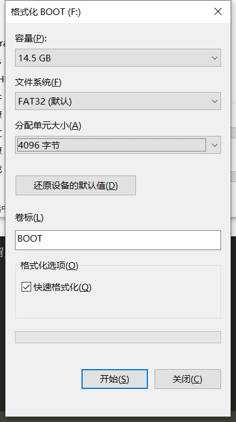

- [第二期 裸机开发](#第二期-裸机开发)
  - [使用汇编点亮 LED 灯](#使用汇编点亮-led-灯)
    - [编写代码](#编写代码)
    - [编译驱动](#编译驱动)
      - [拨码开关设置](#拨码开关设置)
    - [将板子连接到 PC](#将板子连接到-pc)
    - [makefile 的编写](#makefile-的编写)
  - [IMX 启动方式](#imx-启动方式)
  - [C语言编写 LED 驱动](#c语言编写-led-驱动)
    - [设置处理器模式](#设置处理器模式)
    - [设置 SP 指针](#设置-sp-指针)
- [第三期 系统移植](#第三期-系统移植)
  - [window 烧写程序](#window-烧写程序)
    - [mfgTool 使用](#mfgtool-使用)
  - [ubuntu 烧写程序](#ubuntu-烧写程序)
  - [编译uboot](#编译uboot)
    - [进入uboot](#进入uboot)
- [第四期 驱动开发](#第四期-驱动开发)
  - [环境搭建](#环境搭建)
  - [字符设备开发基础实验](#字符设备开发基础实验)
    - [编写 Makefile](#编写-makefile)
    - [编写字符驱动模块加载和卸载程序](#编写字符驱动模块加载和卸载程序)
  - [编译烧写](#编译烧写)


-----

# 第二期 裸机开发


## 使用汇编点亮 LED 灯


### 编写代码

- 创建逻辑驱动目录

```sh
mkdir MIX6ULL
/home/book/kenspace/linux/IMX6ULL/board_drivers
/home/book/kenspace/linux/IMX6ULL/board_drivers/1_leds
```


**I.MX6ULL IO初始化：**

- 使能时钟，CCGR0-CCGR6 这 7 个寄存器控制着 6ULL 所有外设时钟的使能，为了简单，在程序中将 CCGR0~CCGR6 这7个寄存器全部设置为 0XFFFFFFFF， 相当于使能所有外设时钟。

首先我们需要在 IMX6ULL 参考手册中查找到 CCGR0-CCGR6 的地址，找到 18 章 CCM 的 CCM_CCGR0 ，找到 CCM_CCGR0 ~ CCM_CCGR6 , 地址是：`Address: 20C_4000h base + 68h offset = 20C_4068h`

- IO复用，将寄存器 IOMUXC_SW_MUX_CTL_PAD_GPIO1_IO03 的 bit3~0 设置为 0101=5 ，这样 GPIO1_IO03 就复用为 GPIO

找到 30 章中 IOMUXC_SW_MUX_CTL_PAD_GPIO1_IO03 的地址，并将它设置为 5

- 寄存器 IOMUXC_SW_PAD_CTL_PAD_GPIO1_IO03 是设置 GPIO1_IO03 的电气属性。包括压摆率、速度、驱动能力、开漏、上下拉等。

找到 IOMUXC_SW_PAD_CTL_PAD_GPIO1_IO03 的地址是 0x020E02F4

- 配置 GPIO 功能，设置输入输出。设置 GPIO1_DR 寄存器 bit3 为 1，也就是设置为输出模式。设置 GPIO1_DR 寄存器的 bit3，为1表示输出高电平，为 0 表示输出低电平。

通过查看手册查到 GPIO1_GDIR 的地址是 0x0209C004

```x86asm
.global _start

_start:
    @ 初始化。使能所有外设时钟
    @ LDR 主要用于从存储加载数据到寄存器 Rx 中，LDR 也可以将一个立即数加载到寄存器 Rx 中
	ldr r0, =0x020c4068  @ CCGR0
    ldr r1, =0XFFFFFFFF  @ 要向 CCGR0 写入的数据，就是用 0XFFFFFFFF 

    @ CCGR1
    ldr r0, =0x020C406C  @ CCGR1
    str r1, [r0]

    @ CCGR2
    ldr r0, =0x020C4070
    str r1, [r0]

    @ CCGR3
    ldr r0, =0x020C4074
    str r1, [r0]

    @ CCGR4
    ldr r0, =0x020C4078
    str r1, [r0]

    @ CCGR5
    ldr r0, =0x020C407C
    str r1, [r0]

    @ CCGR6
    ldr r0, =0x020C4080
    str r1, [r0]


    @ IO复用，将寄存器 IOMUXC_SW_MUX_CTL_PAD_GPIO1_IO03 的 bit3~0 设置为 0101=5 ，
    @ 这样 GPIO1_IO03 就复用为 GPIO
    /*
    配置 GPIO1_IO03 PIN 的复用为 GPIO ，也就是设置
    IOMUXC_SW_MUX_CTL_PAD_GPIO1_IO03 = 5
    IOMUXC_SW_MUX_CTL_PAD_GPIO1_IO03 寄存器的地址是  0x020E0068
     */

    ldr r0, =0x020e0068
    ldr r1, =0x5
	str r1, [r0]

    @ 寄存器IOMUXC_SW_PAD_CTL_PAD_GPIO1_IO03是设置 GPIO1_IO03的电气属性。
    @ 包括压摆率、速度、驱动能力、开漏、上下拉等。
    /* 
    *  bit0:    0 低速率
     * bit5:3： 110 R0/6驱动能力
     * bit7:6： 10 100MHz速度
     * bit11：  0 关闭开路输出
     * bit12：  1 使能pull/kepper
     * bit13：  0 kepper
     * bit15:14：00 100K下拉
     * bit16： 0 关闭hys
    */
    @ 换成 16 进制是 10B0
    ldr r0, =0x020e02f4
    ldr r1, =0x010B0
    str r1, [r0]

    /* 设置GPIO 
     * 设置GPIO1_GDIR寄存器，设置GPIO1_GPIO03为输出
     * GPIO1_GDIR寄存器地址为 0x0209c004,设置GPIO1_GDIR寄存器bit3为1,
     * 也就是设置GPIO1_IO03为输出。
     */
     ldr r0, =0x0209c004
     ldr r1, =0x08
     str r1, [r0]

     /* 打开LED，也就是设置GPIO1_IO03为0 也就是低电平
      * GPIO1_DR 寄存器地址为 0x0209c000
      */
    ldr r0, =0x0209c000
    ldr r1, =0
    str r1, [r0]

    @ 不断的循环
loop:
    b loop  @ 跳转到 loop
    @ 这里需要一个回车换行，否则会出现警告
```

### 编译驱动

编译到 SD 卡

- 编译

```sh
arm-linux-gnueabihf-gcc  -g -c led.s -o led.o   # -g 是产生调试信息， -c 是指定源文件
```

- 链接

> STM32 的存储起始地址和运行起始地址都是 0X08000000    
> 对于 6ULL 来说，链接起始地址应该指向 RAM 地址。RAM 分为内部 RAM 和外部 RAM，也就是 DDR     
> 本教程所有裸机例程的链接地址都在 DDR 中，链接起始地址为 0X87800000

```sh
arm-linux-gnueabihf-ld -Ttext 0X87800000 led.o -o led.elf
```

- 将 elf 文件转成 bin 文件

```sh
arm-linux-gnueabihf-objcopy -O binary -S -g led.elf led.bin
```

- 查看 SD 卡名称

```sh
$ ll /dev/sd*
brw-rw---- 1 root disk 8,  0 Mar 14 23:30 /dev/sda
brw-rw---- 1 root disk 8,  1 Mar 14 23:30 /dev/sda1
brw-rw---- 1 root disk 8,  2 Mar 14 23:30 /dev/sda2
brw-rw---- 1 root disk 8,  3 Mar 14 23:30 /dev/sda3
brw-rw---- 1 root disk 8,  4 Mar 14 23:30 /dev/sda4
brw-rw---- 1 root disk 8, 16 Mar 15 21:33 /dev/sdb
brw-rw---- 1 root disk 8, 17 Mar 15 21:33 /dev/sdb1
```

- 开始烧写

在 ubuntu 下烧写，所以需要把 SD 卡挂到 ubuntu 中去。烧写就是将 bin 文件写到绝对地址上。用 Imxdownlaod 烧写。

Imxdownlaod 会向 `led.bin` 添加一个头部，生成新的 `load.imx` 文件，这个 load.imx 文件就是最终烧写到SD卡里面去的。

```sh
 ./imxdownload led.bin /dev/sdb
```

#### 拨码开关设置

> 拨码开关设置: 1 7 拨上去，其他的下来（原来是1，3，6，7 拨上去）

### 将板子连接到 PC

使用 USB 线连接，注意 Band rate 选择 115200 。


### makefile 的编写

```
led.bin : led.s
	# 编译成目标文件
	arm-linux-gnueabihf-gcc -g -c led.s -o led.o
	# 链接
	arm-linux-gnueabihf-ld -Ttext 0x87800000 led.o -o led.elf
	# 转成二进制 bin 文件
	arm-linux-gnueabihf-objcopy -O binary -S -g led.elf led.bin
	# 反汇编
	arm-linux-gnueabihf-objdump -D led.elf > led.dis

clean:
	rm -rf *.o led.bin led.elf led.dis
```

----

## IMX 启动方式

对于 6ULL

- 启动方式的选择

两种，BOOT_MODE0 和 BOOT_MODE1，这两个是两个 IO 来控制的。选择从 USB 启动还是内部 BOOT 启动。

- 选择启动设备

前提是，你设置MODE1和MODE0是从内部BOOT启动的，也就是 MODE1=1，MODE0=0。

通过 BOOT_CFG 选择, 有 BOOT_CFG1,2,4，每个 8 位。BOOT_CFG 是由 LCD_DATA0~23 来设置的。


## C语言编写 LED 驱动

### 设置处理器模式

设置 6ULL 处于 SVC 模式 下。设置 CPSR 寄存器的 bit4-0，也就是 M[4:0] 为 10011=0X13。读写状态寄存器需要用到 MRS 和 MSR 指令。MRS 将 CPSR 寄存器数据读出到通用寄存器里面，MSR 指令将通用寄存器的值写入到 CPSR 寄存器里面去。

### 设置 SP 指针

SP 指针可以指向内部 RAM，也可以指向 DDR，我们这样将其指向 DDR。

使用b指令，跳转到C语言函数，比如main函数。


--------

# 第三期 系统移植

## window 烧写程序

> 使用 MfgTool 工具烧写

拨码开关拨到 USB：1，3，6，7 上去 --> 1 下，2 上，后面的无所谓

在Windos使用NXP提供的mfgtool来向开发烧写系统。需要用先将开发板的USB_OTG接口连接到电脑上。

切记！使用OTG烧写的时候要先把SD卡拔出来，等USB OTG与电脑连接成功以后就可以再将SD卡插进去了。

### mfgTool 使用

> 买的板子是 EMMC


双击 Mfgtool2-eMMC-ddr512-eMMC.vbs ，连接成功后会显示 “符合 HID 标准的供应商定义设备”， 点击 start ==》 stop ==> exit

因为我们的系统是烧写到 EMMC 中的，所以需要将拨码开关拨到 EMMC 中。

> 1 0 1 0 0 1 1 0

按复位键重启，然后 输入 root 用户名即可进入系统。

> 烧写的系统是存在 mfgtool\Profiles\Linux\OS Firmware\firmware 这里


烧写原理：MfgTool 其实是先通过 USB OTG 先将 uboot、kernel 和.dtb(设备树) 这是三个文件下载到开发板的 DDR 中，注意不需要下载 rootfs。就相当于直接在开发板的 DDR 上启动 Linux 系统，等 Linux 系统启动以后再向 EMMC 中烧写完整的系统，包括 uboot、linux kernel、.dtb(设备树)和 rootfs，因此 MfgTool 工作过程主要分两个阶段：

> **uboot、kernel 和.dtb --> DDR --> 启动 linux 系统 --> 向 EMMC(存储器) 中烧写完整的系统**

- ①、将 firmware 目录中的 uboot、linux kernel 和.dtb(设备树)，然后通过 USB OTG 将这个文件下载到开发板的 DDR 中，目的就是在 DDR 中启动 Linux 系统，为后面的烧写做准备。

- ②、经过第①步的操作，此时 Linux 系统已经运行起来了，系统运行起来以后就可以很方便的完成对 EMMC 的格式化、分区等操作。EMMC 分区建立好以后就可以从 files 中读取要烧写的 uboot、linux kernel、.dtb (设备树)和 rootfs 这 4 个文件，然后将其烧写到 EMMC 中，这个就是 MfgTool 的大概工作流程。

## ubuntu 烧写程序

大体步骤：首先向SD卡烧写一个系统，然后使用 SD 卡启动，启动以后在 Linux 中执行烧写到 EMMC 或 NAND 中。

- 现将 SD 卡格式化



- 拷贝 image_download 文件

将 `D:\kendallStudy\正点原子第三期\mfgtool\Profiles\Linux\OS Firmware\file` 这个文件夹拷贝到 `/home/book/kenspace/linux/IMX6ULL/image_download` 中。


```sh
book@kendall:~/kenspace/linux/IMX6ULL/image_download/files$ ls
boot  filesystem  imx6mkemmcboot.sh  imx6mknandboot.sh  imx6mksdboot.sh  modules  README.txt

# 并给三个脚本给予执行权限
chmod +x imx*
```

- 将 SD 卡连接到 ubuntu 下面

---

## 编译uboot

```sh
book@kendall:alientek_uboot$ tar vxjf uboot-imx-2016.03-2.1.0-gee88051-v1.6.tar.bz2 
```

使用的是 512MB+8GB 的 EMMC 核心板

```sh
# 一般在编译前先清理一下工程 
make ARCH=arm CROSS_COMPILE=arm-linux-gnueabihf- distclean
```

这里的 make 命令带有三个参数，第一个是 ARCH ，也就是指定架构 ，这里肯定是 arm ；第二个参数 CROSS_COMPILE 用于指定编译器 ，只需要指明编译器前缀就行了，比如 arm-linuxgnueabihf-gcc 编译器的前缀就是 “`arm-linux-gnueabihf-`” ；最后一个参数 distclean 就是清除工程 。


mx6ull_14x14_ddr512_emmc_defconfig ： 是一个默认配置文件，由恩智浦官方提供（在路径uboot/configs），或经过其它开发商修改的。

```sh
# 配置 uboot：
make ARCH=arm CROSS_COMPILE=arm-linux-gnueabihf- mx6ull_14x14_ddr512_emmc_defconfig    #会生成一个.config文件
```

同样有三个参数，不同的是，最后一个参数是 mx6ull_alientek_emmc_defconfig。前面说了 uboot 是 bootloader 的一种，可以用来引导 Linux，但是 uboot 除了引导 Linux 以外还可以引导其它的系统，而且 uboot 还支持其它的架构和外设，比如 USB、网络、SD 卡等。这些都是可以配置的，需要什么功能就使能什么功能。所以在编译uboot 之前，一定要根据自己的需求配置 uboot。
mx6ull_alientek_emmc_defconfig 就是正点原子针对 I.MX6U-ALPHA 的 EMMC 核心板编写的配置文件。

```sh
# 编译uboot
make V=1 ARCH=arm CROSS_COMPILE=arm-linux-gnueabihf- -j12
```

通过第 3 行配置好 uboot 以后就可以直接“make”编译 uboot 了。

其中 V=1 用于设置编译过程的信息输出 级别；-j 用于设置主机使用多少线程编译uboot ，最好设置成我们虚拟机所设置的核心数，如果在 VMware 里面给虚拟就分配了 4 个核，那么使用-j4 是最合适的，这样 4 个核都会一起编译。

> 或者用脚本直接编译：`/home/book/kenspace/linux/IMX6ULL/uboot/alientek_uboot\mx6ull_alientek_emmc.sh`


编译完之后就会生成一个 `u-boot.imx`

正点原子板子的芯片需要添加头部信息

将 u-boot.bin 拷贝到 `D:\kendallStudy\正点原子第三期\mfgtool\Profiles\Linux\OS Firmware\firmware`, 并将名字修改成 `u-boot-imx6ull-14x14-emmc.imx`.

在复制一份到 `D:\kendallStudy\正点原子第三期\mfgtool\Profiles\Linux\OS Firmware\files\boot` 文件夹下，命名为：`u-boot-imx6ull-14x14-ddr512-emmc`

连接 OTB 线连接上去，拨码开关：0 1 .....

双击 ：Mfgtool2-eMMC-ddr512-eMMC.vbs

### 进入uboot

> 1 0 1 0 0 1 1 0


启动时按回车,，有以下日志说明成功了。

```
U-Boot 2016.03 (Jul 09 2022 - 01:44:14 -0400)

CPU:   Freescale i.MX6ULL rev1.1 792 MHz (running at 396 MHz)
CPU:   Industrial temperature grade (-40C to 105C) at 53C
Reset cause: POR
Board: I.MX6U ALPHA|MINI
I2C:   ready
DRAM:  512 MiB
MMC:   FSL_SDHC: 0, FSL_SDHC: 1
*** Warning - bad CRC, using default environment

In:    serial
Out:   serial
Err:   serial
switch to partitions #0, OK
mmc1(part 0) is current device
Net:   FEC1
Error: FEC1 address not set.

Normal Boot
Hit any key to stop autoboot:  0 
```


----
----

# 第四期 驱动开发

## 环境搭建

```
sudo apt-get install nfs-kernel-server rpcbind
```

以后我们可以在开发板上通过网络文件系统来访问 nfs 文件夹，要先配置 nfs，使用如下命令打开 nfs 配置文件 /etc/exports

```
sudo vim /etc/exports
```

## 字符设备开发基础实验

在 linux 内核源码中

```
kernel_source$ vim include/linux/fs.h +1606
```

### 编写 Makefile

```mk
KERNELDIR := /home/book/kenspace/linux/IMX6ULL/linux_Drives/linux-imx-rel_imx_4.1.15_2.1.0_ga_alientek

CURRENT_PATH := $(shell pwd)

obj-m := chardevbase.o

build: kernel_modules

kernel_modules:
	$(MAKE) -C $(KERNELDIR) M=$(CURRENT_PATH) modules

clean:
	$(MAKE) -C $(KERNELDIR) M=$(CURRENT_PATH) clean 
```

### 编写字符驱动模块加载和卸载程序

```c
#include <linux/module.h>
#include <linux/kernel.h>
#include <linux/init.h>
#include <linux/fs.h>
#include <linux/slab.h>
#include <linux/uaccess.h>
#include <linux/io.h>

static int __init chardevbase_init(void)
{
    return 0;
}
static void __exit chardevbase_exit(void)
{
   //出口函数具体逻辑 
}


// 模块的入口与出口
module_init(chardevbase_init);
module_exit(chardevbase_exit);
```

## 编译烧写

直接通过脚本编译

```
/home/book/kenspace/linux/IMX6ULL/uboot/alientek_uboot/mx6ull_alientek_emmc.sh
```

烧录到 sd 卡中，使用 `ll /dev/sd*` 查看。


