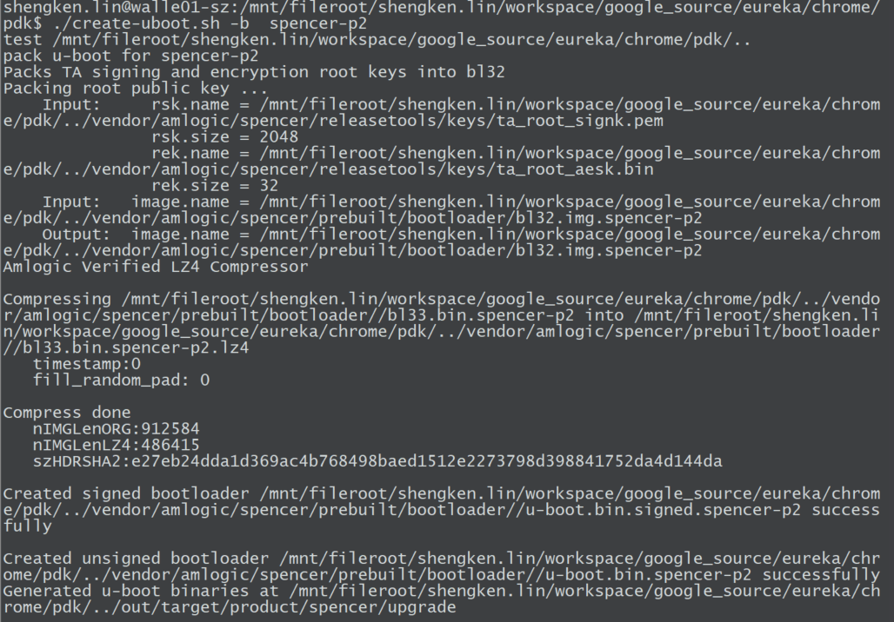

- [编译签名烧录](#编译签名烧录)
    - [1、sync spencer code](#1sync-spencer-code)
  - [2、Build SDK](#2build-sdk)
    - [2.1 Bootloader (bl2 + bl31 + bl32 + u-boot)](#21-bootloader-bl2--bl31--bl32--u-boot)
    - [2.2 Kernel](#22-kernel)
    - [2.3 Kernel module - NN](#23-kernel-module---nn)
  - [3.签名](#3签名)
    - [3.1 签名u-boot](#31-签名u-boot)
    - [3.2 签名kernel](#32-签名kernel)
      - [3.2.1 获取生成ramdisk](#321-获取生成ramdisk)
  - [4、烧录](#4烧录)
  - [使用脚本编译和签名](#使用脚本编译和签名)
- [测试模型](#测试模型)
  - [模型转换](#模型转换)
    - [编译出 ssd_small_multiout_be.nb](#编译出-ssd_small_multiout_benb)
- [TASK: VSI 版本编译问题 bug](#task-vsi-版本编译问题-bug)
  - [测试bechmark_model](#测试bechmark_model)
    - [update kernel & uboot & system](#update-kernel--uboot--system)

---

> 波特率：921600

# 编译签名烧录

### 1、sync spencer code

```sh
mkdir spencer-sdk
repo init -u https://eureka-partner.googlesource.com/amlogic/manifest -b spencer-master -m combined_sdk.xml
repo sync

# Note:
# Some git are Google International only, so we cannot download them.
# And you will see some error message about "repo sync"
# If you want to skip it, you can remove it from "~/eureka/spencer-sdk/.repo/manifests/combined_sdk.xml".
 --- a/combined_sdk.xml
 +++ b/combined_sdk.xml
 @@ -14,7 +14,5 @@
    <project name="amlogic/lloyd-isp" path="lloyd-isp" revision="spencer-master"/>
    <project name="verisilicon-sdk" path="verisilicon" revision="6.4.2"/>
    <project name="amlogic/freertos" path="freertos" revision="spencer-master"/>
 -  <project name="amlogic/lloyd-proprietary-3a" path="lloyd-3a" revision="spencer-master"/>
 -  <project name="xtensa-tools" path="amlogic/xtensa" revision="master"/>
    <project name="external/flatbuffers" path="amlogic/flatbuffers" revision="quartz-master"/>
  </manifest>
```

## 2、Build SDK

### 2.1 Bootloader (bl2 + bl31 + bl32 + u-boot)

```sh
# build without "release"，Default compilation option will enable logs. 

cd ~/eureka/spencer-sdk/
 
cd bl2
./build_bl2.sh spencer-p2 release
cd -
 
cd bl31
./build_bl31.sh spencer-p2 release
cd -
 
cd bl32
./build_bl32.sh spencer-p2 release
cd -
 
cd u-boot
./build_uboot.sh spencer-p2 ./../../chrome release
cd -
```

### 2.2 Kernel

```sh
# 切换分支
git branch -a | grep spencer

git checkout -t remotes/eureka-partner/spencer-master


cd ~/eureka/spencer-sdk/
 
cd kernel
./build_kernel.sh spencer-p2 ./../../chrome
```

### 2.3 Kernel module - NN

```sh
cd ~/eureka/spencer-sdk/
 
cd verisilicon
./build_ml.sh arm64 spencer-p2 ./../../chrome
cd -
```

## 3.签名

> Notes: 首先需要先获取到pdk编译脚本，这里以 spencer-p2 为例

### 3.1 签名u-boot

```sh
cd chrome/pdk
# mkdir -p ../out/host/linux-x86/bin/

chrome$ tree out/host/
out/host/
└── linux-x86
    └── bin
        ├── kernel_iv.bin
        ├── kernel_iv.txt
        ├── mkbootimg
        ├── pem_extract_pubkey.py
        ├── sign-boot-g12a-dev.sh
        └── sign-boot-g12a.sh

# 编译签名uboot
cd pdk
./create-uboot.sh -b  spencer-p2
```



### 3.2 签名kernel

#### 3.2.1 获取生成ramdisk

下载最新的 ramdisk

> https://console.cloud.google.com/storage/browser/_details/cast-partner-amlogic-internal/internal/master/spencer-eng/314706/factory/spencer-fct-spencer-p2-314706.zip;tab=live_object

解压后将 fct_boot.img 拷贝到 chrome/pdk/unpack_boot 目录下，

```sh
# /mnt/fileroot/shengken.lin/workspace/google_source/eureka/chrome/pdk/unpack_boot
unpack_boot.sh ./fct_boot.img ./boot_out unpack_boot    ## 注意修改脚本路径
cp ramdisk.img ../../chrome/out/target/product/spencer/boot_unpack/

## /mnt/fileroot/shengken.lin/workspace/google_source/eureka/chrome/pdk
./build-bootimg.sh -b spencer-p2
```

## 4、烧录

- 烧录路径

> workspace/google_source/eureka/chrome/out/target/product/spencer/upgrade

- 烧录命令

> upgrade 中没有的 misc.img 和 fct_boot.img  在刚刚下载解压出来的文件夹中。

```sh
adnl.exe  Download u-boot.signed.bin 0x10000
adnl.exe run
adnl.exe bl2_boot -F  u-boot.signed.bin


# echo off
# ping 0.0.0.0 -n 5 > null
# echo on

adnl.exe oem "store init 1"
adnl.exe oem "mmc dev 1"

# 如果不单独编译dts这个可以不用执行，因为 dtb 已经打包到 u-boot.signed.bin
# adnl.exe Partition -M mem -P 0x1000000 -F spencer-p2.dtb
# adnl.exe oem "emmc part_write 0x1000000"

# echo off
# ping 0.0.0.0 -n 5 > null
# echo on

adnl.exe  Partition -M mem -P 0x2000000 -F u-boot.signed.bin
adnl.exe oem "store boot_write bootloader 0x2000000 0x1ffe00"

# echo off
# ping 0.0.0.0 -n 3 > null

adnl.exe Partition -P tpl_a  -F tpl.signed.bin
adnl.exe Partition -P tpl_b  -F tpl.signed.bin
adnl.exe Partition -P boot_a  -F boot.img
adnl.exe Partition -P boot_b  -F boot.img
adnl.exe Partition -P misc  -F misc.img
adnl.exe Partition -P system_b  -F fct_boot.img
adnl.exe oem "enable_factory_boot"
adnl.exe oem "reset"
```


关闭日志：dmesg -n 1

## 使用脚本编译和签名

```sh
kendall-spencer-p2-complie_uboot_kernel.sh u-boot
kendall-spencer-p2-complie_uboot_kernel.sh kernel
kendall-spencer-p2-complie_uboot_kernel.sh verisilicon
```


# 测试模型

> 只测 be 结尾的

最终生成的 ko 和 so 文件路径

```sh
build/sdk/drivers
```

```sh
# 切换分支
git checkout -t  remotes/eureka-partner/6.4.9
```


- 下载解压

- push 到开发板

```
Z:\workspace\google_source\eureka\spencer-sdk\NN649\AML_OUTPUT\All_precompile_bin\All_pre-compiled_bin\spencer\model> adb.exe push alexnet_caffe_be /cache

adb.exe push galcore.ko /cache
```

- 到开发板上加载 module


- 设置环境变量： export LD_LIBRARY_PATH=/data/drivers:$LD_LIBRARY_PATH

- 追踪线程： strace -f -F -o log.txt ./alexnetcaffe ./alexnet_caffe_a1.nb space_shuttle.jpg 输出到 log.txt


- 加载之前需要先卸载掉其他的，否则空间不足

```
rmmod galcore
rmmod dhd
rmmod iv009_isp
rmmod iv009_isp_sensor
rmmod iv009_isp_lens
rmmod iv009_isp_iq
```

Z:\workspace\google_source\eureka\spencer-sdk\verisilicon\build\sdk> adb.exe push .\drivers\. /lib/

- 挂载查看日志： dmesg -n 8; insmod /lib/galcore.ko showArgs=1; dmesg -n 1


```sh
lsmod 
/cache/alexnet_caffe_be # ./alexnet_caffe_be ./alexnet_caffe_be.nb ./space_shuttle.jpg 


/cache/FPN_be # chmod  777 *
./FPN_be ./FPN_be.nb ./640.jpg

/cache/googlenet_caffe_be # chmod 777 *
/cache/googlenet_caffe_be # ./googlenet_caffe_be ./googlenet_caffe_be.nb ./goldfish_224x224.jpeg 

/cache/inceptionv1_be # chmod 777 *
./inceptionv1_be ./inceptionv1_be.nb goldfish.jpeg 

...
```


## 模型转换

### 编译出 ssd_small_multiout_be.nb

ubuntu 记录

- 转换模型

需要转换的模型： Z:\workspace\google_source\eureka\spencer-sdk\NN649\AML_OUTPUT\All_precompile_bin\All_pre-compiled_bin\spencer\model

```sh
# ~/NN/649/actool_6.3.1/acuity-toolkit-binary-6.3.1/google_test_mode
vim alexnet_caffe/alexnet_caffe_03.sh 
vim alexnet_caffe/alexnet_caffe_02.sh 
vim alexnet_caffe/alexnet_caffe_01.sh 

# 查看输出
# vim yolov2/export_nbg_be.sh 

cd ssd_small_multiout
# ~/NN/649/actool_6.3.1/acuity-toolkit-binary-6.3.1/google_test_model/ssd_small_multiout

# 编译 ssd_small_multiout
$ bash step1.sh ssd_small_multiout
$ bash step2.sh ssd_small_multiout
# rm iter_0_*
# rm ssd_small_multiout_be/ -rf

# rm ssd_small_multiout.data 
# rm ssd_small_multiout.quantize 
# rm ssd_small_multiout.quantize 
# rm tflite.export.data 
# rm ssd_small_multiout.json 

bash step1.sh ssd_small_multiout
vim ssd_small_multiout.json
vim ssd_small_multiout_inputmeta.yml

bash step2.sh ssd_small_multiout
vim ../ssd_big_multiout/ssd_big_multiout_04_be.sh

bash step3.sh ssd_small_multiout
ls ssd_small_multiout_be/ -al

bash step4_inference.sh ssd_small_multiout
```

- 编译模型

```sh
# cp  /mnt/fileroot/yuegui.he/c2/amlogic_sdk/alexnet_caffe_be/build_vx.sh .
# 注意修改成自己的路径

./build_vx.sh 

# 修改  makefile.linux 
vim makefile.linux 
# 114 TARGET_NAME = tflite 

./build_vx.sh 
```

- 测试模型

```sh
Z:\workspace\google_source\eureka\spencer-sdk\verisilicon\build\sdk> adb.exe push .\drivers\. /lib/

# \workspace\google_source\eureka\spencer-sdk\alexnet_caffe_be\bin_r>
insmod galcore.ko

./tflite ./alexnet_caffe_be.nb iter_0_input_0_out0_1_3
./tflite ./alexnet_caffe_be.nb ./space_shuttle.jpg 
```

- 转换输出文件为 txt

修改 vnn_post_process.c

```c
vsi_nn_SaveTensorToTextByFp32(graph, tensor, filename, "\n");
或者
vsi_nn_SaveTensorToTextByFp32( graph, tensor, filename, NULL );
```


# TASK: VSI 版本编译问题 bug

> https://partnerissuetracker.corp.google.com/issues/242716462

编译命令：./build_ml.sh arm64 spencer-p2 ../../chrome/


```sh
cd chrome/

source build/envsetup.sh 

PARTNER_BUILD=true lunch

cd vendor/

find . -name "benma*"
```

编译 chrome

```sh
cd chrome

source build/envsetup.sh  

# PARTNER_BUILD=true lunch elaine-eng
PARTNER_BUILD=true lunch

make BOARD_NAME=spencer-p2 PARTNER_BUILD=true  -j12 otapackage
```

## 测试bechmark_model


```sh
# /mnt/fileroot/shengken.lin/workspace/google_source/eureka/chrome
cp spencer_ota_tools/framework out/host/linux-x86/ -rf


# export PATH="$PATH:/mnt/nfsroot/yuegui.he/bak_chrome/build/bin/"
# 1. download https://confluence.amlogic.com/download/attachments/180725736/missing-binary.zip?version=2&modificationDate=1651397450635&api=v2
# 2. unzip -o missing-binary.zip

cp ./make_ext4fs ./mkbootfs ./veritysetup ../build/bin/ &&
cp ./signapk.jar ./dumpkey.jar ../build/framework/ &&
cp ./signapk.jar ./dumpkey.jar ../out/host/linux-x86/framework/ &&
chmod 755 ./build/bin/make_ext4fs ../build/bin/mkbootfs ./build/bin/veritysetup
```

### update kernel & uboot & system

```sh
cd spencer_target/
unzip internal_master_spencer-eng_315654_spencer-target_files-315654.zip

# update spencer p2 kernel
chrome/spencer_target$ cp ../../spencer-sdk/kernel/arch/arm64/boot/kernel.spencer.gz-dtb.spencer-p2 ./BOOT/kernel
chrome$ cp ../spencer-sdk/kernel/arch/arm64/boot/kernel.spencer.gz-dtb.spencer-p2 ./spencer_target/BOOT/RAMDISK/lib/kernel/kernel-spencer-p2 

# chrome/spencer_target$ zip -r internal_master_spencer-eng_315654_spencer-target_files-315654.zip -f BOOT/

cp internal_master_spencer-eng_315654_spencer-target_files-315654.zip /mnt/fileroot/shengken.lin/workspace/google_source/eureka/chrome/
```