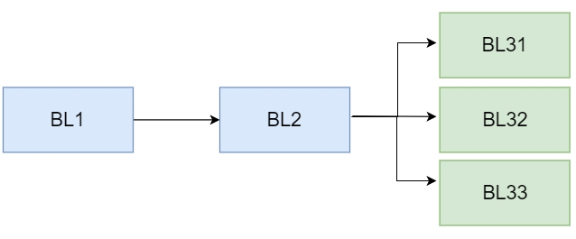
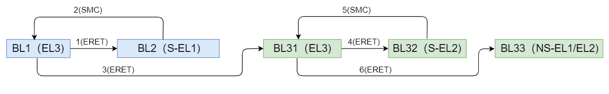

- [armv8启动总体流程](#armv8启动总体流程)
	- [启动阶段](#启动阶段)
	- [内存规划原则](#内存规划原则)

------

# armv8启动总体流程

随着 CPU 处理能力和芯片制造工艺的不断提升，高性能芯片逐渐发展成 SOC，单独一颗芯片上处理 CPU 外还会集成大量不同功能的 IP 核，比如中断控制器，DSP，GPU，总线控制器，视频处理和编码模块，还有电源管理模块等。为了更好地管理这些硬件资源，以及为上层用户提供统一的服务和接口，SOC 上一般都需要运行操作系统。所以系统引导程序的主要功能就是初始化系统的软硬件状态，为操作系统提供一个合适的软硬件环境，以及加载和启动操作系统镜像。

## 启动阶段

Armv8 的启动流程包含多个阶段，典型地有 BL1、BL2、BL31、BL32、BL33，根据需求的不同，这些阶段可以适当地裁剪或添加。内阁阶段的源码会被编译成独立的启动镜像，并保存到特定的存储介质中，由于一般的存储介质如spi flash、nand flash、emmc、ssd等）都支持代码的直接执行，因此需要在启动时先将镜像加载到可直接执行代码的存储介质，如 SRAM 或 DDR 中，然后运行相关代码。其典型的加载流程如下：

- BL1是启动的第一阶段，该镜像必须要存储在可直接执行的介质中。若芯片支持XIP 启动方式，其可被存储在片外可直接执行的介质中（如 norflash）。若不支持XIP ，则需要存储在芯片的片内 ROM 中，此时在芯片出厂后该部分代码就将被固化，后续再也不能被修改和升级。若芯片要支持安全启动，则需要将 bootrom 作为启动时的信任根，此时除调试阶段外，SOC 必须禁用 XIP (保证启动安全）。

- BL2 镜像由 BL1 加载，此时 DDR 还没有被初始化，因此它需要被加载到片内的 SRAM 中执行，一般在这个阶段会**完成DDR 的初始化**，因此后面的镜像都可以被加载到 DDR 中。从上图可知，BL31、BL32 和 BL33都是由 BL2 加载的，其中 BL31 和 BL32 是可选的，若系统不支持 TRUST OS，则可去掉 BL32，若不支持EL3 异常等级及 secure monitor，则可去掉 BL31。

- BL33 一般指 uboot，一般通过它最终启动操作系统内核

> 以上流程中我们假定系统支持的最高异常等级为EL3，且支持secure monitor和TRUST OS，同时BL2运行在secure EL1，BL33运行在non secure EL1或non secure EL2状态。

- （1）由于 armv8 架构规定，arm 核复位后默认会进入当前系统支持的最高异常等级，因此 BL1 运行在 EL3，它执行完成后会通过异常返回 ERET 的方式跳转到 BL2
- （2 - 3）BL2 执行完成后需要跳转到 BL31，由于 BL31 运行在 EL3 异常等级，而 BL2 根据需求不同可能运行于 secure EL1 或 EL3。当 BL2 运行于 EL3 时可直接通过 ERET 方式跳转到 BL31 中，但若其运行在 secure EL1 时，则只能通过 smc 异常触发进入 EL3 异常等级。
	- 显然，此时 BL31 由于尚未设置其自身的 smc 异常处理程序而无法直接处理该异常，因此，为了完成跳转流程，BL1 需要先代理该异常的处理。因此 BL1 在退出之前先设置 smc 异常处理函数，BL2 触发 smc 启动 BL31 时，BL1 捕获该异常并根据 BL2 传入的参数设置 BL31 的入口地址和系统初始状态，并通过ERET跳转到 BL31 的入口地址处执行。

- （4）BL32阶段会运行 TRUST OS，它运行于 secure EL1 异常等级，BL31 可根据其镜像加载信息设置入口地址以及其它状态，并完成跳转
- （5 - 6）BL32 加载完成后将通过SMC返回到BL31，然后由 BL31 跳转到 non secure EL1 或 non secure EL2 以执行 BL33

## 内存规划原则

嵌入式系统的内存一般包含 ROM、SRAM  DDR，其中 ROM 和 SRAM 位于 SOC 片内，DDR 位于芯片外部。它们的特点如下：

- （1）ROM 中的内容**断电后不会消失**，不仅可用于代码执行，还可以用于镜像存储，但其只有【**只读**】权限

- （2）SRAM 和 DDR 中的内容在**断电后都会消失**，因此只能被用于代码的动态执行，而不能用于镜像存储

- （3）ROM 和 SRA M都是直接连接总线上，系统上电后即可直接执行。而 DDR 需要通过 DDR phy 和 DDR controller 连接到总线上，因此使用之前必须要先对其执行初始化操作

根据上述各种内存的特点和前面镜像加载启动流程的需求，在内存规划中我们需要考虑以下几个问题：

- （1）由于 BL1 需要固化到 ROM 中，且是系统最先执行的，因此 ROM 地址需要被映射到 cpu 的重启地址处

- （2）由于 ROM 是只读的，BL1 镜像除了代码段和只读数据段之外还包含可读写数据段，这部分数据在 BL1 启动时需要从ROM重定位到 SRAM 中

- （3）由于 BL1 被固化在 ROM 中，芯片出产后就不能更改，因此 DDR 初始化代码不能集成到 BL1 中。故 BL2 需要被加载到 SRAM 中执行，且在 BL2 中执行 DDR 初始化流程

- （4）BL2 之后的其它镜像既可以运行于 SRAM 中，也可以运行于 DDR 中

- （5）从前面的镜像启动流程可知，若 BL2 运行于 secure EL1 下，当其执行完成后，需要通过 smc 再次陷入BL1去执行 BL31 流程，因此 BL2 和 BL1 的地址不能有重叠

- （6）BL31 除了执行启动流程外，在系统运行过程中还会以 secure monitor 的方式驻留，为 normal 空间的 smc 异常提供服务历程，以及为 normal os 和 trust os 之间提供消息转发、中断路由转发等功能。因此，BL31 镜像需要永久驻留内存，在系统启动完成后不能被回收 

- （7）与 BL31 类似，BL32在启动后需要驻留内存为系统提供安全相关服务，因此为其所分配的内存也不能被回收
  
- （8）除此之外，BL1、BL2 和 BL33（一般为 uboot ）的内存在系统启动完成后都可以被释放给操作系统使用

|  类型   | 作用  |
|  ----  | ----  |
| ROM  | BL1（bootrom） |
| SRAM  | Bl1（rw data） |
| SRAM  | Shared ram BL2 |
| SRAM  | BL31 |
| SRAM  | BL32 |
| DDR  | BL33 |